# **内容**

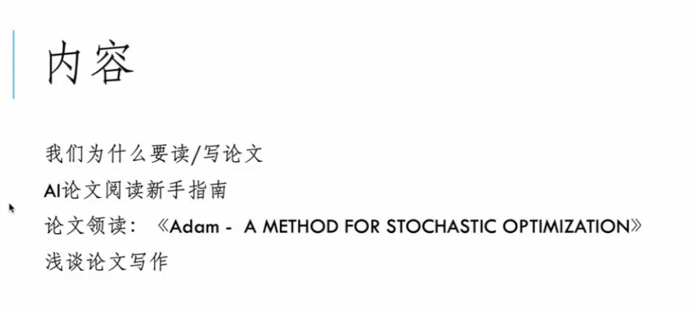

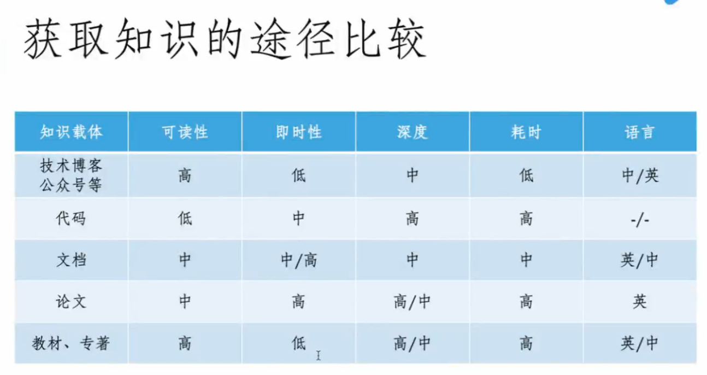

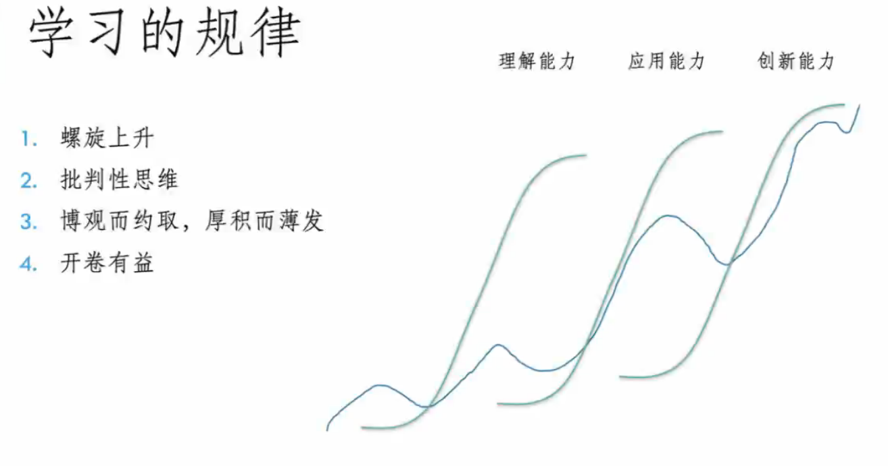

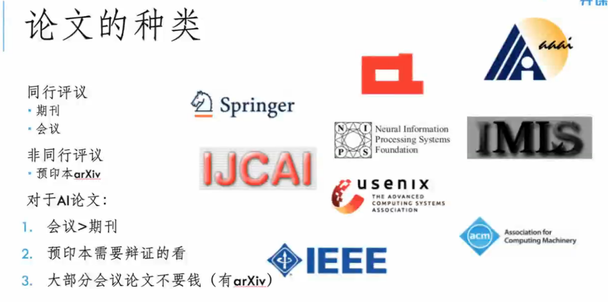

- Guide2research

  <http://www.guide2research.com/>

  按H排，一个计算公式

- 计算机学会目录

  <https://www.ccf.org.cn/xspj/gyml/>

- Arrive

  内容会很新，有邮件推荐

- dblp

- https://www.semanticscholar.org/

  替代版的谷歌学术

- Scihub

  下载SCI用的

- 好水的B类会议

  挑H低的，比较好水

# 读论文读什么

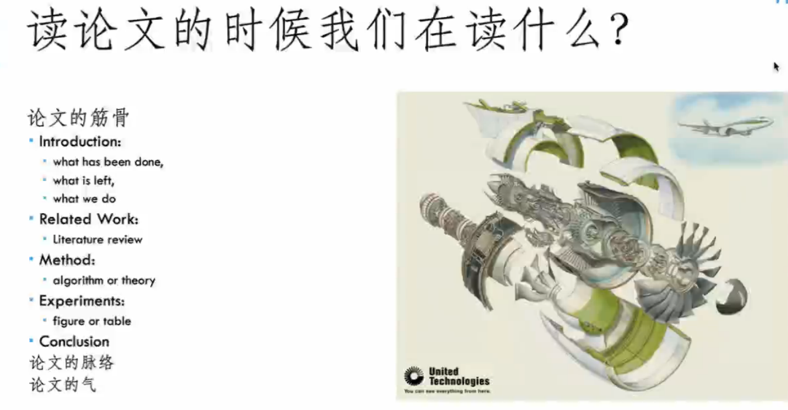

nips.cc 顶会

AI落地难

多伦多大学，OpenAI

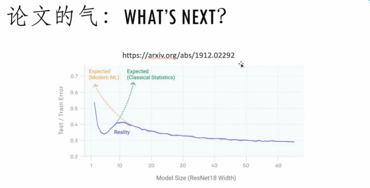

论文的影响力怎么表现出来？
GCN

## 举例

值得一读的文章

https://arxiv.org/pdf/1912.02292.pdf

# 论文写作

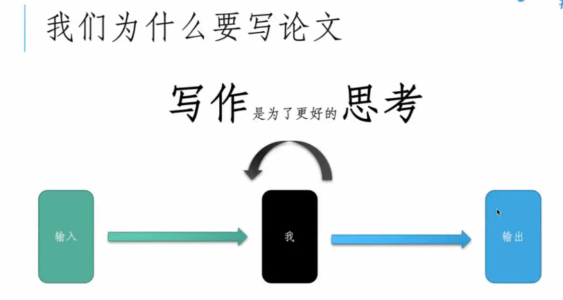

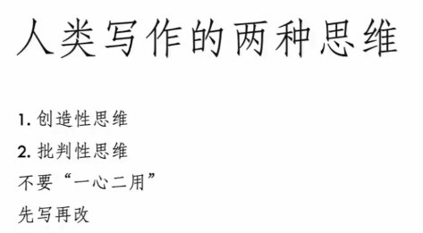

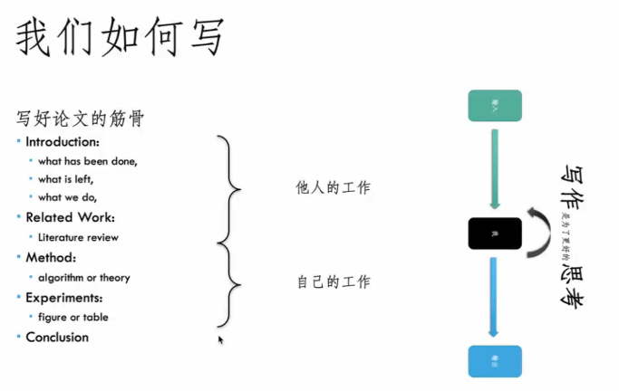

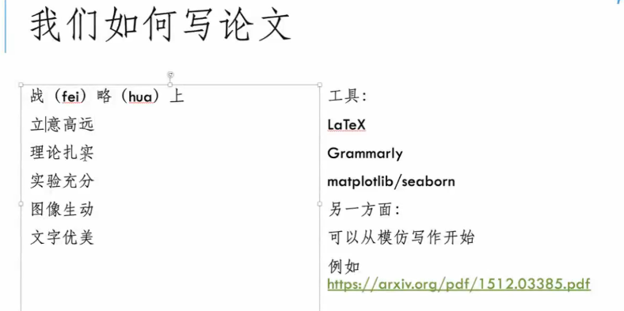

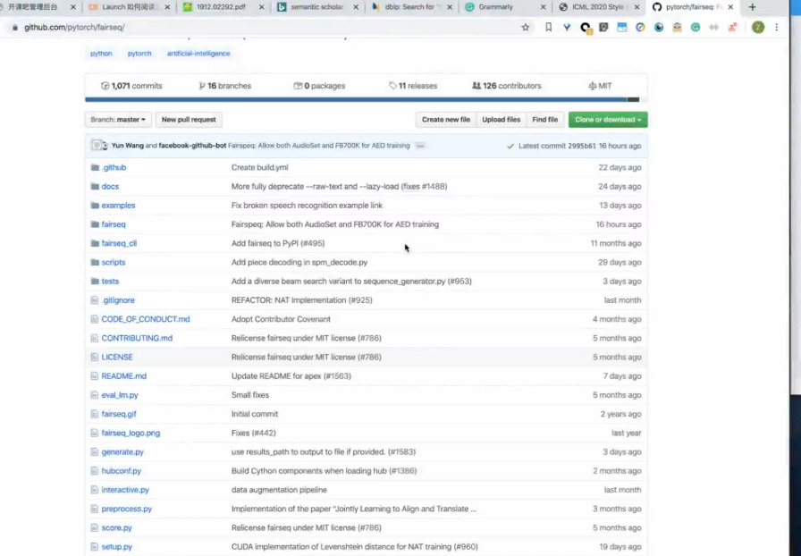

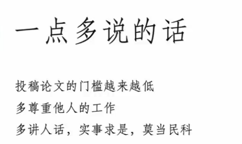

# 小结

- 有批判性思维
- 读论文主要是理解能力
- 论文量少的时候，容易走弯路，容易浮躁，多看多想

# 提问

**出现句子一样，单词一样**

1. 英语问题
2. 知识背景
3. 论文太长，论文结构，没有很明确，不知道那一部分注意什么内容
4. 用文档固化自己的思想，可以参考学术届的论文，展示自己的工作，做报告等，

**怎么养成良好的编程思维**

- 多看看代码

