# 计算机基础导论

## 为什么需要数学？

## 人类如何表示数字？

## 计算机如何对数字进行处理？
- 由逻辑电路组成

  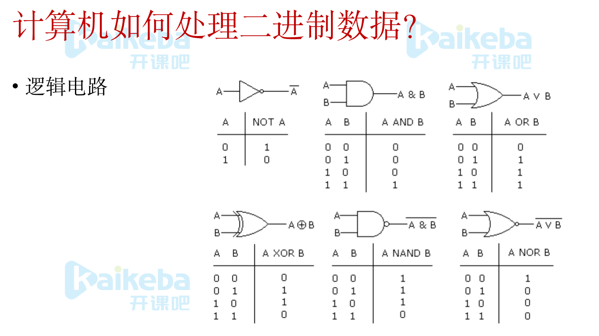

## 计算机并非无所不能

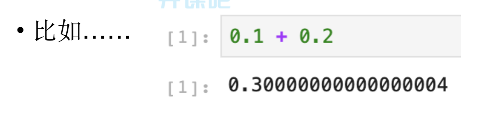

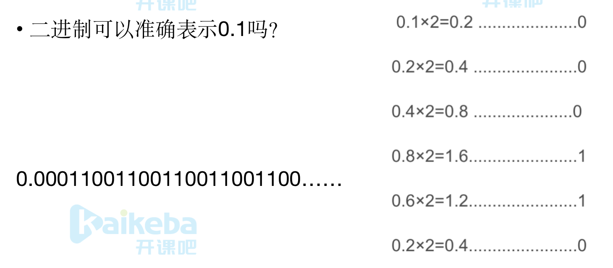

- **会无限循环**

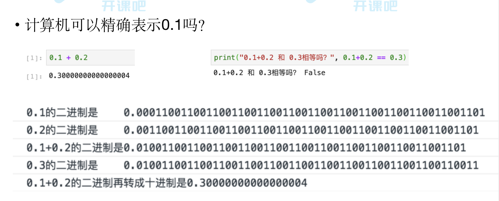

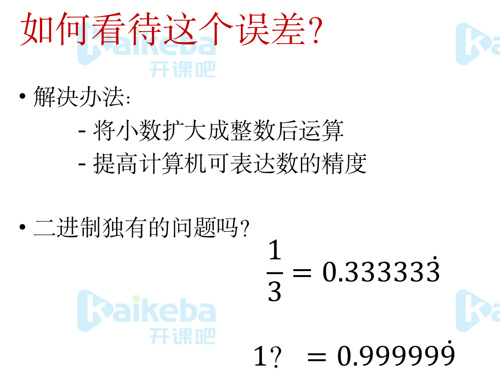

- **答案是相等的**

# 人工智能需要的数学知识

## 微积分基础（导数）

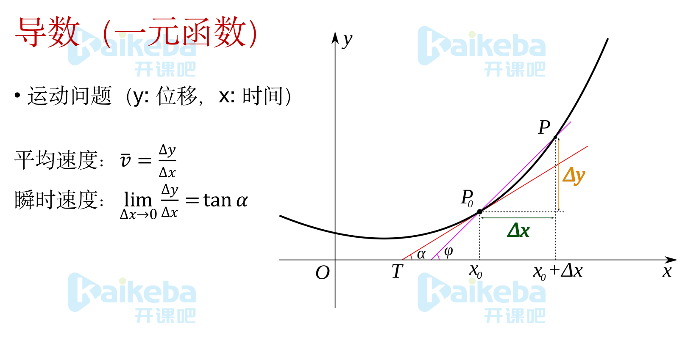

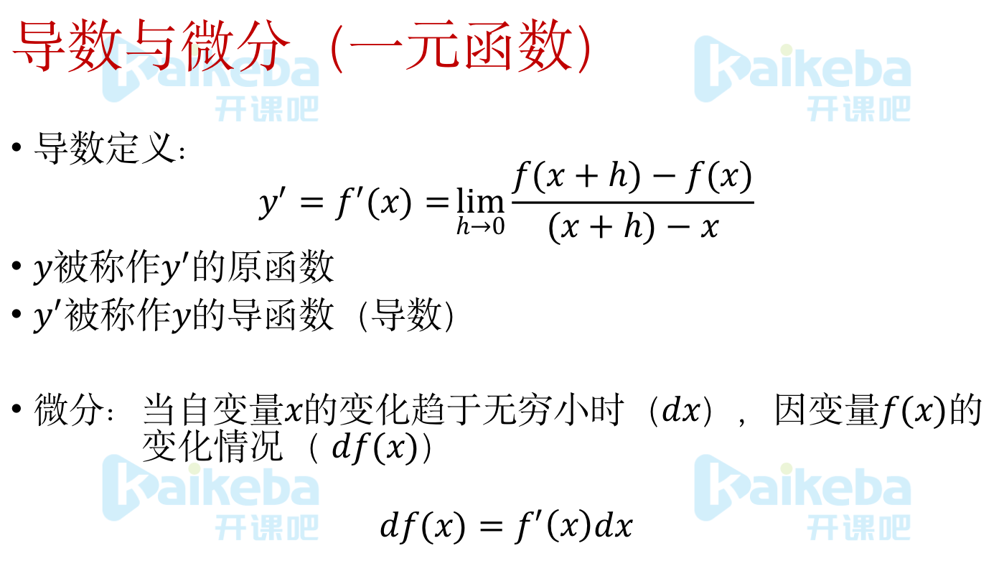

## 线性代数基础（矩阵）

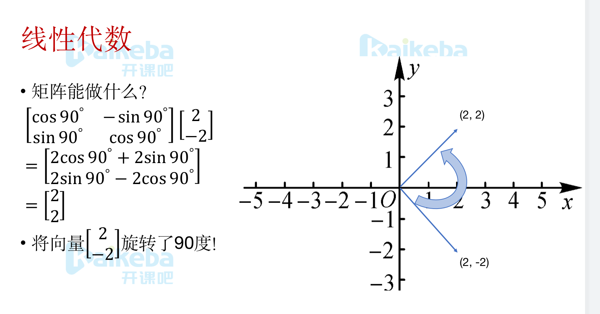

## 概率&统计基础（随机变量）

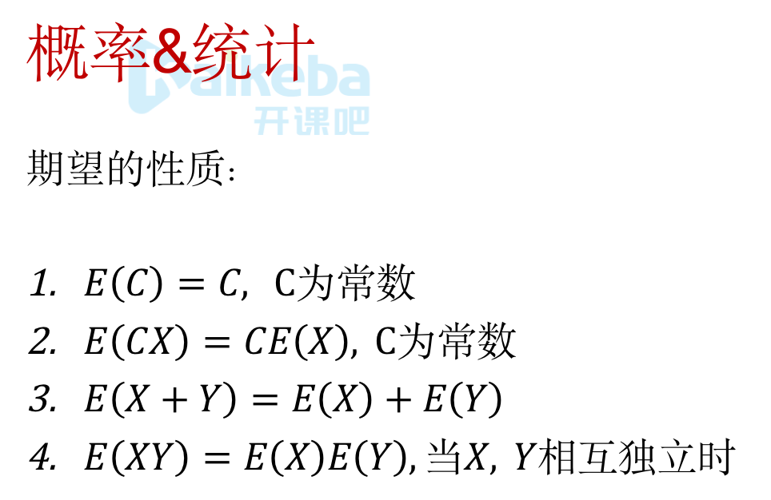

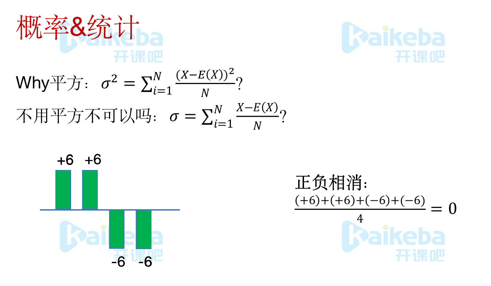

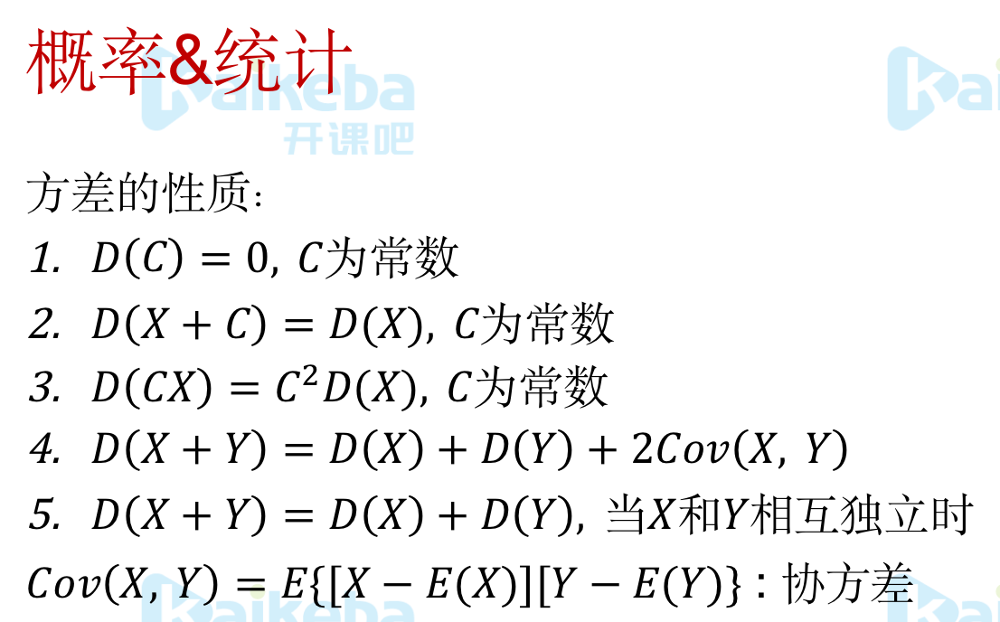

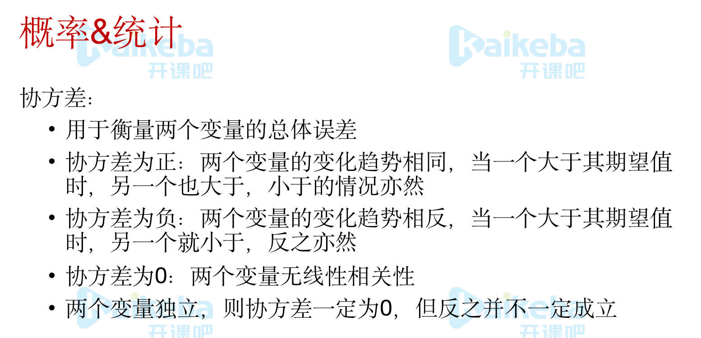

## 图论（图的概念）

推荐系统，会用图的结构表示，然后去分析，遍历等总结

