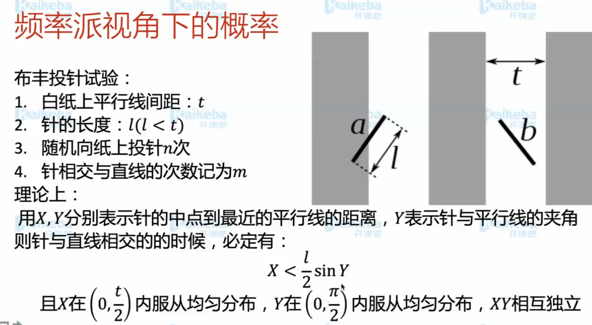
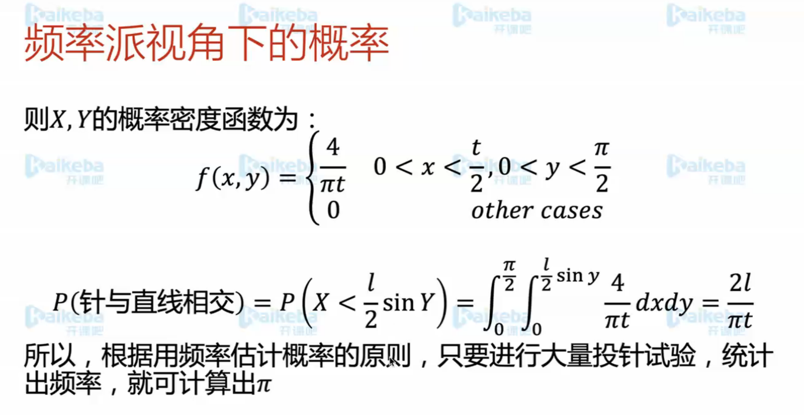
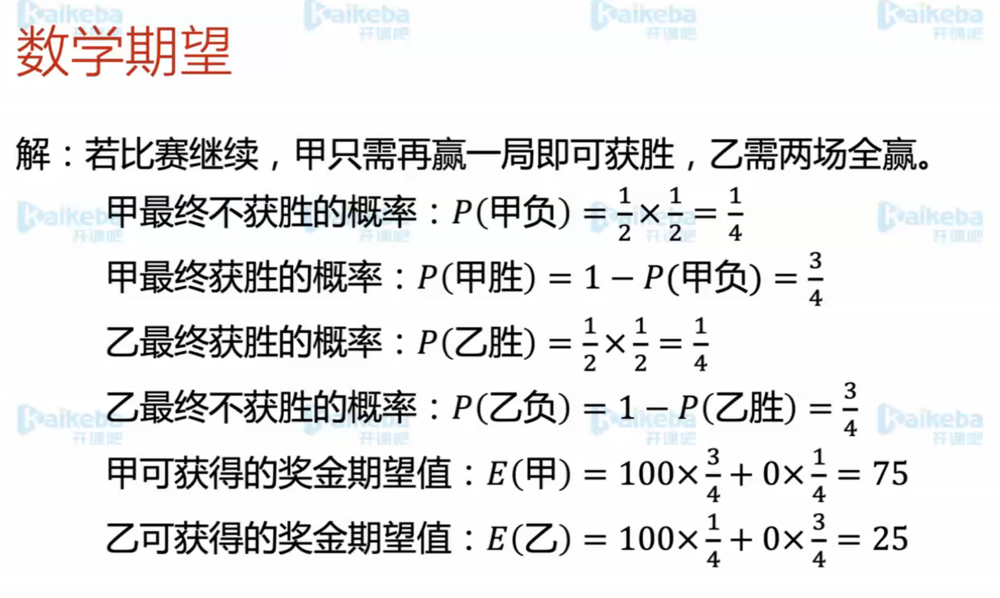
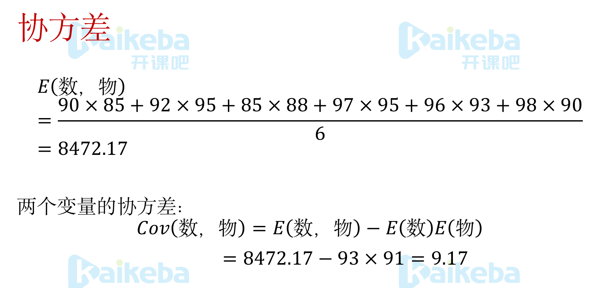
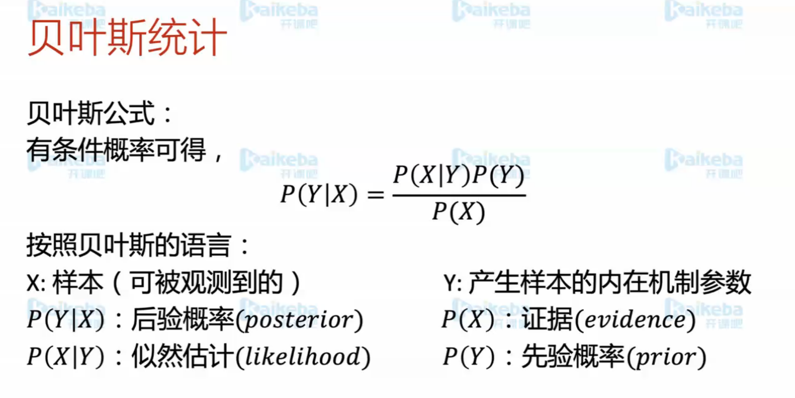

# 人工智能数据基础-概率与统计

## 目录

**概率是什么
古典概型&几何概型
条件概率&联合概率
期望&方差&协方差
二项分布
高斯分布
中心极限定理
泊松分布
贝叶斯先验分布&后验分布
机器学习分类指标**

## 相关截图

## 疑问

- 概率函数
- 概率密度函数

## 题目

协方差为正，数学好的时候，物理可能也好，反之亦然

## 总结

- 破解生活中一些不正确的直觉