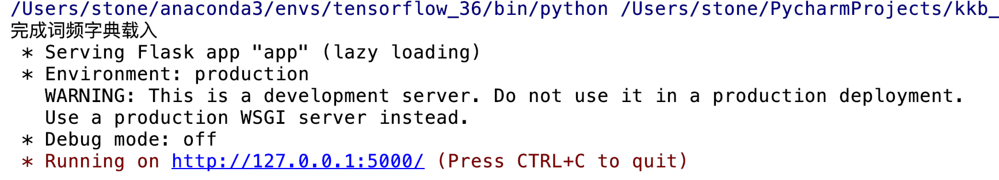
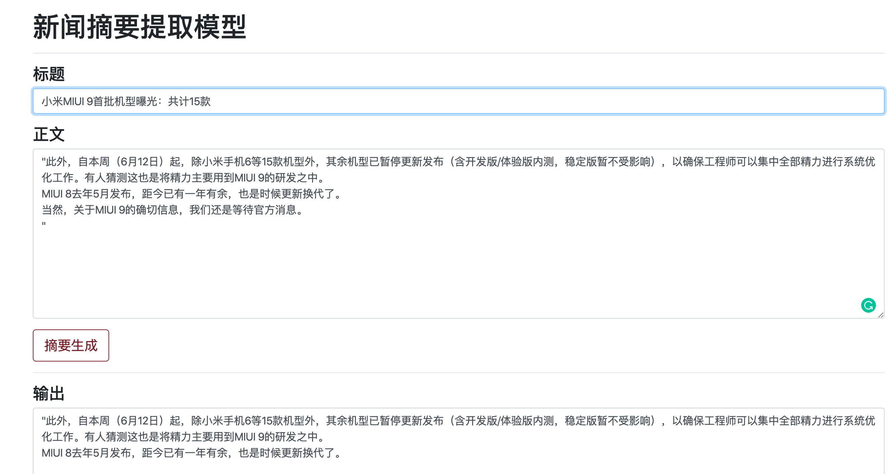

[TOC]

# **1 项目简介**

- 新闻文本摘要自动生成

# **2 环境依赖**

- Python3.6
- Flask1.1.1
- Jieba
- 其他：bootstrap、js、ajax、

# **3 目录结构描述**

- data: 存放模型数据，维基百科词典
- img: 项目相关图片截图
- static: 存放css和js文件
- template: 存放index.html
- app.py: 服务器端启动入口
- extract_news.py: 新闻数据各部分内容提取
- gensim_test.py: 训练词向量
- process_news.py: 处理新闻语料数据
- process_wiki.py: 处理维基百科数据
- SIF.py: 生成句向量
- text_abstract.py: 余弦相似度进行摘要提取
- vector_view.py:  词向量可视化
- show.ppt: 项目效果展示图

# **4 相关操作说明**

## 4.1 维基百科数据处理

### WikiExtractor工具  

- <https://github.com/attardi/wikiextractor>

~~~
WikiExtractor.py [-h] [-o OUTPUT] [-b n[KMG]] [-c] [--json] [--html]
                        [-l] [-s] [--lists] [-ns ns1,ns2]
                        [--templates TEMPLATES] [--no-templates] [-r]
                        [--min_text_length MIN_TEXT_LENGTH]
                        [--filter_category path_of_categories_file]
                        [--filter_disambig_pages] [-it abbr,b,big]
                        [-de gallery,timeline,noinclude] [--keep_tables]
                        [--processes PROCESSES] [-q] [--debug] [-a] [-v]
                        [--log_file]
                        input
eg:                  
WikiExtractor.py -o wiki_articles.txt /Users/stone/PycharmProjects/kkb_projects/project1/data/zhwiki-20191120-pages-articles-multistream.xml.bz2
~~~

- 数据量

~~~
total_nums 5570027
len+files [100, 100, 100, 100, 100, 100, 100, 100, 100, 100, 27, 100, 100, 100]
~~~

- 输出结果：

  分词后的结果，维基百科的词频

  

## 4.2 词向量

### 4.2.1 词向量构建

- 文本过滤特殊字符，空格等
- 结巴分词，并进行文本保存
- 使用gensim

~~~python 
model = word2vec.Word2Vec(PathLineSentences(inputpath),
                              size=100, window=5, min_count=2, workers=10)
model.save(outpath)
~~~

### 4.2.2 测试词向量效果

### 4.2.3 词向量可视化

- 可视化词向量-TSNE	使用

  参考网址：

  1. <https://blog.csdn.net/Class_guy/article/details/89014779>

  2. <https://www.kaggle.com/jeffd23/visualizing-word-vectors-with-t-sne>

## 4.3 SIF句向量

- 句向量

  <https://www.cnblogs.com/llhthinker/p/10335164.html>

  <https://blog.csdn.net/sinat_31188625/article/details/72677088>

  <http://www.feingto.com/?p=27534>

- 权重计算

  

## 4.3 核心模型搭建

- 相似度模型

  <https://www.zhihu.com/question/29978268>

- KNN平滑

- 参数调节

## 4.4 可视化

- flask, bottle, bootstrap

# **5 运行流程**

- 运行app.py文件，进入http://127.0.0.1:5000/，进入主目录

- 进入主目录，输入新闻标题，新闻正文，点击摘要生成按键

# **6 参考资料**

## 6.1 KNN平滑

- <http://www.feingto.com/?p=27534>

## 6.2 字典存储为pkl格式

- <https://blog.csdn.net/yangtf07/article/details/81571371>
- <https://blog.csdn.net/qq_41621362/article/details/94452160>

~~~python
# 存储到pkl文件
def pkl_out(dict_data, pkl_out):
    with open(pkl_out, 'wb') as fo:     # 将数据写入pkl文件
        pickle.dump(dict_data, fo)
~~~

## 6.3 词频计算

~~~python
Counter()                           # a new, empty counter
c = Counter('gallahad')                 # a new counter from an iterable
c = Counter({'red': 4, 'blue': 2})      # a new counter from a mapping
c = Counter(cats=4, dogs=8)
~~~

- <https://blog.csdn.net/The_lastest/article/details/81027387>

## 6.4 前端页面

- <https://github.com/stem-nlp/text-summarization.git>

# 7 questions

## 7.1 matplotlib中文显示

尝试了网上四种方法，分别如下：

~~~
#### 1 macOS系统原因，字体换成Songti SC解决
matplotlib.rcParams['font.family'] = 'Songti SC'
matplotlib.rcParams['font.size'] = 10
#### 2
# plt.rcParams['font.sans-serif'] = ['SimHei'] # 指定默认字体
# plt.rcParams['axes.unicode_minus'] = False # 解决保存图像是负号'-'显示为方块的问题

#### 3
# myfont = matplotlib.font_manager.FontProperties(
#     fname='/Users/stone/Library/Fonts/SimHei.ttf')
# matplotlib.rcParams['axes.unicode_minus'] = False

#### 4
# plt.rcParams['font.family'] = ['sans-serif']
# plt.rcParams['font.sans-serif'] = ['SimHei']
~~~

**参考网址：**<https://github.com/matplotlib/matplotlib/issues/15062>

