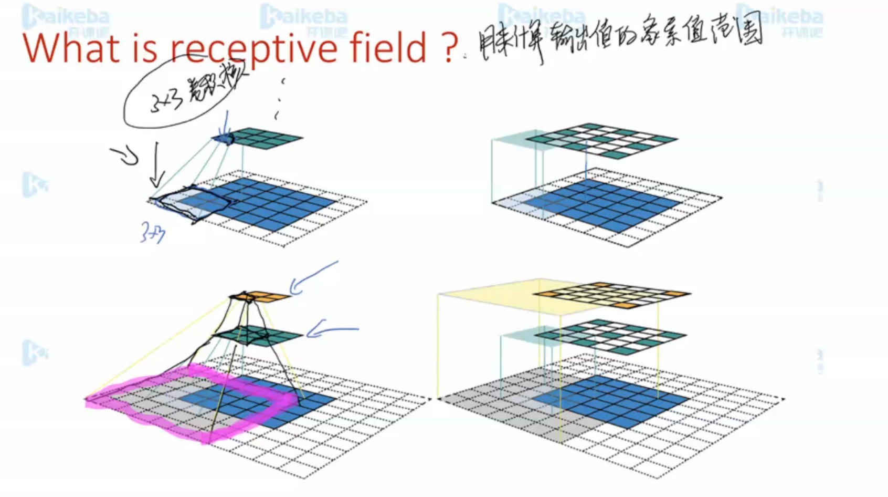
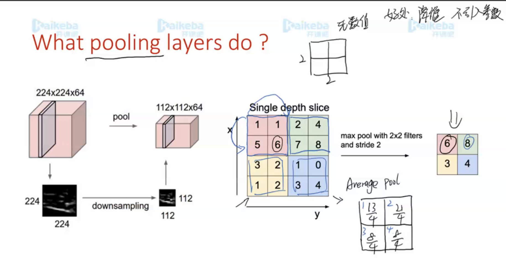

**Froward and backward propagations**
SGD
Training scheme and some training tips
Some terminologies
    Epoch 
    Iteration 
    Hyperparameters
    Parameters

L1: 会使得选择更加稀疏

L2:不会那么稀疏

Convolutional Neural Networks 
What is CNN.
Pooling
Training tips 
Some Famous CNN Models
LetNet
AlexNet
GoogleNet
VGG, ResNet
DenseNet
Coding
Introduction of keras

参数共享好处：

平移不变形

## padding 

- 使用好处： 可以保持纬度

使用samepadding好处，可以保持纬度不变

进行一个向下取整
卷积核是一个超参，取决于后面的训练

## 感受野

用来计算输出值的像素值范围

越往上叠，感受视野越大

## pooling

**好处：**降纬、不引入任何参数

## feature-map

- **如果是在一个多维的图片上进行卷积**
- 输入的channel要和卷积核的channel一致，用到多少个卷积核，就有多少个channel
- 

高层的feature是基于底层的feature进行卷积

## 其他CNN

- 高纬到地纬变换

好处： 

- 简单的可以直接传
- 复杂的可以进一步，训练深层网络
- 

## textCNN

最终可以得到整个句子的表示