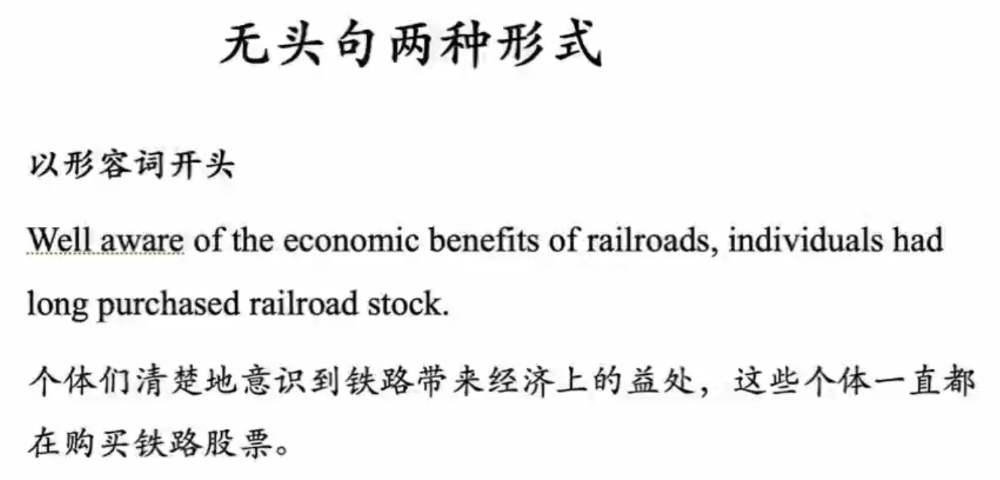

难度： GRE难度

## 词典

欧陆词典

灵格斯

## 四维

- L：listening
- R: reading
- W: writing
- S: speaking

## 英文学习的输入和输出

input： Reading + Listening

output: Speaking + Writing

Economist, NewYoker, Times, WSJ, education, bad blood, 

收集单词时，相应的句子记录下来

## 3s版本

- 把未来看作熔炉的观点是错的

Tentative: 实验性的

## 单词积累

### 背

1. 读原版文字

   学术文章：Economsit, Times, WSJ, NewYorker

   文学作品：Sidney，

2. B站

   曲根词汇： 四六级，托福雅思等等（第一遍记笔记，碎片时间磨耳朵）

3. app

   墨墨词汇； Excel表格（背单词，专属词汇）

**PS： 大量重复**

## 长难句阅读步骤

给老鼠注射了氨基酸是否会导致体内S的增加，

Rendered == provided 

