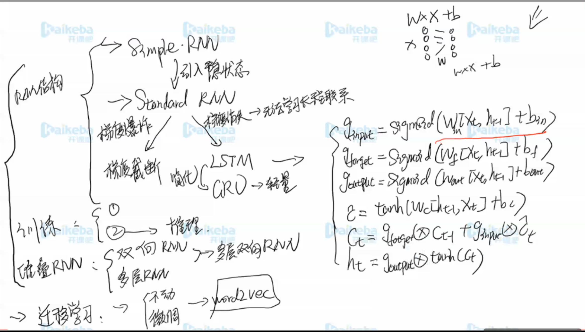

## **RNN概览**

## **LSTM**

- 使用加法，解决梯度消失

### **加入选择门**

一个点乘操作

### 加入遗忘门

如果信息不停加，最后会导致进入饱和区，训练不了

### **名字来源**

## **GRU**

LSTM简化版GRU

## RNN训练

### teacher forcing

- 在训练的时候，用上了正确的标签结果，见图片中序号1

  好处：第一个预测错了，不影响第二个

- 在训练时，用上了预测的结果，见图片中序号2

- 区别：序号1的训练更快，一般训练用的是第一种方式，计算一样，只是decoder，输入不一样

- 推理的时候，只能使用第二种

## 迁移学习

- 任务A数据很少，任务B数据多
- 最早用在图像上，因为图像的底层学习到的是局部信息，可以认为B因为数据多，能够很好的学习到底层的信息。其他图像，底层也是由点，线组成的，所以把B底层的参数直接拿过来用。

### 微调

- 一般参数更新：w=w+*w
- 使得*w在一个小的范围内

