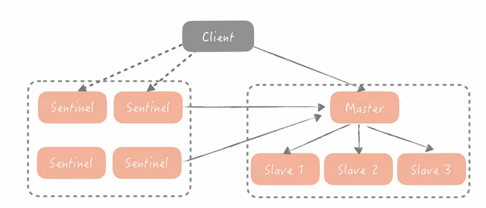

Redis: 

用于缓存

内存数据库，存储不同种类多数据；

- 工程中：存储用户的上下文
- 一问一答的业务问答
- 缓解数据库的压力，提高并发
- 本身用C语言写

git官网上有实现

Slave: 备胎，同步数据

Sentinel: 哨兵，监管master

高可用数据都是通过冗余实现的

### 存在问题

1. 如何判断master挂了
2. 如何从slave中选
3. 如果保持数据一致性

缓存击穿：

很多查找都没有找到，会使得数据库的负载变高，首先要知道在不在缓存内，然后去查找，缓存击穿是查不到数据导致请求走到了数据库。不隆过滤器作用可以简单理解为哈希表，请求过来先去normal feature中去查找。

**字符串**

**字典**

Mysql

Annoy:处理数据在百万级，耗时百万级搜索操作时

做大规模的向量检索

