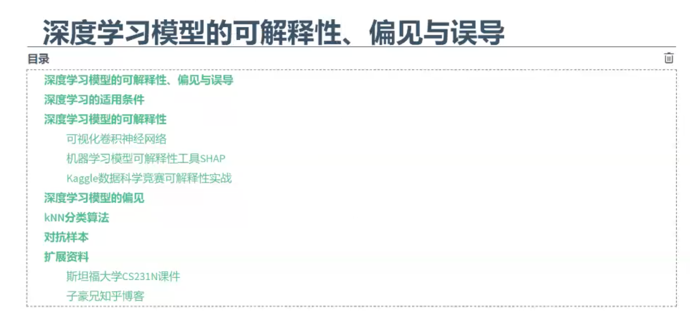
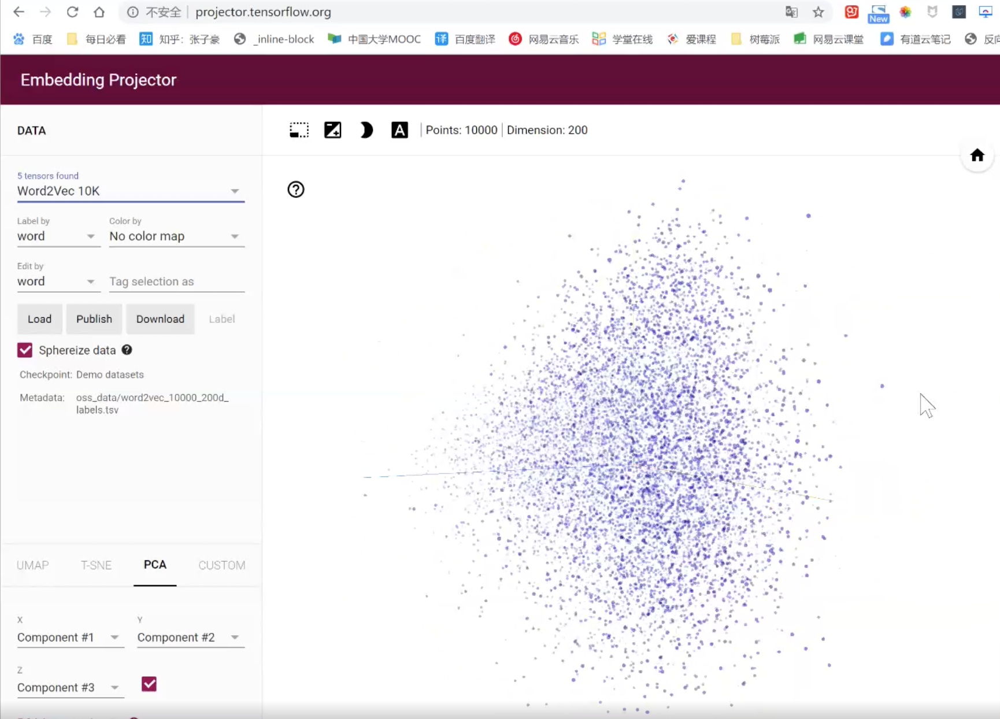
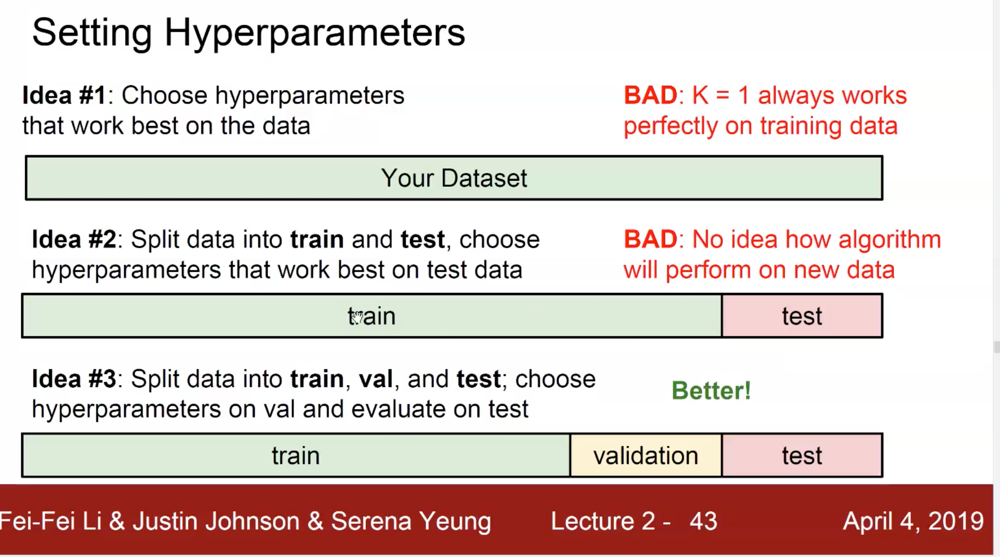
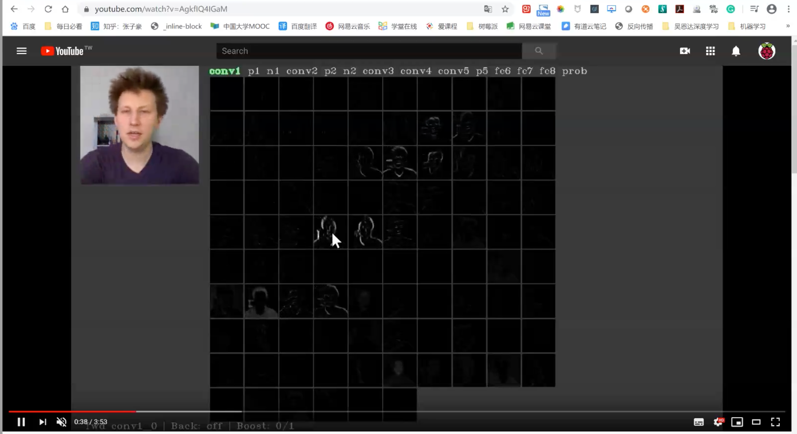
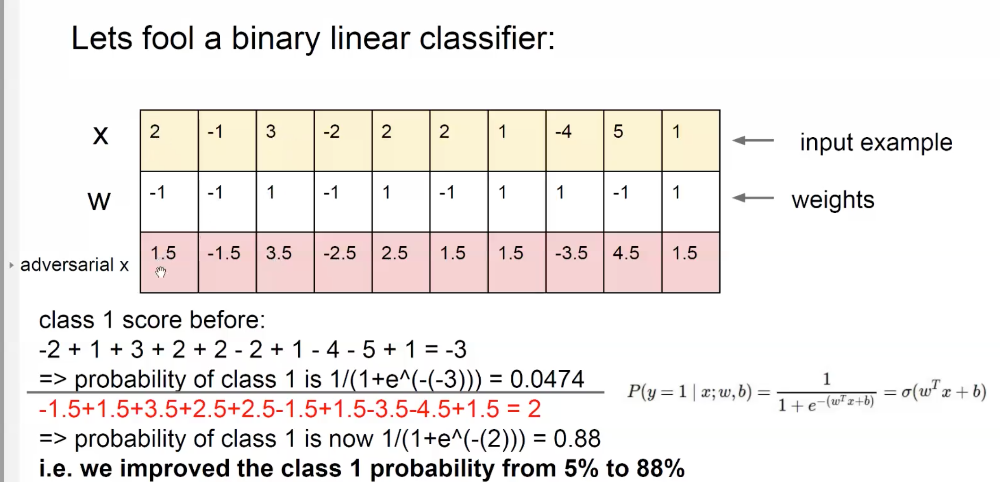
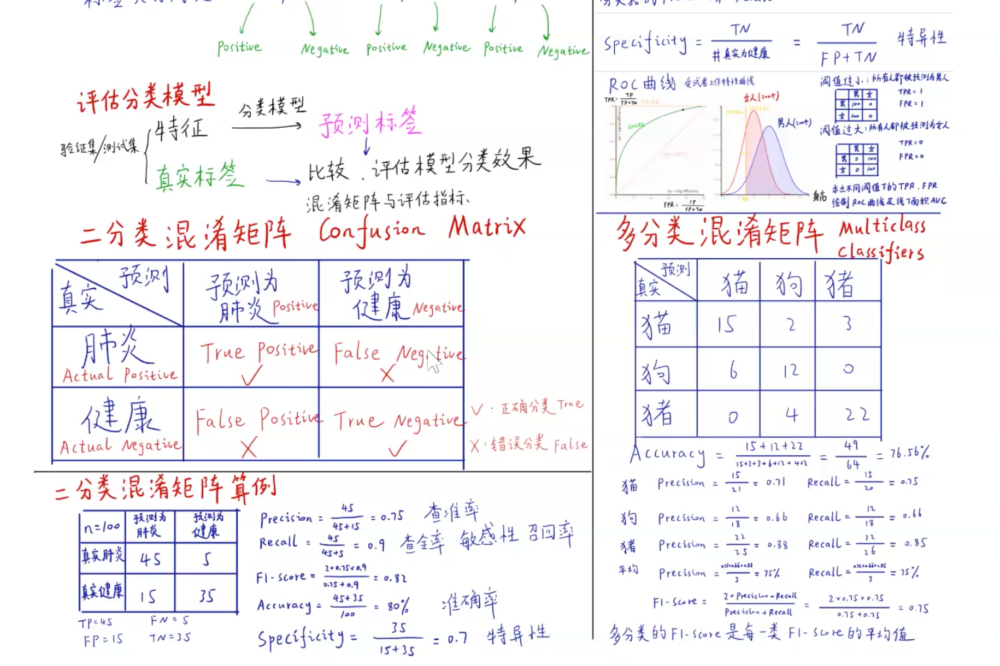
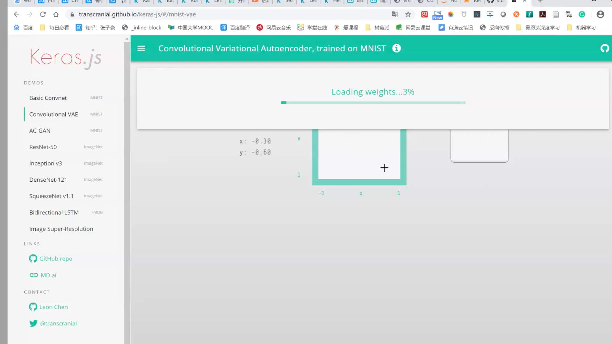

# assignment09 经典机器学习

# **目录**

# 深度学习缺点

- 深度学习的一个缺点是可解释性不强，模型内部是黑箱。
- 自然语言中的指代消歧，存在偏见

## tensorflow提供的降纬工具

## 交叉验证

## KNN

- 惰性算法
- 纬度灾难
- 所以实际中不怎么会使用KNN

## youtube一个视频

- 反卷积结果，可视化出来

## 对抗样本

- 
- 给输入加噪音，比如负的加正的，正的加负的
- 图中展示的是

## 混淆矩阵

- ROC曲线越靠上，效果越好

- UCI：机器学习数据集代称

## SHAP

- 可解释性分析
- github上有

## 优化论，矩阵论在机器学习中也很重要

## Kaggle

- 很多大公司都会把数据集放在kaggle上 
- 竞赛

## keras.js

# 作业：

## 1.思考在自然语言处理中如何发掘模型的可解释性

- 可视化中间层
- 测试集中某类别打乱，看哪些打乱，会影响准确率
- 相同类型的向量聚集在一起，变得线性可分，最后加一个线性分类层。 eg：对图形进行降纬，对表示进行降纬。
- 对图像进行遮挡，观察遮挡后，模型效果，见论文《Visualizing and Understanding Convolutional Networks》也是计算机视觉领域大名鼎鼎的一篇论文
- 通过反卷积结果，进行可视化，feature map动态展示出来
- ROC越高，模型越好，AOC面积越大，越好。

## 2.在Seq2Seq和注意力机制中如何可视化模型细节

- 打印出attention计算中的全值向量，在输入序列与输出序列之间建立注意力机制的关联矩阵。

## 3.对抗样本能否运用到自然语言处理模型中

- 对抗样本： 给一个网络加一些噪音，使得网络可以变得指鹿为马
- 可以生成假网络，给一些图像一些看似随机的噪音，就能够糊弄网络去指鹿为马。

## 4.复现Kaggle心脏病数据集冠军kernel，理解所用的模型可解释性技巧

### 数据集描述

13个特征

~~~
age
sex
chest pain type (4 values) [胸痛类型]
resting blood pressure [静息血压]
serum cholestoral in mg/dl [血清胆汁]
fasting blood sugar > 120 mg/dl[空腹血糖]
resting electrocardiographic results (values 0,1,2) [静息心电图结果]
maximum heart rate achieved [达到最大心率]
exercise induced angina [运动性心绞痛]
oldpeak = ST depression induced by exercise relative to rest [运动引起的相对于休息的ST抑郁]
the slope of the peak exercise ST segment [最高运动ST段的斜率]
number of major vessels (0-3) colored by flourosopy [萤光显色的主要血管数目（0-3）]
thal: 3 = normal; 6 = fixed defect; 7 = reversable defect [固定缺陷; 可逆缺陷]
~~~

## 复现地址

- <https://www.kaggle.com/tentotheminus9/what-causes-heart-disease-explaining-the-model>

## 介绍

在机器学习的所有应用程序中，使用黑匣子诊断任何严重的疾病总是很困难的。如果模型的输出是特定的治疗过程（可能有副作用），手术或没有治疗，则人们会想知道原因。

该数据集提供许多变量以及患有或不患有心脏病的目标条件。 下面，首先在简单的随机森林模型中使用数据，然后使用ML可解释性工具和技术对模型进行研究。

word2vec可视化网页： <projector.tensorflow.org>，可以使用降维的方法，进行可视化。

传统机器学习，本质上是规则，可解释性强。

KNN是一种惰性算法，没有真正学习到什么，所以也意味着更大的学习成本。

交叉验证方法，度量模型性能，避免偶然误差，提高机器学习整体性能。KNN不会在图像处理中使用。因为他没有训练好的模型 

支持向量机，当时被称为数学的巅峰之作。

深度学习，可解释性不强，容易被误导。

反卷积方法，使得可解释性变强

半监督学习

给出最后4096向量，怎么回到输入，返回原始输入图像

