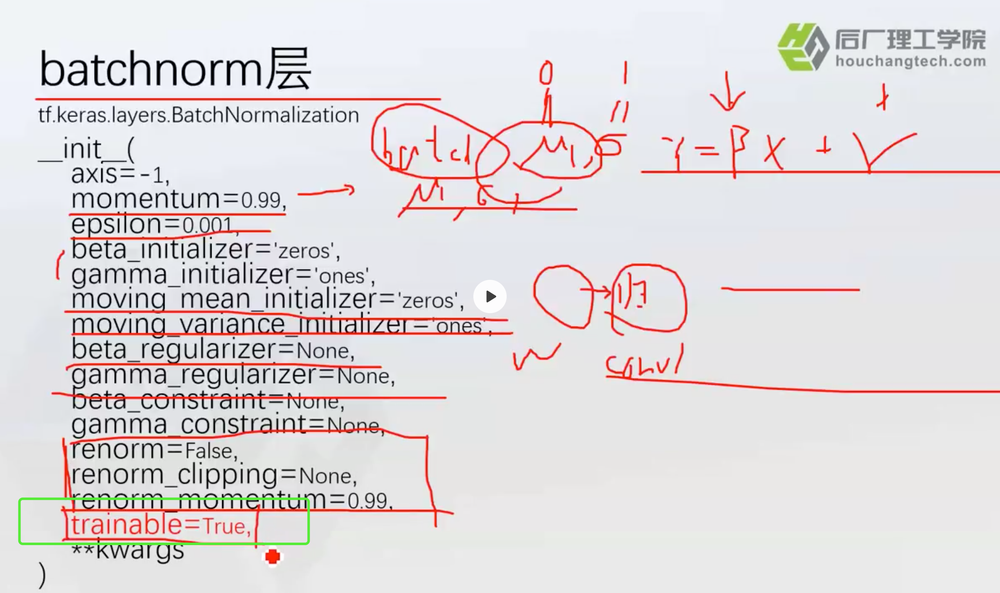
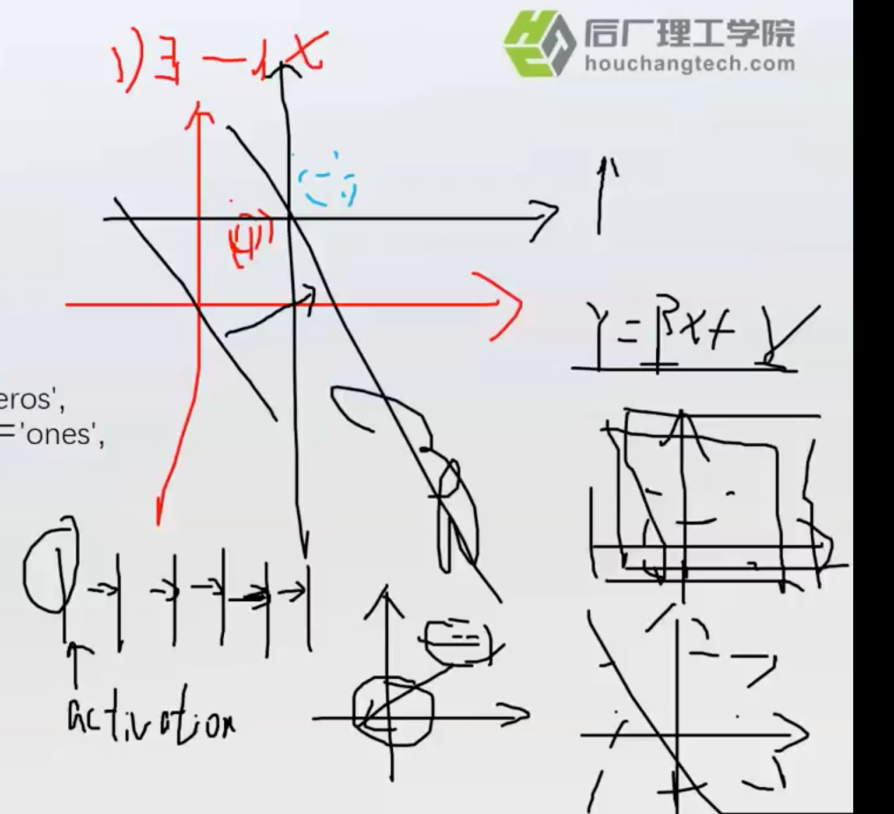

# tensorflow2.0

## tf2.0和tf1.x1区别

- tf1.x：静态图

  每次编译都是固定的

- Tf2.x：动态图

## checkpoints

- 只保存权重

## dropout

- ==0.5 代表50%的神经元被删除了

## batchnorm

- 在训练，测试的时候，会用到不同的参数

  

- 为什么要使用Batchnorm?

  1. 因为经过非线性激活函数后，可能数据会变得很奇怪。

  2. 所以有人提出考虑，在每一层进行一个归一化，但是会产生问题，导致在每一层学到的东西就没了。所以做完归一化后，可以使用一个$$y=W_1x+W_2$$,其中$$W_1, W_2$$ 是根据我们的数据拟合出来的。

  3. batchnorm就是在速度和效果方面做一个权衡。

     

