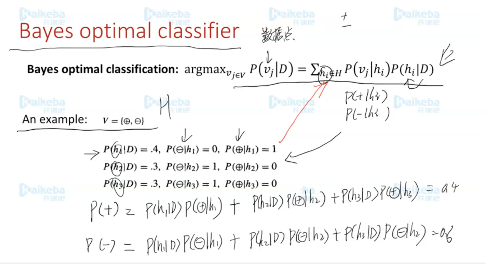
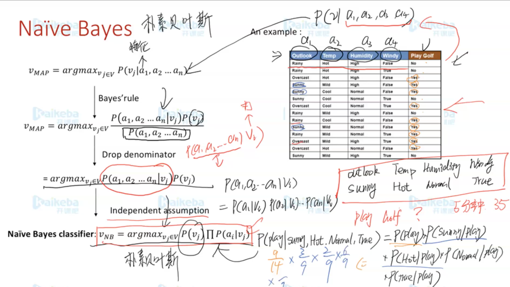
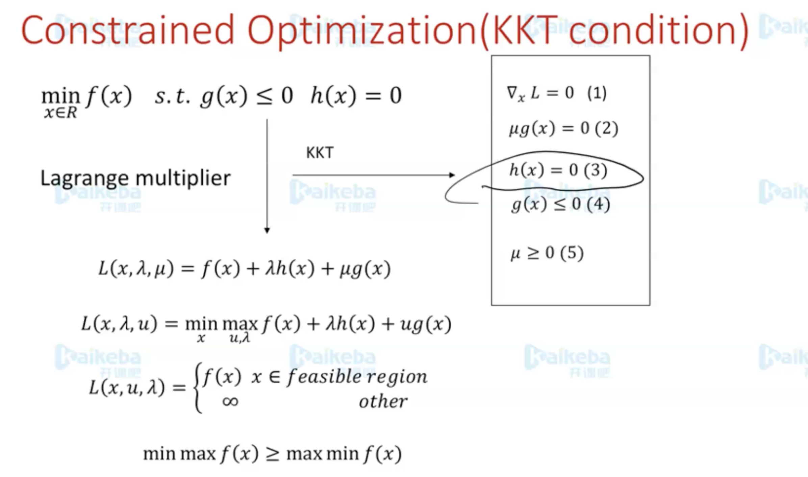
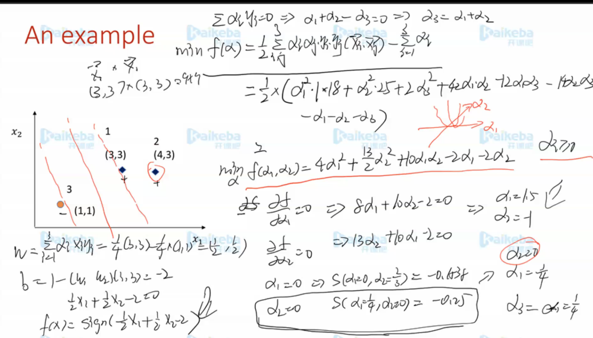

# 经典机器学习

## 深度学习存在的问题

1. 不能一味扩充模型的大小，维度上升，特征数的上升，计算成本变高，也会导致过拟合等
2. 很依赖数据，但是获取高质量的数据成本很高

## 贝叶斯

- 需要便利H，但是H可能很多，所以计算很难实现，所以后面引入朴素贝叶斯算法

## KKT条件

等式不等式放在一起，叫做KKT条件。

支持向量机直到2012年被深度学习替代

## SVM优缺点

### 优点

1. 可以得到全局最优
2. 通过kernal可以支持非线性
3. 不会带来维度灾难
4. 具有可解释性

### 缺点

1. 计算复杂度比较高
2. 本质上是一个二分类，如果需要进行多分类，需要按照二分类为单元

