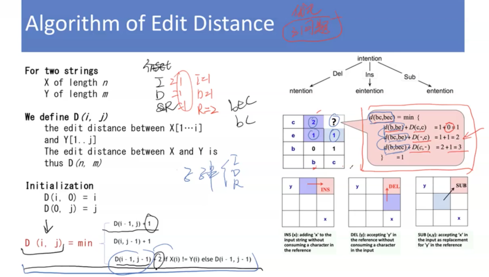
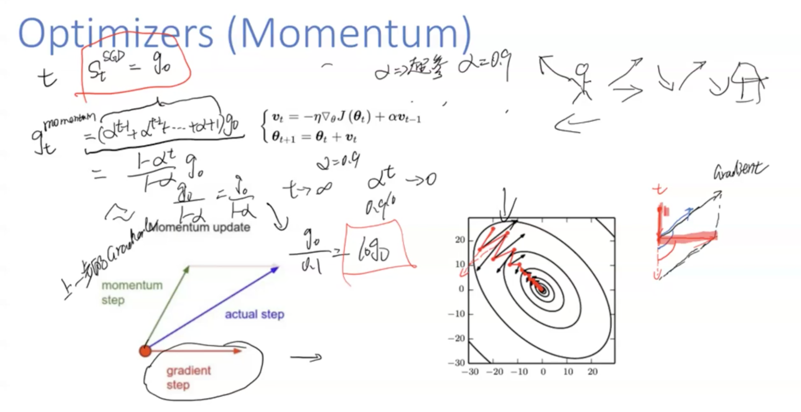
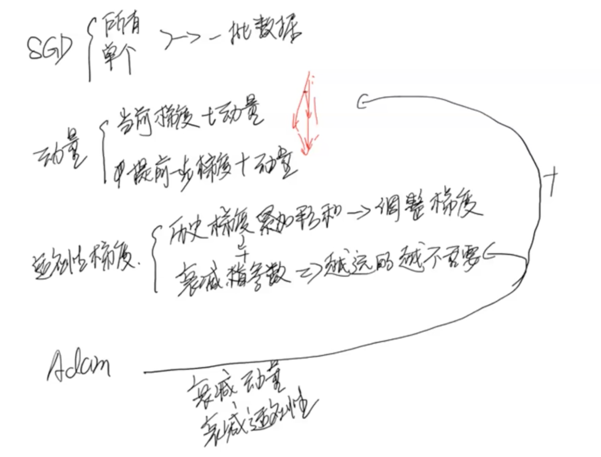

## 装饰器

- 可以在不改变函数内部代码的情况下，增加一些其他的功能

- 贪心得到的不一定是最优的，可能是局部最优，不是递归，每次都选取最优的，但是不能保证是全局最优的

- 情况1: 删除，当两个字符串相差一个时，就删除其中一个，编辑距离为1
- 情况2: 插入，插入一个字符，默认编辑距离为1
- 情况3: 替换，替换时，默认编辑距离为2，可以使用

## Momentum优化

基于动量

# **不同梯度下降**

## 批量梯度下降

**批量梯度下降法**（Batch Gradient Descent，简称BGD）是梯度下降法最原始的形式，它的具体思路是在更新每一参数时都使用所有的样本来进行更新，也就是方程（1）中的m表示样本的所有个数。

**优点：**全局最优解；易于并行实现；

**缺点：**当样本数目很多时，训练过程会很慢。

## 随机梯度下降

**随机梯度下降法**：它的具体思路是在更新每一参数时都使用一个样本来进行更新，也就是方程（1）中的m等于1。每一次跟新参数都用一个样本，更新很多次。如果样本量很大的情况（例如几十万），那么可能只用其中几万条或者几千条的样本，就已经将theta迭代到最优解了，对比上面的批量梯度下降，迭代一次需要用到十几万训练样本，一次迭代不可能最优，如果迭代10次的话就需要遍历训练样本10次，这种跟新方式计算复杂度太高。

但是，SGD伴随的一个问题是噪音较BGD要多，使得SGD并不是每次迭代都向着整体最优化方向。

**优点：**训练速度快；

**缺点：**准确度下降，并不是全局最优；不易于并行实现。

从迭代的次数上来看，SGD迭代的次数较多，在解空间的搜索过程看起来很盲目。

## **小批量梯度下降法**

小批量梯度下降法（Mini-batch Gradient Descent，简称MBGD）：它的具体思路是在更新每一参数时都使用一部分样本来进行更新，也就是方程（1）中的m的值大于1小于所有样本的数量。为了克服上面两种方法的缺点，又同时兼顾两种方法的有点。

## **三种方法使用的情况：**

如果样本量比较小，采用批量梯度下降算法。如果样本太大，或者在线算法，使用随机梯度下降算法。在实际的一般情况下，采用小批量梯度下降算法。

- 以上内容可以在花书中看到

