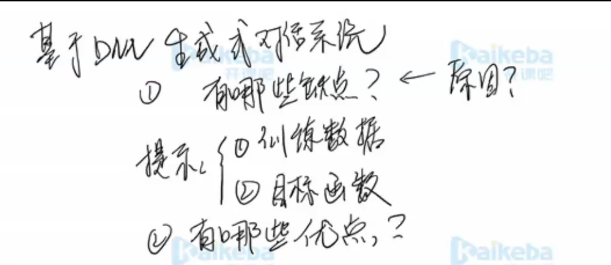
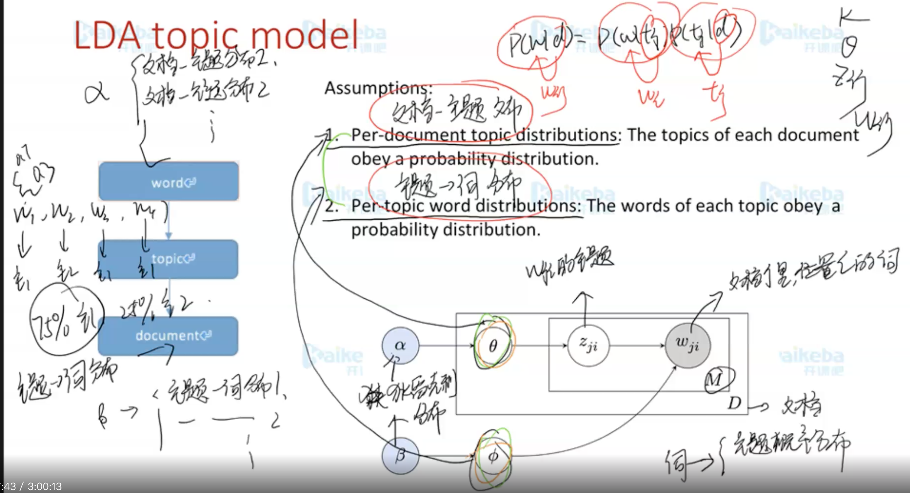

# **自然语言理解的关键问题**

## 基于DNN生成式对话系统有哪些缺点，优点

**缺点：**

1. 训练数据

   依赖训练数据等数量，质量

2. 目标函数

   不具有可解释性

**优点：**

实现简单，不依赖规则，数据，模型泛化性好

## LDA

- gensim中库
- 模型需要学习两个分布，通过采样分布
  1. 文档-主题分布
  2. 主题-词分布
- 无监督学习
- 通过最后词的结果，判断主题
- 要先确定主题数
- 训练过程
  1. 文档中每个词赋与一个主题
  2. 吉布斯采样，通过采样方式重新确定主题，直到最后所有词收敛
  3. 训练完之后可以得到主题下的词分布、文档-主题分布
  4. 最后所有词都会得到一个相应的主题。

## 命名实体识别

