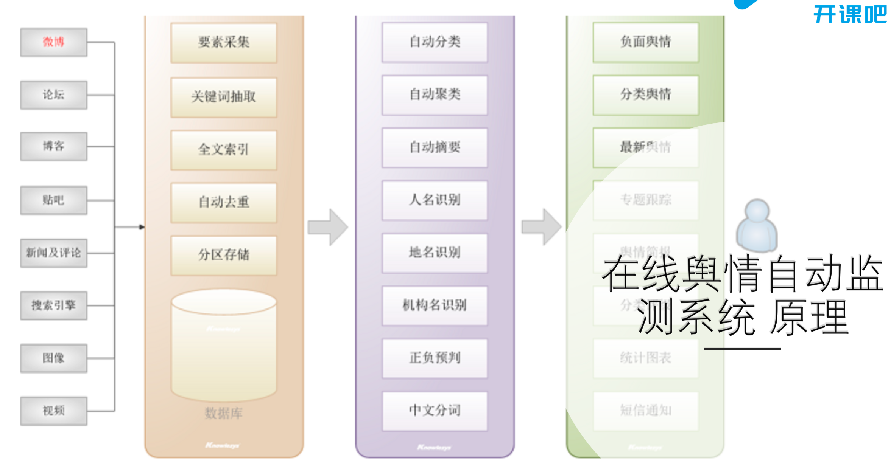
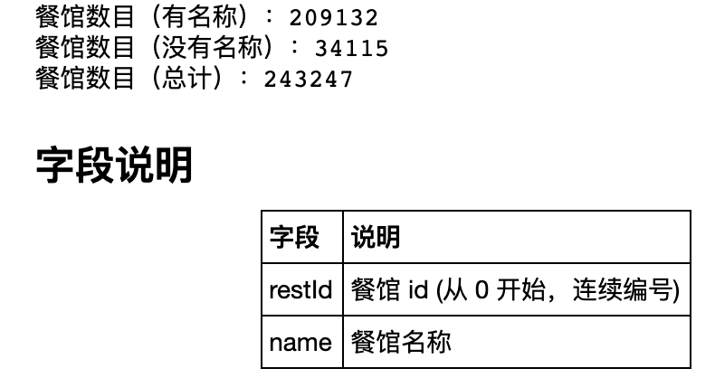
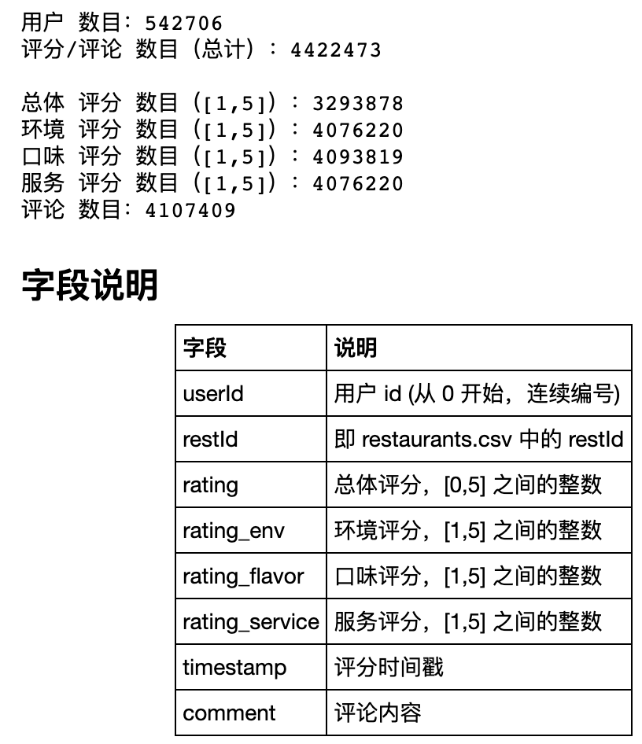

# **项目简介**

在线舆情自动检测系统

按照要求，返回一些你关注的信息。比如你要关注顾客给你 店铺的差评，从而你可以改进自己的店铺； 或者你要关注其他店铺的好评然后看其他店铺的优点并学习。

舆情分析系统的核心技术在于舆情分析引擎，涉及的最主要的技术包括文本分类、聚类、观点倾 向性识别、主题检测与跟踪、自动摘要等计算机 文本信息内容识别技术。

# **数据获取**

## 爬虫技术

根据相应任务，爬取数据

### 网络请求

### 爬虫流程控制模块

### 内容分析提取模块

## **直接下载数据**

### 餐馆数据

- <https://github.com/SophonPlus/ChineseNlpCorpus/blob/master/datasets/yf_dianping/intro.ipynb>

# **数据预处理**

1. 提取出相关内容
2. 提取出关键词，以及对应的文本内容（多分类）
3. 消极，积极评论区分（二分类）

# **情感分析**

抽取出评论中的一些涉及观点的名词形容词短语， 通过情感分类技术确定其观点的情感倾向。

二分类：消极；积极

## 打标签

先确定消极，积极评论标签，如何根据不同评分进行衡量

## 模型

RNN,GRU,LSTM,CNN,FNN,Transformer

## **模型训练**

# **爬虫实时监控**

# **项目部署**

## **输入**

文章

## **输出**

文章的情感消极，积极分类

