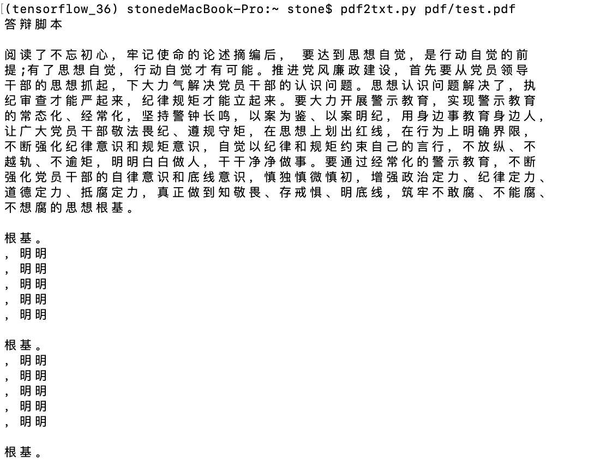

# **0. 项目简介**

PDF文档关键信息自动高亮

## 项目流程

1. PDF转HTML
2. PDF转文本
3. 文本关键词提取
4. 解析第1步骤中的HTML标签，匹配第3步骤中提取的关键词，修改标签进行高亮（FSM算法）
5. Bottle/Flask进行部署

# **1. PDF转成HTML**

## pdf转html（pdf）

- <https://github.com/coolwanglu/pdf2htmlEX>

### 安装

- <https://pypi.org/project/pdfminer/>

`pip install pdfminer`(此方法安装出错，错误日志如下)

~~~
(tensorflow_36) stonedeMacBook-Pro:~ stone$ pip install pdfminer
Collecting pdfminer
  Using cached https://files.pythonhosted.org/packages/71/a3/155c5cde5f9c0b1069043b2946a93f54a41fd72cc19c6c100f6f2f5bdc15/pdfminer-20191125.tar.gz
Collecting pycryptodome (from pdfminer)
  Downloading https://files.pythonhosted.org/packages/b1/b2/bfb57f69150322680c126f542e1a49fc1bd17c107e9b5e981ae79ecf9b42/pycryptodome-3.9.7-cp36-cp36m-macosx_10_6_intel.whl (13.3MB)
     |██▏                             | 911kB 6.9kB/s eta 0:30:12ERROR: Exception:
Traceback (most recent call last):
  File "/Users/stone/anaconda3/envs/tensorflow_36/lib/python3.6/site-packages/pip/_vendor/urllib3/contrib/pyopenssl.py", line 294, in recv_into
    return self.connection.recv_into(*args, **kwargs)
  File "/Users/stone/anaconda3/envs/tensorflow_36/lib/python3.6/site-packages/OpenSSL/SSL.py", line 1840, in recv_into
    self._raise_ssl_error(self._ssl, result)
  File "/Users/stone/anaconda3/envs/tensorflow_36/lib/python3.6/site-packages/OpenSSL/SSL.py", line 1646, in _raise_ssl_error
    raise WantReadError()
OpenSSL.SSL.WantReadError
~~~

- **上述错误解决**：隔一天，重新下载了pip了一下，可以了

~~~
(tensorflow_36) stonedeMacBook-Pro:~ stone$ pip install pdfminer
Collecting pdfminer
  Using cached https://files.pythonhosted.org/packages/71/a3/155c5cde5f9c0b1069043b2946a93f54a41fd72cc19c6c100f6f2f5bdc15/pdfminer-20191125.tar.gz
Collecting pycryptodome (from pdfminer)
  Downloading https://files.pythonhosted.org/packages/b1/b2/bfb57f69150322680c126f542e1a49fc1bd17c107e9b5e981ae79ecf9b42/pycryptodome-3.9.7-cp36-cp36m-macosx_10_6_intel.whl (13.3MB)
     |████████████████████████████████| 13.3MB 10kB/s 
Building wheels for collected packages: pdfminer
  Building wheel for pdfminer (setup.py) ... done
  Stored in directory: /Users/stone/Library/Caches/pip/wheels/e1/00/af/720a55d74ba3615bb4709a3ded6dd71dc5370a586a0ff6f326
Successfully built pdfminer
Installing collected packages: pycryptodome, pdfminer
Successfully installed pdfminer-20191125 pycryptodome-3.9.7
~~~


### **使用**

1. `pdf2txt.py samples/simple1.pdf`(没有试这种方法)
2. `docker run -ti --rm -v ~/pdf:/pdf bwits/pdf2htmlex pdf2htmlEX --zoom 1.3 test.pdf`

~~~
(base) stonedeMacBook-Pro:~ stone$ docker run -ti --rm -v ~/pdf:/pdf bwits/pdf2htmlex pdf2htmlEX --zoom 1.3 test.pdf
Preprocessing: 1/1
Working: 1/1
~~~


## Docker搭建

- 输入pdf文件，输出html文件

- <https://hub.docker.com/r/bwits/pdf2htmlex/>

# **2. PDF中的文字提取**

## PDFMiner

- 使用 PDFMiner 等Python包，获得一块一块的pdf文本文字

- <https://pypi.org/project/pdfminer/>
  PDFMiner 是用于PDF文档的文本提取工具
  
  

```
> pdf2txt.py [-P password] [-o output] [-t text|html|xml|tag]
             [-O output_dir] [-c encoding] [-s scale] [-R rotation]
             [-Y normal|loose|exact] [-p pagenos] [-m maxpages]
             [-S] [-C] [-n] [-A] [-V]
             [-M char_margin] [-L line_margin] [-W word_margin]
             [-F boxes_flow] [-d]
             input.pdf ...
```

- `-P password` : PDF password.
- `-o output` : Output file name.
- `-t text|html|xml|tag` : Output type. (default: automatically inferred from the output file name.)
- `-O output_dir` : Output directory for extracted images.
- `-c encoding` : Output encoding. (default: utf-8)
- `-s scale` : Output scale.
- `-R rotation` : Rotates the page in degree.
- `-Y normal|loose|exact` : Specifies the layout mode. (only for HTML output.)
- `-p pagenos` : Processes certain pages only.
- `-m maxpages` : Limits the number of maximum pages to process.
- `-S` : Strips control characters.
- `-C` : Disables resource caching.
- `-n` : Disables layout analysis.
- `-A` : Applies layout analysis for all texts including figures.
- `-V` : Automatically detects vertical writing.
- `-M char_margin` : Speficies the char margin.
- `-W word_margin` : Speficies the word margin.
- `-L line_margin` : Speficies the line margin.
- `-F boxes_flow` : Speficies the box flow ratio.
- `-d` : Turns on Debug output.

## pdfplumber

- Pdfplumber是一个可以处理pdf格式信息的库。可以查找关于每个文本字符、矩阵、和行的详细信息，也可以对表格进行提取并进行可视化调试。
- 参考：<https://blog.csdn.net/Elaine_jm/article/details/84841233>

~~~
import pdfplumber

pdf_name = "pdf/input/1.pdf"
with pdfplumber.open(pdf_name) as pdf:
    for page in pdf.pages:
        page_txt = page.extract_text()
        # 获取文本，直接得到字符串，包括了换行符【与PDF上的换行位置一致，而不是实际的“段落”】
        print(page_txt)
~~~

# **3. KEYWORDs，关键词提取**

- 使用关键词提取技术、word embedding 词向量技术

- 使用 TextRank 或者 TFIDF 获得关键词；使用 word embedding 获得与输入单词接

  近的单词；输出这些单词

# **4. HTML文件自动高亮**

- 解析HTML的Tag，修改 Tag 将PDF文本高亮

​       **参考网址：**<https://segmentfault.com/a/1190000016746396>，<https://m.yisu.com/zixun/3098.html>，<https://blog.csdn.net/Yellow_python/article/details/100516921>

~~~python
from bs4 import BeautifulSoup
# 打开html文件
soup = BeautifulSoup(open("pdf/test1.html"))
print(type(soup))
# 返回所有tag列表
print(soup.find_all('a'))
# 返回一个标签名为"a"的Tag
print(soup.find("a"))
~~~

- 需要用到一个 Finite State Machine算法

# **5. Bottle/Flask进行部署**

