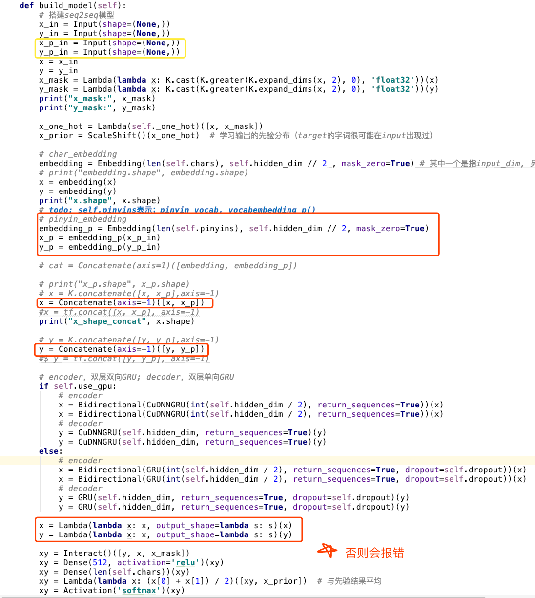
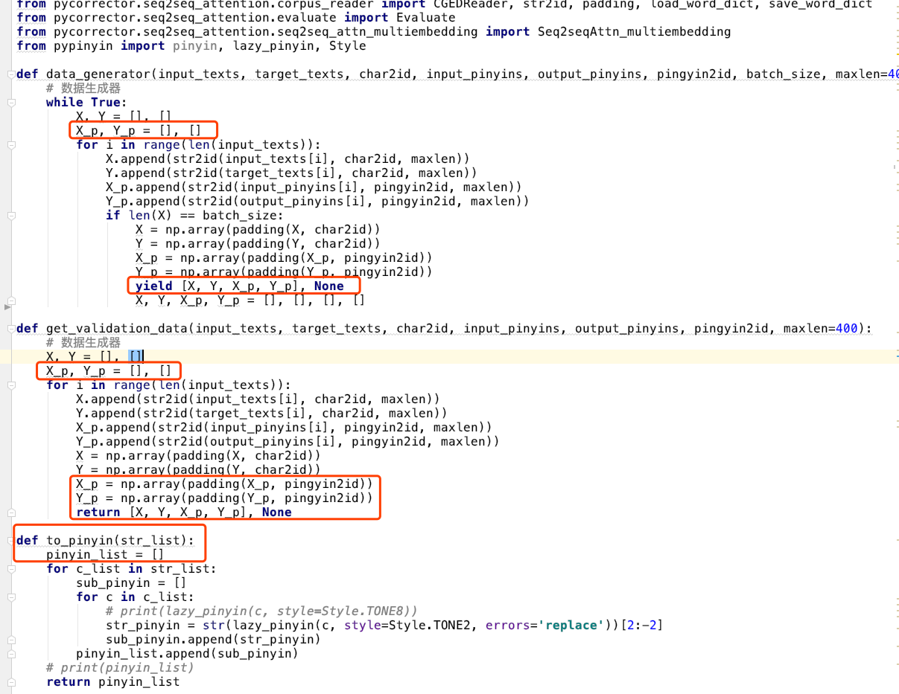
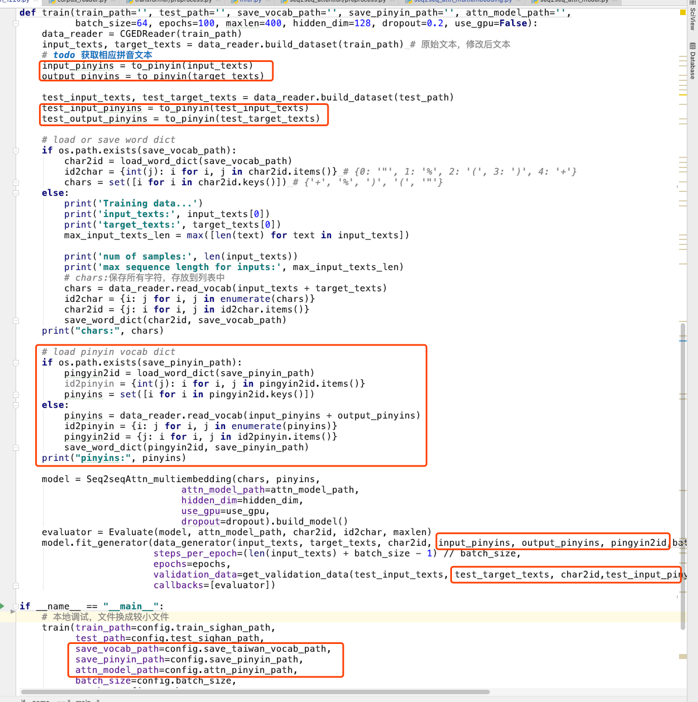

# 介绍

- 在原有此向量基础上，添加拼音词向量
- 词向量拼接那块卡了很久

~~~
import numpy as np
import tensorflow as tf

a=tf.constant(np.array([[1 , 2, 3]]))
b=tf.constant(np.array([[3,2,2]]))
c1=tf.concat([a,b],axis=0)
c2=tf.concat([a,b],axis=1)

sess=tf.Session()
sess.run(tf.global_variables_initializer())
sess.run(c1)
Out[10]: 
array([[1, 2, 3],
       [3, 2, 2]])
sess.run(c2)
Out[11]: array([[1, 2, 3, 3, 2, 2]])
————————————————
版权声明：本文为CSDN博主「喵水军的近卫第76师」的原创文章，遵循 CC 4.0 BY-SA 版权协议，转载请附上原文出处链接及本声明。
原文链接：https://blog.csdn.net/qq_36810544/article/details/82968112
~~~

- 见代码`/Users/stone/PycharmProjects/pycorrector/pycorrector/seq2seq_attention/seq2seq_attn_multiembedding.py`和`/Users/stone/PycharmProjects/pycorrector/pycorrector/seq2seq_attention/train_1220.py`

`train.py`文件

# **存在问题**

~~~
4276/4276 [==============================] - 9622s 2s/step - loss: 0.8107 - val_loss: 1.9423
Traceback (most recent call last):
  File "train_1220.py", line 152, in <module>
    use_gpu=config.use_gpu)
  File "train_1220.py", line 126, in train
    callbacks=[evaluator])
  File "/usr/local/lib/anaconda3/lib/python3.6/site-packages/keras/legacy/interfaces.py", line 91, in wrapper
    return func(*args, **kwargs)
  File "/usr/local/lib/anaconda3/lib/python3.6/site-packages/keras/engine/training.py", line 1418, in fit_generator
    initial_epoch=initial_epoch)
  File "/usr/local/lib/anaconda3/lib/python3.6/site-packages/keras/engine/training_generator.py", line 251, in fit_generator
    callbacks.on_epoch_end(epoch, epoch_logs)
  File "/usr/local/lib/anaconda3/lib/python3.6/site-packages/keras/callbacks.py", line 79, in on_epoch_end
    callback.on_epoch_end(epoch, logs)
  File "../../pycorrector/seq2seq_attention/evaluate.py", line 67, in on_epoch_end
    target = gen_target(sent, self.model, self.char2id, self.id2char, self.maxlen)
  File "../../pycorrector/seq2seq_attention/evaluate.py", line 22, in gen_target
    proba = model.predict([xid, yid])[:, i, :]  # 预测
  File "/usr/local/lib/anaconda3/lib/python3.6/site-packages/keras/engine/training.py", line 1149, in predict
    x, _, _ = self._standardize_user_data(x)
  File "/usr/local/lib/anaconda3/lib/python3.6/site-packages/keras/engine/training.py", line 751, in _standardize_user_data
    exception_prefix='input')
  File "/usr/local/lib/anaconda3/lib/python3.6/site-packages/keras/engine/training_utils.py", line 102, in standardize_input_data
    str(len(data)) + ' arrays: ' + str(data)[:200] + '...')
ValueError: Error when checking model input: the list of Numpy arrays that you are passing to your model is not the size the model expected. Expected to see 4 array(s), but instead got the following list of 2 arrays: [array([[ 751, 2961, 3327, 4474,  160, 3795, 1508,  269, 1603,  821, 3511,
         269, 5076, 1838, 2265, 3327,  221,   93],
       [ 751, 2961, 3327, 4474,  160, 3795, 1508,  269, 1603,  821, 3511,
~~~

## 解决办法

- 问题貌似是出在evaluate那一部分， 先暂时把那一部分去掉。