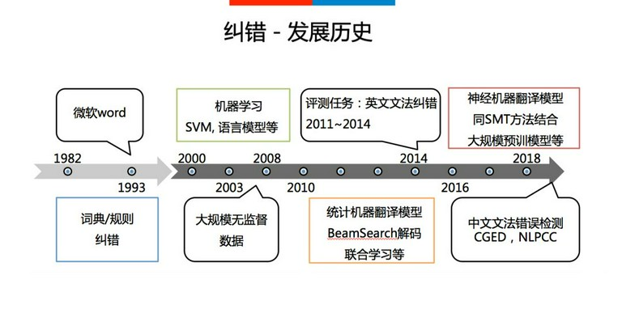
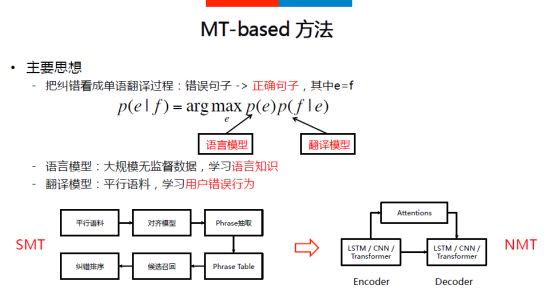
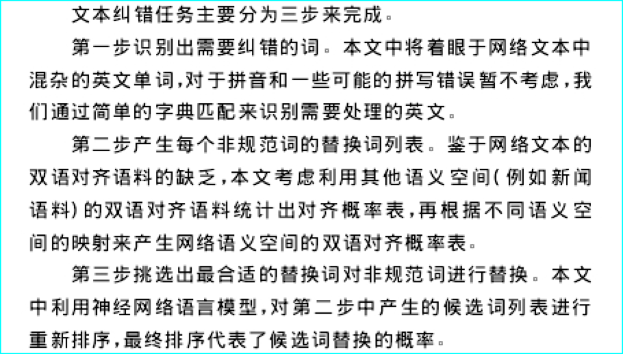

# **研究背景**

中文文本纠错，常见类型包括：

谐音字词纠错，如 配副眼睛-配副眼镜
混淆音字词纠错，如 流浪织女-牛郎织女
字词顺序颠倒纠错，如 伍迪艾伦-艾伦伍迪
字词补全，如 爱有天意-假如爱有天意
形似字纠错，如 高梁-高粱
中文拼音推导，如 xingfu-幸福
中文拼音缩写推导，如 sz-深圳
语法错误，如 想象难以-难以想象

文本纠错任务包括对于文本中的错误检测和纠正。这项任务在NLP领域至关重要，是后续应用任务比如搜索引擎，自动文本打分的基础，文本纠错错误不仅有可能会影响阅读，同时还有可能会完全改变整个文本框架的含义。尤其是在中文语言处理中，拼音错误可能更加严重，因为它们有可能会进一步影响基础自然语言处理任务比如分词等等。

因为数据量的限制，所以很多经典的有监督的学习方法很少在文本纠错领域有所应用，所以也进一步限制了CSC的房展。

当前也有很多主流的方法，聚焦于适用非监督的学习方法。比如语言模型，因此CSC的技术比较受限制，并且CSC的进展到现在为止也没有很令人满意。

CSC面临的一个最大的挑战是大规模有标签数据的不适用，以及标注拼音错误是一件昂贵和有挑战性的工作。

中文拼写错误大多是来自于字形相似性和拼音相似所导致的错误，这是因为，中文作为一种象形文字，数量种类多达7000多个。并且研究中发现现代中文中，常用的音节数量一共是398中。因此众多中文汉字共享相同的发音，这也进一步导致了P类型的错误。

# **国内外研究现状**

在现有文本纠错研究领域中，大多是基于英文的文本纠错，英文文本纠错和中文文本纠错还是存在一定区别。其中包括英文文本中存在单词边界，而中文文本中则不存在词边界。所以在研究中，进行纠错时需要考虑上下文。另一方面英文字符集仅有26个，而中文常用字符集就多达三千多。

中文本纠错的方法，整体来看，一般可以分为以下几个部分，首先是错误识别，可以判断文本是否存在错误需要纠正，如果存在则传递到后面两层。然后是纠正候选阶段，该阶段主要目的在于，利用一种或多种策略（规则或模型），生成针对原句的纠正候选。这一阶段是整体流程召回率的保证，同时也是一个模型的上限。该阶段主要目的在于，在上一阶段基础上，利用某种评分函数或分类器，结合局部乃至全局的特征，针对纠正候选进行排序，最终排序最高（如没有错误识别阶段，则仍需比原句评分更高或评分比值高过阈值，否则认为不需纠错）的纠正候选作为最终纠错结果。大部分的模型基本上可以划分为这三阶段，大多模型省略第一阶段，认为所有文本都默认需要纠正，部分模型会将三阶段联合建模，在逐个构造候选的同时进行评分和筛选，本质上都属于这个框架。

1. 错误检测部分先通过结巴中文分词器切词，由于句子中含有错别字，所以切词结果往往会有切分错误的情况，这样从字粒度和词粒度两方面检测错误， 整合这两种粒度的疑似错误结果，形成疑似错误位置候选集；
2. 错误纠正部分，是遍历所有的疑似错误位置，并使用音似、形似词典替换错误位置的词，然后通过语言模型计算句子困惑度，对所有候选集结果比较并排序，得到最优纠正词。

纠错技术相对于词法分析，句法分析等受到的关注一直较小，一方面是因为文本出错的比例比较小，在一些重要场合，也有专门人员进行校验；另一方面本身问题也相对较难，其要求计算机对语言规则以及文本语义有深刻的理解。在2000年以前，业界主要依靠长期积累的纠错规则和纠错词典来进行纠错，比如微软的文档编辑产品WORD即采用这种方法。随着机器学习技术的发展，纠错问题受到了学术界和工业界越来越多的关注，其中有两大主流方法：一种解决思路是将语言错误归类，然后采用Maxent、SVM等分类方法对这些类别进行重点识别；另外一种思路是借鉴统计机器翻译（SMT）的思想，将语言纠错等价为机器翻译的过程，即错误文本翻译为正确文本，并随之出现了一系列的优化方法。最近几年，随着神经机器翻译（NMT）技术的快速发展，人们逐步将SMT与NMT技术结合起来解决纠错问题。最近几年中文纠错的研究也得到较多的关注和发展，并陆续举办了几届中文纠错评测，例如CGED与NLPCC等。

目前，基于机器翻译的方法已经成为文本纠错的主流技术，主要思想是把纠错看成同种语言中错误句子翻译为正确句子的过程，如上图中的公式所示，其核心由语言模型和翻译模型组成。语言模型学习语言规则、语言知识；翻译模型从平行语料中学习用户的纠错行为。SMT纠错一般的典型做法：首先基于平行语料训练对齐模型，得到多粒度（字、词、音、形、短语）的混淆矩阵（Phrase Table）；针对具体的纠错实例，基于句子中的错误点从Phrase Table中召回可能的正确候选，然后基于句子语义理解，对这些纠错候选进行排序，从而得到正确的结果。

而NMT方法主要依赖于大规模的监督语料，忽略掉中间的各种步骤，直接实现端到端的学习。NMT方法相对于SMT方法的优势在于避免了SMT每一步过程中导致的错误传递，同时具有更强大的学习能力。

早期的文本纠错领域主要依靠长期积累的语法规则和纠错词典来进行纠错。该解决思路主要是分为两步走，分别是错误检测和错误纠正。

基于话题翻译模型的双语文本纠错

 

文本纠错的工作可以看作是机器翻译的工作，文本中混杂的非规范词看作是源文本，其对应的规范词看作是目标文本。对于相同语义空间的文本来说，很容易训练出一个翻译模型来解决文本纠错的问题。但是由于社交网络训练语料的匮乏，而
其它语义空间双语对齐语料相比很容易获得。最好的方法是能够利用其它语义空间的双语对齐语料，进行一些调整来适应网络文本语义空间。Liu 等［7］提出了一种话题翻译模型，根据其它语义空间的双语对齐语料和目标语义空间的话题分布进行映射，最终可以得到一个训练语料充足且适应性强的模型。文中利用了隐藏马尔可夫话题模型，由 Gruber 等［9］在 2007 年提出。该模型将文档中词的话题看作一条马尔可夫链，假定相同句子和相邻句子中的词应该属于相同的话题，来计算话题分布。最终可以得到每个话题下产生单词的概率( 单词 | 话题) 和每个句子属于某个话题的概率( 话题| 句子) 。

# **数据**

中文输入纠错的评测数据主要包括 SIGHAN Bake-off 2013/2014/2015 这三个数据集，均是针对繁体字进行的纠错。

见文件夹`public data`

## **公开数据集**

## **其他数据**

**形近字典**

`/Users/stone/PycharmProjects/correction/data/simp.pickle`

**音近字典**

`/Users/stone/PycharmProjects/correction/data/SimilarPronunciation.txt`

**常用字表**

`/Users/stone/PycharmProjects/correction/data/cncorpus/现代汉语常用字表.xls`

# **评估指标**

虽然文本纠错具体会分为错误识别和错误修正两部分，并分别构造评价指标。但考虑到端到端任务，我们评价完整的纠错过程：

该纠的，即有错文本记为 P，不该纠的，即无错文本记为 N
对于该纠的，纠对了，记为 TP，纠错了或未纠，记为 FP
对于不该纠的，未纠，记为 TN，纠了，记为 FN。
通常场景下，差准比查全更重要，FN 更难接受，可构造下述评价指标：

# **写作框架**

无监督，改进的decoder

## 方法模型

### witnesses寻找

该方法是用来寻找重复文本，作为输入数据，利用之间的互补性

1. 语言模型
2. 编辑距离

### 改进的encoder， decoder模型

一个是宏观图，另一个是详细内部结构图

1. encoder层
2. decoder层
3. 多输入encoder，decoder

## **实验**

### 数据

**OCR数据**

1. 法律卷宗扫描件(图片数据)
2. 法律文书集
3. 程序批量生成数据
4. 字形相似字典

**ASR数据**

1. 台湾拼音数据集
2. 字音相似字典
3. 人民日报语料库

**公开数据集**

### 评估指标

**自动评估**

**人为评估**

### baselines 

# **参考网址**

- <https://mlnote.com/2017/04/09/Reading-Notes-of-Error-Correction/>

[Karen Kukich](https://dblp.uni-trier.de/pers/hd/k/Kukich:Karen):
**Techniques for Automatically Correcting Words in Text.** [ACM Comput. Surv. 24(4)](https://dblp.uni-trier.de/db/journals/csur/csur24.html#Kukich92): 377-439 (1992)

[1]张俊祺. 面向领域的语音转换后文本纠错研究[D].华南理工大学,2019.

在中文查错方面，主要有三种类型的方法[24]
：1、利用文本上下的字、词和
词性等局部语言特征，2、利用转移概率对相邻的词间进行评估。3、利用规则或语言学
知识，如语法规则，搭配规则等。这三种方法各有优缺点，因此也有学者三种方法混合
使用。而在中文纠错方面，学者的研究大多针对不同错误类型来进行纠正。东北大学[
29]
提出模式匹配的方式，对长词进行纠错处理。IBM 中国研究中心[
30]提出用替换字表的方
法来对侦测出来的错误给出纠正建议，用于对形近字和近音字的纠正，但该方法局限于
替换字表。石敏[
28]提出用结合二元模型和上下文语境模型，从列表中选取正确的同音词，
该方法主要针对同音错误。

