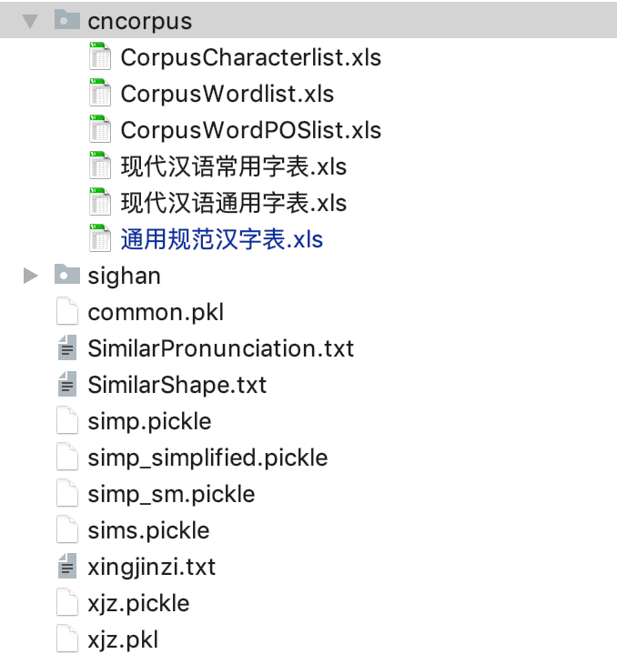
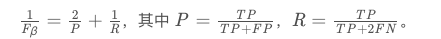
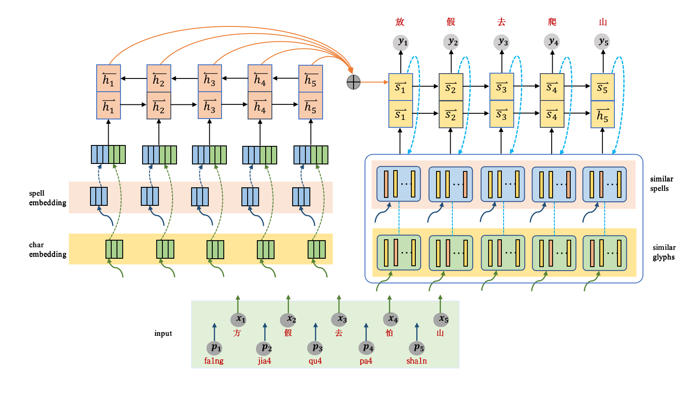

# **研究背景**

中文文本纠错，常见类型包括：

谐音字词纠错，如 配副眼睛-配副眼镜
混淆音字词纠错，如 流浪织女-牛郎织女
字词顺序颠倒纠错，如 伍迪艾伦-艾伦伍迪
字词补全，如 爱有天意-假如爱有天意
形似字纠错，如 高梁-高粱
中文拼音推导，如 xingfu-幸福
中文拼音缩写推导，如 sz-深圳
语法错误，如 想象难以-难以想象

文本纠错任务包括对于文本中的错误检测和纠正。这项任务在NLP领域至关重要，是后续应用任务比如搜索引擎，自动文本打分的基础，文本纠错错误不仅有可能会影响阅读，同时还有可能会完全改变整个文本框架的含义。尤其是在中文语言处理中，拼音错误可能更加严重，因为它们有可能会进一步影响基础自然语言处理任务比如分词等等。

因为数据量的限制，所以很多经典的有监督的学习方法很少在文本纠错领域有所应用，所以也进一步限制了CSC的房展。

当前也有很多主流的方法，聚焦于适用非监督的学习方法。比如语言模型，因此CSC的技术比较受限制，并且CSC的进展到现在为止也没有很令人满意。

CSC面临的一个最大的挑战是大规模有标签数据的不适用，以及标注拼音错误是一件昂贵和有挑战性的工作。

中文拼写错误大多是来自于字形相似性和拼音相似所导致的错误，这是因为，中文作为一种象形文字，数量种类多达7000多个。并且研究中发现现代中文中，常用的音节数量一共是398中。因此众多中文汉字共享相同的发音，这也进一步导致了P类型的错误。

# **目前研究**

在现有文本纠错研究领域中，大多是基于英文的文本纠错，英文文本纠错和中文文本纠错还是存在一定区别。其中包括英文文本中存在单词边界，而中文文本中则不存在词边界。所以在研究中，进行纠错时需要考虑上下文。另一方面英文字符集仅有26个，而中文常用字符集就多达三千多。

中文本纠错的方法，整体来看，一般可以分为以下几个部分，首先是错误识别，可以判断文本是否存在错误需要纠正，如果存在则传递到后面两层。然后是纠正候选阶段，该阶段主要目的在于，利用一种或多种策略（规则或模型），生成针对原句的纠正候选。这一阶段是整体流程召回率的保证，同时也是一个模型的上限。该阶段主要目的在于，在上一阶段基础上，利用某种评分函数或分类器，结合局部乃至全局的特征，针对纠正候选进行排序，最终排序最高（如没有错误识别阶段，则仍需比原句评分更高或评分比值高过阈值，否则认为不需纠错）的纠正候选作为最终纠错结果。大部分的模型基本上可以划分为这三阶段，大多模型省略第一阶段，认为所有文本都默认需要纠正，部分模型会将三阶段联合建模，在逐个构造候选的同时进行评分和筛选，本质上都属于这个框架。

# **数据**

中文输入纠错的评测数据主要包括 SIGHAN Bake-off 2013/2014/2015 这三个数据集，均是针对繁体字进行的纠错。

见文件夹`public data`

## **公开数据集**

## **其他数据**

**形近字典**

`/Users/stone/PycharmProjects/correction/data/simp.pickle`

**音近字典**

`/Users/stone/PycharmProjects/correction/data/SimilarPronunciation.txt`

**常用字表**

`/Users/stone/PycharmProjects/correction/data/cncorpus/现代汉语常用字表.xls`

# **评估指标**

虽然文本纠错具体会分为错误识别和错误修正两部分，并分别构造评价指标。但考虑到端到端任务，我们评价完整的纠错过程：

该纠的，即有错文本记为 P，不该纠的，即无错文本记为 N
对于该纠的，纠对了，记为 TP，纠错了或未纠，记为 FP
对于不该纠的，未纠，记为 TN，纠了，记为 FN。
通常场景下，差准比查全更重要，FN 更难接受，可构造下述评价指标：

# **写作框架**

无监督，改进的decoder

## 方法模型

### witnesses寻找

该方法是用来寻找重复文本，作为输入数据，利用之间的互补性

1. 语言模型
2. 编辑距离

### 改进的encoder， decoder模型

一个是宏观图，另一个是详细内部结构图

1. encoder层
2. decoder层
3. 多输入encoder，decoder

## **实验**

### 数据

**OCR数据**

1. 法律卷宗扫描件(图片数据)
2. 法律文书集
3. 程序批量生成数据
4. 字形相似字典

**ASR数据**

1. 台湾拼音数据集
2. 字音相似字典
3. 人民日报语料库

**公开数据集**

### 评估指标

**自动评估**

**人为评估**

### baselines 

# **参考网址**

- <https://mlnote.com/2017/04/09/Reading-Notes-of-Error-Correction/>

