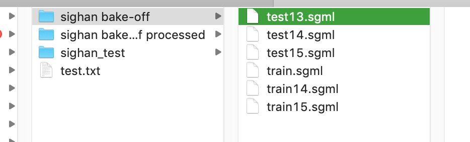

# 正则匹配格式处理

**数据格式处理部分见文件：**`/Users/stone/PycharmProjects/ocr_Correction/data_process/fanti2jianti.py`

- 繁体转简体
- 训练集，测试集格式转换


~~~python
# -*- coding: utf8 -*-
def test_opencc():
    import opencc
    cc = opencc.OpenCC('t2s')
    print(cc.convert(u'Open Chinese Convert（OpenCC）「開放中文轉換」，是一個致力於中文簡繁轉換的項目，提供高質量詞庫和函數庫(libopencc)。'))

from zhtools.langconv import *

def Traditional2Simplified(sentence):
    '''
    将sentence中的繁体字转为简体字
    :param sentence: 待转换的句子
    :return: 将句子中繁体字转换为简体字之后的句子
    '''
    sentence = Converter('zh-hans').convert(sentence)
    return sentence

def T2S_test():
    traditional_sentence = '憂郁的臺灣烏龜'
    simplified_sentence = Traditional2Simplified(traditional_sentence)
    print(simplified_sentence)

import re
# 正则匹配
# 讲错误的字替换为相应的正确的字
def find_text(text):
    word_dic = {}
    # m = re.match(u'<ESSAY title')
    reg = re.compile('<ESSAY title')
    # print(re.findall(u"<ESSAY title=\"(.+?)\">", text))
    sen_list = []
    for i in range(len(text)):

        if text[i].startswith("<PASSAGE"):
            sen_list.append(text[i][24:-11])
        elif text[i].startswith("<WRONG>") and text[i+1].startswith("<CORRECTION>"):
            word_dic[text[i][7:-9]] = text[i+1][12:-14]
    # print(sen_list)
    # print(word_dic)
    return sen_list, word_dic

# 语料替换,遍历原始语料库，如果在实体词典中存在，就替换，并且作为value值
def match_str(sen_list, word_dic):
    sen_dic = {}
    for c in sen_list:
        # print(c)
        for w in word_dic.keys():
            # print(w)
            if c.find(w) > 0:
                # print(w, word_dic[w])
                temp = c.replace(w, word_dic[w])
                # print(temp)
                sen_dic[c] = temp
                # break
    print(sen_dic)
    return sen_dic

def write_to_txt(file_path, sen_dict):
    with open(file_path, 'a', encoding='utf-8') as f:
        for c in sen_dict:
            f.write(c+" "+sen_dict[c])
            f.write('\n')

# 读取文件内容
def read_file(path):
    f = open(path, 'r', encoding='utf-8')
    text = f.readlines()
    # print(text)
    return text

import os
# 测试下句子
def T2S(file_path="/Users/stone/Documents/数据/public_data/Training/SIGHAN15_CSC_A2_Training.sgml"):
    # Todo
    traditional_text = read_file(file_path)
    sim_list = []
    for c in traditional_text:
        simplified_sentence = Traditional2Simplified(c)
        sim_list.append(simplified_sentence)
    # print(sim_list)
    s, d = find_text(sim_list)
    # print(s)
    # print(d)
    file_path = "../data/taiwan_spell.txt"
    write_to_txt(file_path, match_str(s, d))

if __name__=="__main__":
    # T2S_test()
    T2S()


~~~

## 数据格式进一步修改

- 完成日期：2019年12月16日

`/Users/stone/PycharmProjects/ocr_Correction/data/SIGHAN15_CSC_A2_Training_process.txt`

~~~
src: 但 是 我 不 能 去 参 加 ， 因 为 我 有 一 点 事 情 阿 ！
dst: 但 是 我 不 能 去 参 加 ， 因 为 我 有 一 点 事 请 阿 ！
src: 听 起 来 是 一 份 很 好 的 公 司 。 又 意 思 又 很 多 钱 。
dst: 听 起 来 是 一 份 很 好 的 公 司 。 有 意 思 又 很 多 钱 。
src: 因 为 我 下 个 礼 拜 有 很 重 要 的 考 试 ， 所 以 得 要 好 好 地 复 习 。
dst: 因 为 我 下 课 礼 拜 有 很 重 要 的 考 试 ， 所 以 得 要 好 好 地 复 习 。
~~~

- 结果：789 sentences

`/Users/stone/PycharmProjects/ocr_Correction/data/SIGHAN15_CSC_B2_Training_process.txt`

- 结果：1453 sentences

### **sighan数据全部处理完毕**

- 一共2015句子，900k+



处理结果见`sighan bnake-off processed`中

# **出现问题**

## 数据格式处理过程中产生问题

~~~
Traceback (most recent call last):
  File "/Users/stone/PycharmProjects/ocr_Correction/data_process/fanti2jianti.py", line 171, in <module>
    out_path="/Users/stone/Documents/correction_data/test2.txt")
  File "/Users/stone/PycharmProjects/ocr_Correction/data_process/fanti2jianti.py", line 145, in union_format_dir
    traditional_text = read_file(os.path.join(dir_path, text))
  File "/Users/stone/PycharmProjects/ocr_Correction/data_process/fanti2jianti.py", line 79, in read_file
    text = f.readlines()
  File "/Users/stone/anaconda3/envs/tensorflow_36/lib/python3.6/codecs.py", line 321, in decode
    (result, consumed) = self._buffer_decode(data, self.errors, final)
UnicodeDecodeError: 'utf-8' codec can't decode byte 0x80 in position 3131: invalid start byte
~~~

**解决**

一步一步，慢慢调试，发现产生了多余的文件`'.DS_Store'`

- **方法一**

在terminal中输入:

```bash
sudo find / -name ".DS_Store" -depth -exec rm {} \;
```

删除所有.DS_Store文件

.DS_Store是Mac OS保存文件夹的自定义属性的隐藏文件，如文件的图标位置或背景色，相当于Windows的desktop.ini。

**1，禁止.DS_store生成：**
打开   “终端” ，复制黏贴下面的命令，回车执行，重启Mac即可生效。

> defaults write com.apple.desktopservices DSDontWriteNetworkStores -bool TRUE


**2，恢复****.DS_store生成：**

>  defaults delete com.apple.desktopservices DSDontWriteNetworkStores

## **数据写入时存，写不进去**

- 产生原因： 正则匹配时没有正确匹配上


