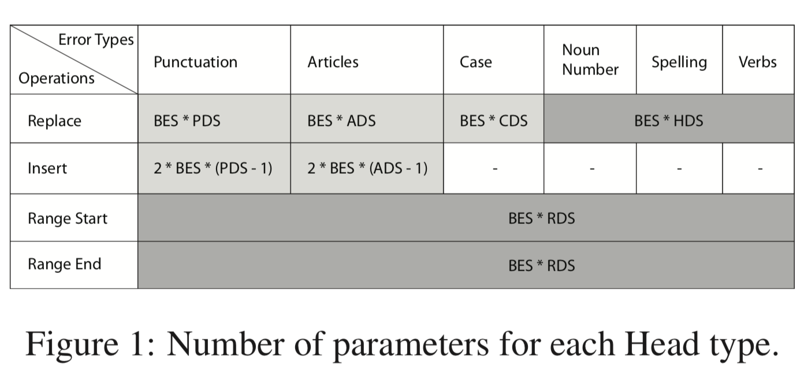
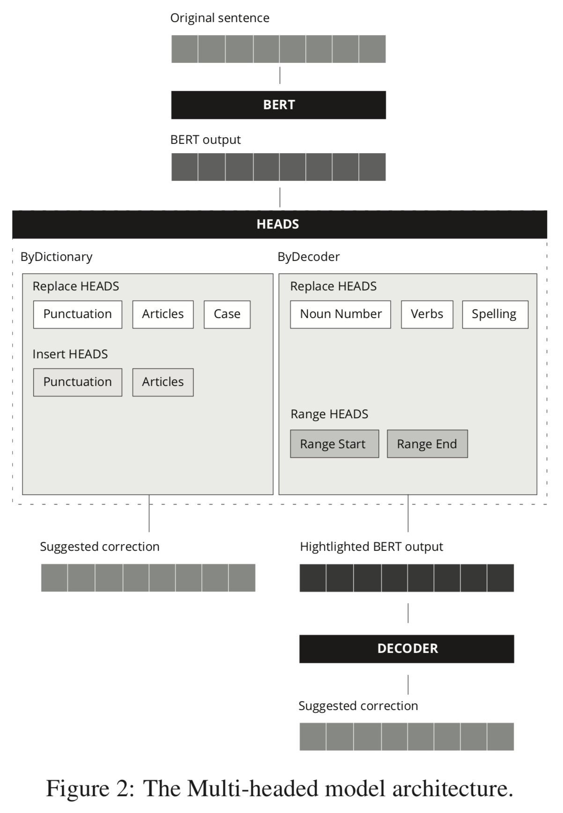
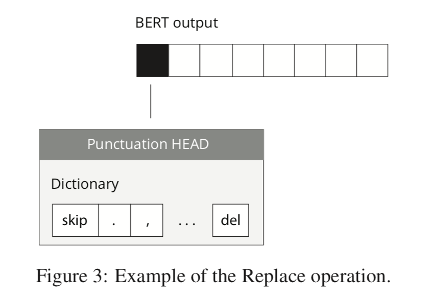
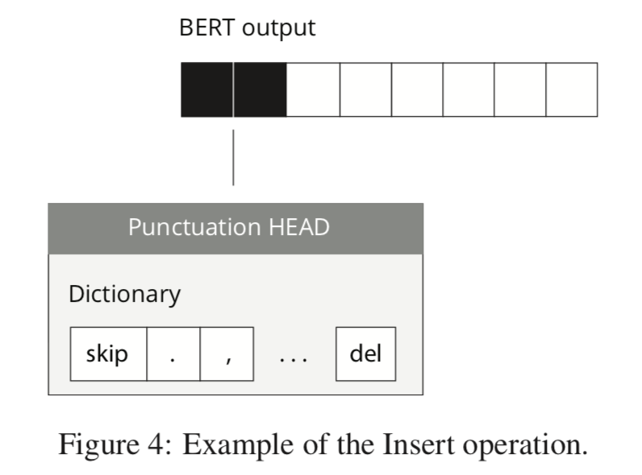
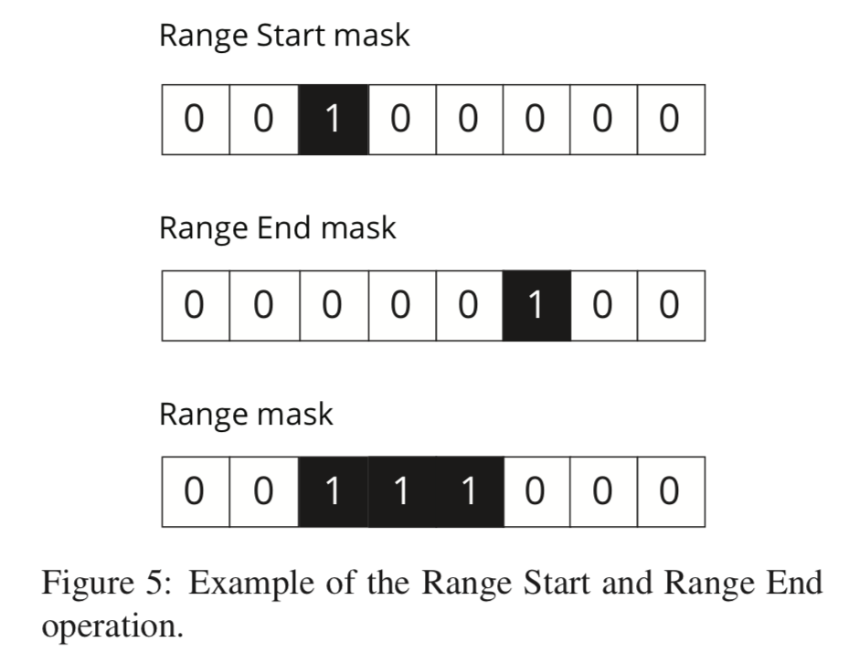
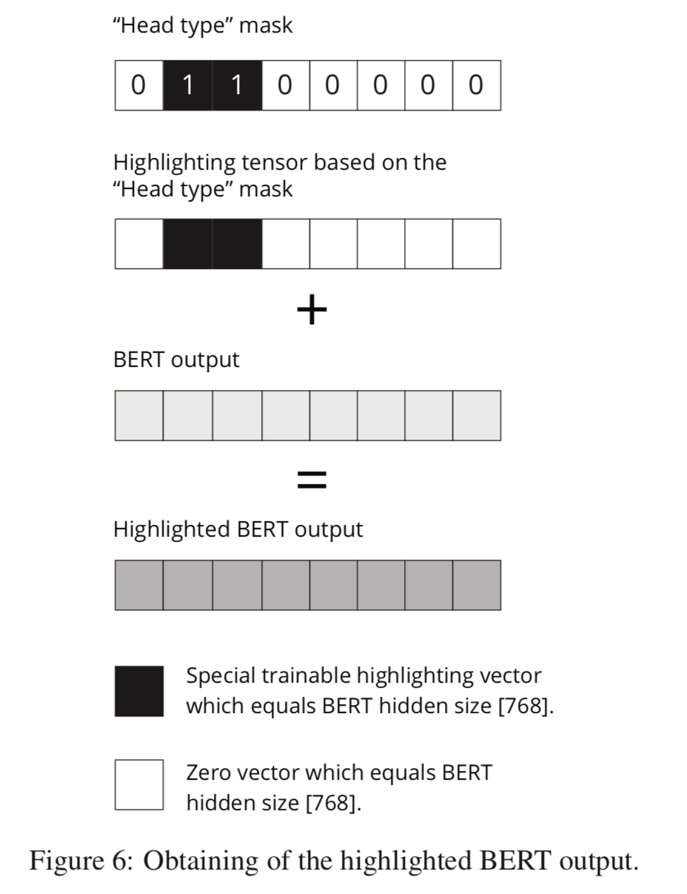

# **摘要**

In this paper, we describe our approach to GEC using the BERT model for creation of encoded representation and some of our enhancements, namely, “Heads” are fully- connected networks which are used for find- ing the errors and later receive recommenda- tion from the networks on dealing with a high- lighted part of the sentence only. Among the main advantages of our solution is increasing the system productivity and lowering the time of processing while keeping the high accuracy of GEC results. 

在本文中，我们描述了使用BERT模型创建编码表示形式的GEC方法，以及我们的一些增强功能，即“ Heads”是完全连接的网络，用于发现错误并随后获得推荐。 来自网络，仅处理句子的突出部分。 我们解决方案的主要优点之一是在保持GEC结果的高精度的同时，提高了系统生产率并缩短了处理时间。

# **简介**

uses BERT as Encoder and specialized “Heads” networks enabling additional text pro- cessing based on particular error types.

使用BERT作为编码器和专用的“ Heads”网络，可以根据特定的错误类型进行附加的文本处理。

# **模型**

The main architectural advantage of our approach is using trained “Heads”.  我们方法的主要架构优势是使用训练有素的“负责人”。

Heads are the fully- connected networks that receive the BERT output result embedding as input and have an output of the Head dictionary size. Each Head is classified by error type given in Errant Error Type Token Tier (Bryant et al., 2017). 

Head是全连接的神经网络，接收BERT输出结果的嵌入作为输入，并具有Head字典大小的输出。 每个头均按Errant错误类型令牌层中给出的错误类型进行分类（Bryant等人，2017）。

We distinguish the following Heads types depending on their usage and based on their context:
• By the type of operation: Replace, Insert, Range Start and Range End;
• By the type of error: Punctuation, Articles, Case, Noun Number, Spelling, Verbs;
• By the type of correction method: ByDictionary (Punctuation, Articles, Case), ByDe- coder (Noun Number, Spelling, Verbs). Output of ByDictionary Heads will be a suggestion from the dictionary. Output of By- Decoder Heads which only detect errors positions will be represented as a “Head type mask” (e.g. Spelling Head mask). For example, Punctuation offers suggestions from its dictionary while Verbs points the place of the error to generate a suggestion by Decoder.

我们根据其用途和上下文来区分以下Heads类型：
•按操作类型：替换，插入，范围开始和范围结束；
•按错误类型分类：标点，文章，格，名词，拼写，动词；
•按更正方法的类型：ByDictionary（标点，文章，格），ByDecoder（名词编号，拼写，动词）。 ByDictionary Heads的输出将是字典的建议。 仅检测错误位置的副解码器磁头的输出将表示为“磁头类型掩码”（例如，拼写磁头掩码）。 例如，标点从字典中提供建议，而动词则指出错误的位置以通过解码器生成建议。

Figure 1 below outlines the number of the parameters of each Head. The dark grey color represents the output which is processed by Decoder, and light grey - the results provided from a Head dictionary.

下图1概述了每个Head的参数数量。 深灰色代表由解码器处理的输出，浅灰色代表从Head字典提供的结果。

The following Head dictionary sizes are used: BERT embedding size (BES) 768; Punctuation dictionary size (PDS) 36; Articles dictionary size (ADS) 5; Case dictionary size (CDS) 3; High- lighting dictionary size (HDS) 2; Range dictionary size (RDS) 2. RDS is applicable for Range Start and Range End Hands. The size of the dictionary for both equals 2; one for skip and the other for start position or end position accordingly. Additionally, for the Insert operation, Delete is eliminated action, thus, we use “-1”.

使用以下Head字典大小：BERT嵌入大小（BES）768； 标点字典大小（PDS）36； 文章字典大小（ADS）5； 大小写字典大小（CDS）3； 高亮度字典大小（HDS）2； 范围字典大小（RDS）2. RDS适用于范围开始和范围结束指针。 两者的字典大小均为2； 一个用于跳过，另一个用于相应的开始位置或结束位置。 另外，对于插入操作，删除是消除操作，因此，我们使用“ -1”。

Since a BERT output is the encoded representation of each token from the input sequence, Heads analyze each token from the BERT output, detect an error in it and depending on its type, either immediately provide a correction or highlight this error position for further correction by the Decoder as shown in Figure 2 below. 

由于BERT输出是输入序列中每个令牌的编码表示形式，因此Heads分析BERT输出中的每个令牌，检测其中的错误并根据其类型，立即提供更正或突出显示此错误位置，以通过以下方式进行更正： 解码器，如下图2所示。

Also, Heads networks are distinguished by the type of the operation performed such as Replace and Insert. Replace Heads are the Heads perform- ing the Replace operation, and it can either provide a suggestion from its dictionary (ByDictionary), or provide a Head type mask for further processing by the Decoder (ByDecoder) as shown in Figure 3 below. 

另外，Heads网络还通过执行的操作类型（例如“替换”和“插入”）来区分。 替换头是执行替换操作的头，它可以从其字典（ByDictionary）中提供建议，也可以提供头类型的掩码以供解码器（ByDecoder）进行进一步处理，如下图3所示。

During the Insert operation, an Insert Head takes two BERT output embeddings which have the dimension of 768 located nearby, concatenates to one embedding with dimension 2*768, processes it and outputs the result with the dimension which equals the dictionary size of a particular Head type. 在插入操作过程中，一个插入头将在附近放置两个768尺寸的BERT输出嵌入，并连接到一个尺寸为2 * 768的嵌入，对其进行处理并输出结果，该尺寸等于特定Head的字典大小。 类型。

Thus, we have probability distribution of a particular Head. Position with the highest probability in a dictionary is what should be inserted. If the probability equals 0, nothing should be done. An example of the Insert operation is shown in Figure 4 below.

因此，我们具有特定头的概率分布。 应该在字典中插入概率最高的位置。 如果概率等于0，则不应执行任何操作。 插入操作的示例在下面的图4中显示。

Range Heads, Range Start, and Range End are used to define the range (start and end position) of an error for the Decoder. Each Range Head uses an approach similar to the Replace ByDictionary Head, thus, the length of its dictionary equals 2. As an output from two Heads, we receive Range Start mask and Range End mask. Using these masks we receive a resulting Range mask that will be used in the highlight and decode technique as shown in Figure 5 below. Thus, Range Head enables detection of those parts of the sentence which need to be either replaced or paraphrased.

范围头，范围起点和范围终点用于定义解码器的错误范围（起点和终点位置）。 每个Range Head都使用类似于Replace ByDictionary Head的方法，因此，其字典的长度等于2。作为两个Head的输出，我们收到Range Start掩码和Range End掩码。 使用这些蒙版，我们将收到一个生成的范围蒙版，它将用在高光和解码技术中，如下图5所示。 因此，Range Head可以检测句子中那些需要替换或释义的部分。

# **4 Highlight and Decode Technique** 

高亮和解码技术

Since there are different types of errors, and it is not possible to compile effective dictionaries as the number of correction options is too large, we used classic Transformer Decoder (Vaswani et al., 2017) and the entire BERT vocabulary. We devel- oped a special “highlight and decode” technique to generate a suggestion for a particular place, de- termined by one of the Heads, and, thus, managed to avoid the reconstruction of the entire sentence (see Figure 6 below). 

由于存在不同类型的错误，并且由于校正选项的数量太大而无法编译有效的词典，因此我们使用了经典的Transformer Decoder（Vaswani et al。，2017）和整个BERT词汇表。 我们开发了一种特殊的“突出显示和解码”技术来生成针对特定地点的建议，该建议由一个首长确定，因此设法避免了整个句子的重构（请参见下面的图6）。

The highlighted BERT output, a Decoder input, in Figure 6 above is a summary of the BERT output and the highlighting tensor, consisting of special embeddings (based on Head type mask) in place of errors detected by one of the ByDe- coder Heads (such as Spelling), and zero vectors in other places. Such approach allows the Decoder to learn how to predict a suggestion only for the highlighted place in the sentence. The various types of Heads and “highlight and decode” technique let the network find and offer suggestions for any er- ror types.

上面的图6中突出显示的BERT输出，解码器输入是BERT输出和突出显示张量的摘要，该张量由特殊的嵌入（基于Head类型掩码）组成，代替了ByDecoder头之一检测到的错误（ （例如，拼写），以及其他位置的零向量。 这种方法允许解码器学习如何仅针对句子中突出显示的位置预测建议。 各种类型的Heads和“突出显示和解码”技术使网络可以找到任何错误类型并提供建议。