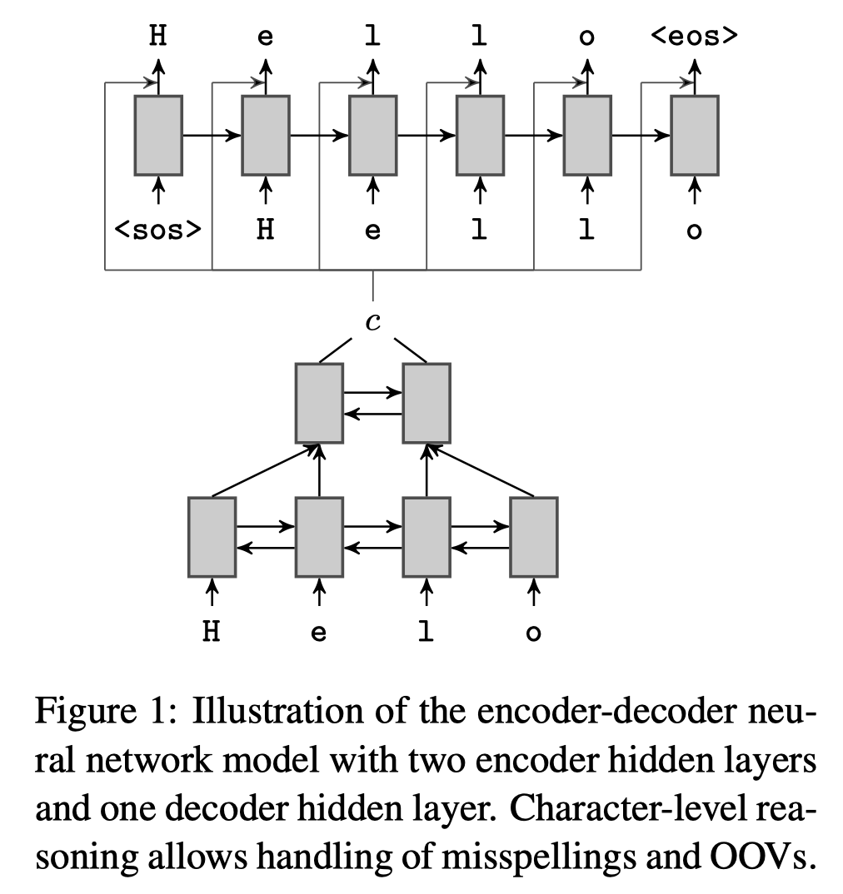

```
layout: post
title: "Neural Language Correction with Character-Based Attention"
tag: 文献阅读
```

# **摘要**

Natural language correction has the potential to help language learners improve their writing skills. While approaches with separate classifiers for different error types have high precision, they do not flexibly handle errors such as redundancy or non-idiomatic phrasing. On the other hand, word and phrase-based machine translation methods are not designed to cope with orthographic errors, and have recently been outpaced by neural models. Motivated by these issues, we present a neural network-based approach to language correction. The core component of our method is an encoder-decoder recurrent neural network with an attention mechanism. By operating at the character level, the network avoids the problem of out-of-vocabulary words. We illustrate the flexibility of our approach on dataset of noisy, user-generated text collected from an English learner forum. When combined with a language model, our method achieves a state-of-the-art F 0.5 -score on the CoNLL 2014 Shared Task. We further illustrate that training the network on additional data with synthesized errors can improve performance.

自然语言纠正具有帮助语言学习者提高写作能力的潜力。尽管针对不同错误类型使用单独分类器的方法具有较高的精度，但它们不能灵活地处理诸如冗余或非惯用语等错误。另一方面，基于单词和短语的机器翻译方法并非旨在解决拼字错误，最近已被神经模型所超越。受这些问题的影响，我们提出了一种基于神经网络的语言校正方法。我们方法的核心组件是具有注意力机制的编码器-解码器递归神经网络。

通过在字符级别上进行操作，网络结构避免了生僻词的问题。我们说明了从英语学习者论坛收集的，由用户生成的嘈杂文本的数据集的灵活性。当与语言模型结合使用时，我们的方法在CoNLL 2014共享任务上获得了最新的F 0.5分数。我们进一步说明，在具有综合错误的其他数据上训练网络可以提高性能。



# **模型架构**

 ## **Character-Level Reasoning**

字符级别推理

Our neural network model operates at the character level, in the encoder as well as the decoder. This is for two reasons, as illustrated by our motivating example. First, we do not assume that the inputs are spell-checked and often find spelling errors in the sentences written by English learners in the datasets we consider. Second, wordlevel neural MT models with a fixed vocabulary are poorly suited to handle OOVs such as multidigit numbers, emoticons, and web addresses (Graves, 2013), though recent work has proposed workarounds for this problem (Luong et al., 2014). Despite longer sequences in the character-based model, optimization does not seem to be a significant issue, since the network often only needs to copy characters from source to target.

我们的神经网络模型在字符级别上运行。 不管是在编码阶段还是解码阶段。如我们的激励示例所示，这有两个原因。 首先，我们不假定输入数据经过拼写检查，并且在我们考虑的数据集中，英语学习者写的句子中经常发现拼写错误。 其次，具有固定词汇量的词级神经MT模型不适合处理OOV，例如多位数数字，表情符号和网址（Graves，2013年），尽管最近的工作提出了解决该问题的方法（Luong等，2014）。 尽管在基于字符的模型中序列较长，但优化似乎并不是一个重要的问题，因为网络通常只需要将字符从源复制到目标。


