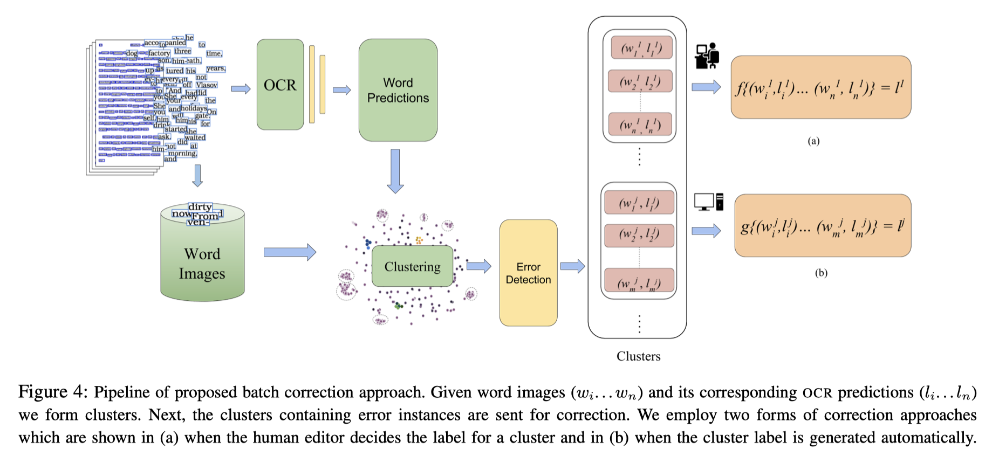

```
layout: post
title: "A Cost Efficient Approach to Correct OCR Errors in Large Document Collections"
tag: 文献阅读
```

# **摘要**

Abstract—Word error rate of an OCR is often higher than its character error rate. This is specially true when OCRs are designed by recognizing characters. High word accuracies are critical to tasks like creation of content in digital libraries and text-to-speech applications. In order to detect and correct the misrecognised words, it is common for an OCR module to employ a post-processor to further improve the word accuracy. However, conventional approaches to post-processing like looking up a dictionary or using a statistical language model (SLM), are still limited. In many such scenarios, it is often required to remove the outstanding errors manually.

We observe that the traditional post processing schemes look at error words sequentially, since OCRs process documents one at a time. We propose a cost efficient model to address the error words in batches rather than correcting them individually. We exploit the fact that a collection of documents, unlike a single document, has a structure leading to repetition of words. Such words, if efficiently grouped together and corrected as a whole can lead to significant reduction in the cost. Correction can be fully automatic or with a human in the loop. Towards this we employ a novel clustering scheme to obtain fairly homogeneous clusters. We compare the performance of our model with various baseline approaches including the case where all the errors are removed by a human. We demonstrate the efficacy of our solution empirically by reporting more than 70% reduction in the human effort with near perfect error correction. We validate our method on Books from multiple languages.

OCR的字错误率通常高于其字符错误率。当通过识别字符来设计OCR时，尤其如此。高精确度对于诸如在数字图书馆中创建内容以及文本到语音应用程序之类的任务至关重要。为了检测和纠正误识别的单词，OCR模块通常采用后处理器来进一步提高单词的准确性。但是，常规的后处理方法（如查找字典或使用统计语言模型（SLM））仍然受到限制。在许多此类情况下，通常需要手动删除未解决的错误。

我们观察到传统的后处理方案按顺序查看错误字，因为OCR一次处理一个文档。**我们提出了一种成本有效的模型来批量解决错误词，而不是单独纠正它们。**我们利用这样一个事实，**即文档集合不同于单个文档，其结构导致单词重复。**如果将这些词有效地组合在一起并进行整体更正，则可以显着降低成本。校正可以是全自动的，也可以是人工进行的。为此，我们采用一种新颖的聚类方案来获得相当均匀的聚类。我们将模型的性能与各种基准方法进行了比较，包括人为消除所有错误的情况。我们通过报告近乎完美的错误校正减少了超过70％的人力，从而通过经验证明了我们解决方案的有效性。我们通过多种语言验证了我们在Books上的方法。

# **简介**

The past decade witnessed a growing interest towards the creation of huge digital libraries by digitizing books [1, 2]. One of the crucial steps towards digitization involves the recognition and reconstruction of document image collection(s) using an OCR. The recognition module in the context of digitizing collections of books could be considerably different from that of recognizing a single document image [3]. In this work, we extend this idea to error correction in document image collections.

在过去的十年中，通过将书籍数字化，人们对建立大型数字图书馆的兴趣日益浓厚[1，2]。 迈向数字化的关键步骤之一涉及使用OCR识别和重建文档图像集。 在数字化书籍藏书的背景下，识别模块可能与识别单个文档图像的模块明显不同[3]。 在这项工作中，我们将此思想扩展到文档图像集合中的错误纠正。

Often the recognition module of the OCRs have an automatic error correction module embedded. This may be using a dictionary or a statistical language model (SLM). However, many applications need further improvement in accuracy. This demands a human intervention for removing these errors. In this paper, we propose enhancements to the naive human correction approach which reduces the cost for human expert review by more than 70%.

OCR的识别模块通常会嵌入一个自动纠错模块。 这可能使用字典或统计语言模型（SLM）。 但是，许多应用需要进一步提高精度。 这需要人工干预以消除这些错误。 在本文中，我们提出了对天真的人类校正方法的改进，该方法可以将人类专家评审的成本降低70％以上。

First - the OCR module makes errors consistently. For two word images drawn from the same type of document, similar noise leads to the same kind of errors. We demonstrate this in Figure 3 where instances of same word images drawn from a document collection are misclassified consistently by the OCR. The second, there can only be a finite vocabulary for a book and majority of words unknown to the error detection system which may include named entities and domain specific terms repeat themselves throughout the collection. This is further validated in Figure 2 where we show that a subset of words in collection occur very frequently and constitutes almost 50% of the total words present.

首先-OCR模块始终会出错。 对于从相同类型的文档中提取的两个单词图像，类似的噪声会导致相同类型的错误。 我们在图3中证明了这一点，其中从文档集合中提取的相同单词图像的实例被OCR一致地错误分类了。 第二，一本书只有一个有限的词汇表，而错误检测系统不知道的大多数单词都可能包含命名实体，并且特定领域的术语在整个馆藏中重复出现。 这在图2中得到了进一步的验证，其中我们显示了集合中单词的一个子集非常频繁地出现，几乎占总单词总数的50％。

Under this setting, grouping based on image features or similarity in the predictions of the OCR can provide cues for automatic correction or aide a human editor. We model the problem of error correction as batch correction where the human reviewer reviews and corrects errors in batches. Figure 1 presents an overview of our proposed batch correction scheme. Word image-prediction pairs extracted from a collection of documents form groups based on their image and text similarity. In case such a group is recognized incorrectly by the OCR, only one instance from the group needs to be corrected which is then propagated to the rest of the group elements.

在此设置下，基于图像特征或OCR预测中的相似性进行分组可以提供自动校正的提示或帮助人工编辑。 我们将纠错问题建模为批处理纠正，在此过程中，人工审阅者会批处理并纠正错误。 图1概述了我们提出的批量校正方案。 从文档集合中提取的Word图像预测对基于它们的图像和文本相似性形成组。 如果OCR错误地识别了这样的组，则只需要纠正该组中的一个实例，然后将其传播到其余的组元素。

The correction can either be made with the help of a human editor or else the correction process can be automated. We discuss both kinds of batch correction processes in detail later in this paper. The major contributions of this work are:

• We demonstrate how clustering can induce an automatic correction and reduce the manual effort in correction significantly.

• We successfully demonstrate ability to scale the clustering scheme to large collection of 100 books.

可以在人工编辑的帮助下进行校正，也可以使校正过程自动化。 本文稍后将详细讨论这两种批处理校正过程。 这项工作的主要贡献是：

•我们演示了聚类如何能够引起自动校正并显着减少手动校正。

•我们成功展示了将聚类方案扩展到100本书的大集合的能力。


# **C OST E FFECTIVE C ORRECTION**

成本有效纠正

## 问题表述

Errors in such a setup are inevitable and the cost of manual correction is significantly high. Since it is practically impossible to verify each word manually, we propose to have an independent error detection mechanism operating on the OCR predictions. Assuming that such a system has a low False Negative Rate, only instances where the OCR prediction is not agreed upon by the error detection pipeline which we denote hereafter as error instances, would then need to be corrected. We assume that the errors are detected with a dictionary or an appropriate error detection module. Our contribution is to make further improvements to this setup by observing that an OCR based system is prone to make systematic errors. Due to the nature of learning, multiple instances of the same word could be misclassified to the same wrong label. We propose a grouping of such misclassifications in a collection of documents which enable correcting these multiple errors in one go. In this work, we use a word-level OCR and a dictionary for the error detection module.

这种设置中的错误是不可避免的，手动校正的成本非常高。由于实际上不可能手动验证每个单词，因此我们建议采用对OCR预测进行操作的独立错误检测机制。假设这样的系统具有较低的误报率，则仅需要校正以下情况，即错误检测管道未同意OCR预测的情况（以下我们将其表示为错误情况）。我们假设使用字典或适当的错误检测模块检测到错误。我们的贡献是通过观察基于OCR的系统易于产生系统错误来进一步改进此设置。由于学习的本质，同一单词的多个实例可能被错误地分类为相同的错误标签。我们建议在一组文档中对此类错误分类进行分组，从而能够一次性纠正这些多个错误。在这项工作中，我们将单词级OCR和字典用于错误检测模块。

One can categorize the agreement between the recognition module and the error detector into four:

1) Error False Positives (EFP): Words that are falsely flagged as error by the detection module since they do not exist in the dictionary OOV.

2) Error True Positives (ETP): Errors of the OCR which are correctly detected by the error detection module.

3) Recognizer False Negatives (RFN): Words exist in the dictionary but are not the correct transcriptions of the word image.

4) True Negatives (TN) of the error detection module: Recognizer correctly predicts word image, and the detection module is in agreement.

可以将识别模块和错误检测器之间的协议分为四类：

1）错误误报（EFP）：检测模块将单词误标记为错误的单词，因为它们在词典OOV中不存在。

2）错误真正（ETP）：错误检测模块正确检测到的OCR错误。

3）识别错误的假阴性（RFN）：单词存在于词典中，但不是单词图像的正确转录。

4）错误检测模块的真阴性（TN）：识别器正确预测单词图像，并且检测模块一致。




## **纠正方法**

Our proposed model for error correction is presented in Figure 4. The document images, segmented at word level go through the OCR pipeline which assigns them labels. The word images and their corresponding predictions are subsequently sent through a clustering pipeline, which groups the word images based on their image and text similarity. We discuss the clustering pipeline along with the features on which the clustering is performed in Section III. Next we perform an error detection on the components of each cluster and identify those clusters in which error instances occur. Only those clusters which contain error instances are sent for either of the two correction techniques- automated or human aided which are discussed below.

我们提出的纠错模型如图4所示。文档图像在单词级别进行了分割，并通过OCR管道为它们分配标签。 随后通过聚类管线发送单词图像及其相应的预测，该聚类管线基于单词图像的图像和文本相似性将单词图像分组。 我们将在第三节中讨论集群流水线以及在其上进行集群的功能。 接下来，我们对每个群集的组件执行错误检测，并识别发生错误实例的那些群集。 仅针对包含以下两种情况下的两种校正技术（自动或人工辅助）发送包含错误实例的群集。

Automated approach: For a given cluster containing word images and their corresponding OCR predictions, the most frequent prediction is chosen to be the representative of the whole cluster and its label is propagated to the remaining cluster elements. Two scenarios arise out of such a setting. For a given cluster-

自动化方法：对于包含单词图像及其相应OCR预测的给定聚类，选择最频繁的预测作为整个聚类的代表，并将其标签传播到其余聚类元素。 这种设置产生两种情况。 对于给定的集群

1) The number of correct predictions is more than incorrect predictions.

1）正确预测的数量多于错误预测的数量。

2) The number of incorrect predictions is more than the number of correct predictions.

2）错误预测的数量大于正确预测的数量。

In the first case, words appearing in ETP get corrected automatically without any further manual corrective action other than verification. In the second case, words appearing in EFP (proper nouns, acronyms, technical keyword, etc.) get corrected without much cost, while for clusters containing ETP , even the correct predictions end up being assigned the wrong label. Thus a human editor is required to verify the assigned label with the actual word image for every erroneous prediction and make keyboard entries wherever necessary. This leads to an added correction cost.

在第一种情况下，ETP中出现的单词会自动得到更正，而无需验证，而无需采取任何其他手动纠正措施。 在第二种情况下，出现在EFP中的单词（专有名词，首字母缩写词，技术关键字等）无需花费很多费用即可得到纠正，而对于包含ETP的群集，即使正确的预测也最终被分配了错误的标签。 因此，对于每个错误的预测，都需要人工编辑来用实际的单词图像验证分配的标签，并在必要时进行键盘输入。 这导致增加的校正成本。

Human aided approach: We allow a human editor to pick the representative of the cluster. This reduces the cost by eliminating the chances of error propagation which arise when labels are generated automatically. However, this also mandates that a human editor be present throughout the correction process. In case of ETP, the editor can enter the correction once and the correction is propagated to all matching images. Our method here reduces the cognitive load for the human, thereby improving efficiency.

人工辅助方法：我们允许人工编辑选择集群的代表。 通过消除自动生成标签时出现的错误传播机会，从而降低了成本。 但是，这还要求在整个纠正过程中都必须有人工编辑。 如果是ETP，编辑者可以输入一次校正，并且校正将传播到所有匹配的图像。 在这里，我们的方法减轻了人类的认知负担，从而提高了效率。

In the above two approaches we consider the clusters to be completely homogeneous. Clusters containing impurities and the relevant correction approach is discussed later in the paper.

在以上两种方法中，我们认为群集完全相同。 本文后面将讨论含有杂质的团簇和相关的校正方法。

# **数据集**

Our dataset comprises of books that have been fully digitized by our OCR module. They are categorized into two types. The first is a smaller subset having books that have been verified by a human expert, while the second composes a larger subset containing unverified books. We denote the former as fully annotated data and the latter as partially annotated data. We seek to evaluate both these datasets on two separate objectives.

我们的数据集包含由我们的OCR模块完全数字化的图书。 它们分为两种类型。 第一个是一个较小的子集，其中包含经过人类专家验证的书籍，而第二个则是一个较大的子集，其中包含未经验证的书籍。 我们将前者表示为完全注释的数据，而将后者表示为部分注释的数据。 我们试图在两个单独的目标上评估这两个数据集。

For the fully annotated dataset, our objective is to find which among the proposed clustering approaches works best for document collection. For the partially annotated dataset, we look to evaluate the scalability of the proposed clustering approaches on larger unverified data. Table I gives details of our dataset, both annotated and partially annotated used in our experiments and the evaluation methods directed towards ascertaining what works for each objective.

对于完全注释的数据集，我们的目标是发现哪种建议的聚类方法最适合文档收集。 对于部分注释的数据集，我们希望评估在较大的未经验证的数据上提出的聚类方法的可伸缩性。 表I列出了实验中使用的带注释的和部分带注释的数据集的详细信息，以及旨在确定对每个目标有效的评估方法。

The annotated dataset comprises of 19 books from English and 32 books from Hindi. Pages from the books are segmented at a word level and annotated by human experts. 5 books are set aside from each of the languages to train the OCR while rest of the books are used for testing and further batch correction experiments.

带注释的数据集包括19本书（英语）和32本书（印地语）。 书中的页面按单词级别进行细分，并由人类专家进行注释。 除了每种语言，还有5本书用于培训OCR，而其余书籍则用于测试和进一步的批纠正实验。

In order to demonstrate the scalability of our approach, we run our experiments on a larger collection containing 100 Hindi books. Most of these books were printed decades ago, resulting in degradation in quality of pages. The collection consists of almost 25,000 pages with more than 5 million words. A subset of 200 pages across 50 books are set aside as test set, for which we obtain bounding boxes and ground truths annotated by human experts.

为了证明我们方法的可扩展性，我们在一个包含100本北印度语书籍的更大的藏书上进行了实验。 这些书大多数是几十年前印刷的，导致页面质量下降。 该馆藏包含将近25,000页，字数超过500万。 将50本书中200页的子集留作测试集，为此我们获得了由人类专家注释的边界框和基本事实。