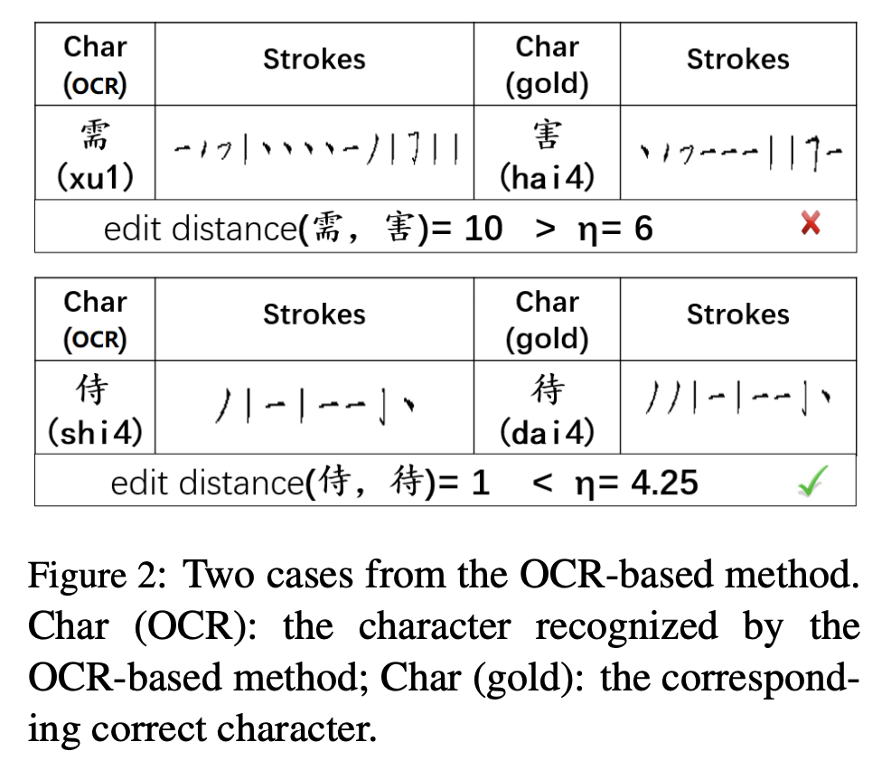

# 摘要

Chinese spelling check (CSC) is a challenging yet meaningful task, which not only serves as a preprocessing in many natural language processing (NLP) applications, but also facilitates reading and understanding of running texts in peoples’ daily lives. However, to utilize datadriven approaches for CSC, there is one major limitation that annotated corpora are not enough in applying algorithms and building models. In this paper, we propose a novel approach of constructing CSC corpus with automatically generated spelling errors, which are either visually or phonologically resembled characters, corresponding to the OCRand ASR-based methods, respectively. Upon the constructed corpus, different models are trained and evaluated for CSC with respect to three standard test sets. Experimental results demonstrate the effectiveness of the corpus, therefore confirm the validity of our approach.

中文拼写检查（CSC）是一项具有挑战性的，有意义的任务，不仅是在许多自然语言处理（NLP）应用程序中作为预处理草错，同时有助于阅读并理解人们日常生活中的运行文本。

但是，为了将数据驱动的方法用于CSC，存在一个主要限制，即注释语料库没有足够充分到可以应用算法和构建模型。

在本文中，我们提出了一种使用自动生成的拼写错误构建CSC语料库的新方法，该方法在视觉上或语音上都是相似的字符，分别对应于基于OCR和ASR的方法。 在构造的语料库中，针对中文拼音检测错误，不同的模型在三种标准的测试集上被训练和评估。实验结果也证实了其方法的有效性。

Spelling check is a crucial task to detect and correct human spelling errors in running texts (Yu
and Li, 2014). This task is vital for NLP applications such as search engine (Martins and Silva,
2004; Gao et al., 2010) and automatic essay scoring (Burstein and Chodorow, 1999; Lonsdale and
Strong-Krause, 2003), for the reason that spelling
errors not only affect reading but also sometimes
completely alter the meaning delivered in a text
fragment. Especially, in Chinese language processing, spelling errors can be more serious since
they may affect fundamental tasks such as word
segmentation (Xue, 2003; Song and Xia, 2012)
and part-of-speech tagging (Chang et al., 1993;
Jiang et al., 2008; Sun, 2011), etc. Of all causes
lead to spelling errors, a major one comes from the
misuse of Chinese input methods on daily texts, e.g., emails and social media posts. Table 1 illustrates two examples of such Chinese spelling
errors. The first incorrect sentence contains a
misused character, 己 (ji2)1
, which has a similar
shape to its corresponding correct character, i.e.,
已 (yi3). In the second incorrect sentence, the
boxed spelling error 她 (ta1) is phonetically identical to its corresponding correct one 他 (ta1).

拼写检查是检测和纠正正在运行的文本中的人为拼写错误的关键任务（Yu
和李，2014年）。对于NLP应用程序（例如搜索引擎（马丁斯和席尔瓦，
2004; Gao et al。，2010）和自动作文评分（Burstein and Chodorow，1999; Lonsdale and
Strong-Krause，2003年），原因是拼写
错误不仅会影响阅读，有时还会影响阅读
完全改变文本中传达的含义
分段。特别是在中文语言处理中，由于
它们可能会影响基本任务，例如单词
分割（薛，2003；宋和夏，2012）
和词性标记（Chang等，1993；
Jiang等，2008； Sun，2011年），等等。
导致拼写错误，主要是来自
在日常文本（例如电子邮件和社交媒体帖子）上滥用中文输入法。表1说明了这样的中文拼写的两个示例
错误。第一个错误的句子包含一个
滥用的角色，己（ji2）1
，它有一个类似的
成形为相应的正确字符，即
已（yi3）。在第二个错误的句子中，
盒装拼写错误她（ta1）在语音上与其对应的正确单词他（ta1）相同。

# Automatic Data Generation

Spelling errors in Chinese are mainly caused by the misuse of visually or phonologically similar characters (Chang, 1995; Liu et al., 2011; Yu and Li, 2014). Errors of visually similar characters (henceforth V-style errors) are due to the prominence of character pairs visually similar to each other. The reason is that, Chinese, as a hieroglyph language, consists of more than sixty thousand characters2 . They are constructed by a limited number of radicals and components3 . As for errors caused by the misuse of phonologically similar characters (henceforth P-style errors), we note that pronunciations of Chinese characters are usually defined by Pinyin, which consists of initials, finals, and tones4 . According to Yang et al. (2012), there are only 398 syllables for thousands of characters in modern Chinese. As a result, there are many Chinese characters sharing similar pronunciation, which further leads to the prominence of P-style errors. In the rest of this section, we describe how we generate these two types of errors in Section 2.1 and 2.2, respectively.

中文拼写错误主要是由
视觉或语音上相似的滥用
人物（Chang，1995; Liu et al。，2011; Yu and
李，2014）。视觉上相似的字符的错误
（此后称为V型错误）是由于字符对的突出显示在视觉上类似于每个字符对
其他。原因是，中文作为一种象形文字，由六万多个字符组成。
。它们由数量有限的部首和成分构成
。如
因语音错误使用而导致的错误
类似的字符（此后为P样式错误），我们
注意汉字的发音是
通常由拼音定义，包括首字母，结尾和音调4
。据杨等。
（2012），只有398个千字节
现代汉语中的字符集。结果，那里
许多汉字共享相似的发音，这进一步导致了声望
P型错误。在本节的其余部分，我们描述如何生成这两种类型的错误
分别在第2.1和2.2节中。

## **OCR-based Generation**

Inspired by the observation that optical character recognition (OCR) tools are likely to misidentify characters with those visually similar ones (Tong and Evans, 1996), we intentionally blur images with correct characters, and apply OCR tools on them to produce V-style spelling errors. In detail, we use Google Tesseract (Smith, 2007) as the OCR toolkit and the generation process is illustrated in Figure 1.

受光学特性的观察启发
识别（OCR）工具可能会误识别
与视觉上相似的字符（Tong
和Evans，1996年），我们故意模糊了图像
使用正确的字符，并在上面应用OCR工具
它们会产生V型拼写错误。
详细来说，我们使用Google Tesseract（Smith，
2007年）作为OCR工具包，生成过程如图1所示。

Given a sentence, as the first step, we randomly select 1 ∼ 2 character(s) from it as our target characters to be detected by Tesseract, denoted as Ctargets. Specifically, except for Chinese characters, other characters like punctuations and foreign alphabets are excluded and we also filter those Chinese characters of low frequency5 based on the statistics of the Chinese Wikipedia Corpus6 . Second, we transfer Ctargets from text to image with 100 × 100 pixels, namely, each generated image has a same size. Third, we randomly blur a region7 in the produced images using Gaussian blurring (Bradski, 2000), which aims at leading the OCR toolkit to make mistakes. Finally, we use Google Tesseract to recognize the blurred images. Once the recognized result does not match to the original one, a V-style error is generated, which is used to replace the original character in the sentence, resulting in a sentence with V-style spelling error(s). After the aforementioned steps, we obtain the spelling errors for each sentence with their correct references.

给定一个句子，作为第一步，我们从中随机选择1到2个字符作为我们要被Tesseract检测的目标字符，称为Ctargets。具体而言，除了中文字符外，其他字符（如标点符号和外来字母）均被排除在外，并且我们还会根据中文维基百科语料库6的统计数据过滤那些低频的汉字5。其次，我们将Ctarget从文本传输到100×100像素的图像，即，每个生成的图像具有相同的大小。第三，我们使用高斯模糊（Bradski，2000）对生成的图像中的region7进行随机模糊处理，目的是引导OCR工具包犯错误。最后，我们使用Google Tesseract识别模糊的图像。一旦识别出的结果与原始结果不匹配，就会生成V型错误，该错误将用于替换句子中的原始字符，从而导致句子中出现V型拼写错误。经过上述步骤，我们获得了每个句子的拼写错误以及正确的参考。

The raw texts used for OCR-based method are mainly from newspaper articles, which are crawled from People’s Daily, an official newspaper website8 , of which articles are reported to undergo a strict edition process and assumed to be all correct. We divide these texts into sentences using clause-ending punctuations such as periods (。), question mark (？), and exclamation mark (！) (Chang et al., 1993). In total, we obtain 50, 000 sentences, each of which contains 8 to 85 characters, including punctuations. These sentences are then handled by the OCR-based method as we describe before, resulting in an annotated corpus containing about 40, 000 annotated sentences with 56, 857 spelling errors. Note that in our experiment, we find that the OCR toolkit can still correctly detect the characters in the produced images even we blur part of the images

用于基于OCR的方法的原始文本
主要来自报纸文章
从官方报纸网站《人民日报》上爬取8
，据报道其中所有文章均经过严格的编辑，并假定全部
正确。 我们使用以下命令将这些文本分为句子
子句结尾的标点，例如句点（。），
问号（？）和感叹号（！）
（Chang等，1993）。 总共我们得到50，000
句子，每个句子包含8到85个字符，包括标点符号。 这些句子
然后由基于OCR的方法处理
之前描述，产生带注释的语料库
包含大约40，000个带注释的句子
56，857拼写错误。 请注意，在我们的实验中，我们发现OCR工具包仍可以正确检测生成的图像中的字符
即使我们模糊了部分图像

Bad Cases and the Solution Although the OCRbased method work smoothly, there are still some cases worth further investigation. By analyzing the generated spelling errors by this method, we find that in terms of shape, there exist some incorrectly recognized characters by the OCR toolkit that greatly differ from their corresponding correct characters. For example, for the blurred image containing the character 领 (ling3), the Tesseract incorrectly recognizes it as 铈 (shi4), which is totally different from 领 (ling3) in shape. Therefore, these cases should be excluded because human are less likely to make such mistakes. In solving this problem, we propose a novel approach to judge whether two characters are visually similar by calculating the edit distance based on the strokes of Chinese characters. Similar to English words consisting of alphabets, a Chinese character can be split into different strokes9 . To this end, we obtain the strokes of Chinese character from the Online dictionary10. Empirically, given two Chinese characters, c1 and c2, we set 0.25∗(len(c1)+len(c2)) as the threshold, η, where len(c) denotes the number of strokes for the Chinese character c. If the edit distance of two characters is more than a threshold η, we consider them not to be similar in shape. To better clarify it, a bad case and a good case are shown in Figure 2.

坏情况和解决方案尽管基于OCR的方法工作顺利，但仍有一些问题
案件值得进一步调查。通过分析
通过这种方法生成的拼写错误，我们
发现在形状方面，OCR工具包存在一些错误识别的字符
与相应的正确字符有很大不同。例如，对于模糊的图像
包含字符领（ling3），Tesseract
错误地将其识别为cer（shi4），其形状与领（ling3）完全不同。因此，
这些情况应排除在外，因为人类是
犯此类错误的可能性较小。在解决这个问题
问题，我们提出了一种新颖的判断方法
通过基于的笔划计算编辑距离，两个字符在视觉上是否相似
中国文字。类似于由字母组成的英语单词，中文字符可以是
分成不同的笔触9
。为此，我们获得
在线上的汉字笔画
字典10。根据经验，给定两个汉字c1和c2，我们将0.25 *（len（c1）+ len（c2））设置为
作为阈值η，其中len（c）表示汉字c的笔画数。如果
两个字符的编辑距离大于
阈值η，我们认为它们在
形状。为了更好地说明这一点，一个坏案例和一个好案例
情况如图2所示。

## ASR-based Generation

Similar to OCR tools, automatic speech recognition (ASR) tools may also mistake characters for others with similar pronunciations (Hartley and Reich, 2005). To build an annotated corpus of P-style errors, we follow the similar inspiration with those for V-style errors and OCR tools, and adopted a pipeline as shown in Figure 3. However, given the availability of various speech recognition datasets, we employ a simpler approach. We exploit a publicly available Mandarin speech corpus, AIShell (Bu et al., 2017), which contains around 140,000 sentences with utterances11. We use Kaldi (Povey et al., 2011), a speech recognition toolkit, to transcribe the utterances into recognized sentences. Finally, by comparing the recognized sentences with the original ones, we can identify whether the recognition results are correct. If not, they can serve as incorrectlyrecognized results and be used to build a corpus with P-style spelling errors

与OCR工具类似，自动语音识别（ASR）工具也可能会将字符误认为发音相似的其他人（Hartley和Reich，2005年）。 建立一个带注释的语料库P型错误，我们遵循类似的启发与V型错误和OCR工具相关的内容，以及
采用了如图3所示的管道。但是，
考虑到各种语音识别数据集的可用性，我们采用了一种更简单的方法。 我们
利用公开可用的普通话语料库AIShell（Bu et al。，2017），其中包括
约有140,000个句子的发音11。 我们
使用语音识别工具包Kaldi（Povey等人，2011）将语音转换为可识别的句子。 最后，通过比较
识别与原始句子相同的句子，我们
可以识别识别结果是否
正确。 如果没有，它们可能会被误认为是正确的结果，并被用来建立语料库
带有P样式的拼写错误

Bad Cases and the Solution For generated Pstyle errors, we also identify some bad cases, which potentially introduce much noise. To improve the quality of the generated corpus, a solution is thus needed to remove them. Table 2 gives three types of bad cases with a good one. We describe the solution to deal with them as follows.

不良情况和解决方案对于产生的Pstyle错误，我们还确定了一些不良情况，
可能会引入很多噪音。 为了提高生成的语料库的质量，因此需要一种解决方案以将其删除。 表2给出
三种类型的不良案例有一种。 我们描述解决这些问题的方法如下。

First, we discard all incorrectly recognized results similar to Case 1, which has different lengths
comparing to the corresponding reference sentence. Second, the incorrect characters in Case 2 have totally different pronunciations with their
corresponding characters in the gold sentence.
Such cases do not satisfy our requirement in generating P-style errors. To this end, we obtain the pronunciation by pinyin12 of Chinese characters from
an online Chinese lexicon13. Then it is easy to
identify whether the incorrectly-recognized characters have similar or same pronunciation with
their corresponding characters in the gold sentence. Specifically, in terms of Pinyin, two characters have similar pronunciation when they have the
same initials and finals but different tones, i.e., da2
and da1. Third, according to Chen et al. (2011),
there may have two errors per student essay on average, which reflects the fact that that each sentence will not contain more than two spelling errors on average. Therefore, we remove those
incorrectly-recognized results that contains more
than two incorrect characters as shown in Case 3.
After the aforementioned steps, we generate a corpus with more than 7K P-style spelling errors in
total. We denote it D-asr and show its statistics in
the D-asr column in Table 3.

首先，我们丢弃所有与情况1类似的错误识别的结果，但结果的长度不同与相应的参考句子进行比较。其次，案例2中的错误字符的发音完全不同黄金句中的相应字符。这种情况不能满足我们生成P型错误的要求。为此，我们从汉语拼音中获得拼音12的发音。在线中文词典13。然后很容易识别错误识别的字符的发音与它们在金句中的对应字符。具体来说，就拼音而言，当两个字符具有拼音时，它们的发音相似相同的首字母和结尾，但音调不同，即da2和da1。第三，根据Chen等。 （2011），每篇学生论文平均可能有两个错误，这反映了一个事实，即每个句子平均不会包含两个以上的拼写错误。因此，我们删除了那些错误识别的结果包含更多情况2中显示的两个不正确字符。经过上述步骤，我们生成了一个语料库，该语料库中的P样式拼写错误超过7K
总。我们将其表示为D-asr，并在表3中的D-asr列。

# **数据集**

We use two public datasets from prior work, Lang-8 (Mizu- moto et al. 2011) and NUCLE (Dahlmeier, Ng, and Wu 2013), to create our parallel data. Along with the sentence pairs from NUCLE, we extract and use the English sentence pairs in Lang-8 by selecting essays written by English learn- ers and removing non-English sentences from them using a language identification tool1. Sentence pairs that are un- changed on the target side are discarded from the training set. A subset of this data, 5.4K sentence pairs from NUCLE, is taken out to be used as the development data for model se- lection and training the rescorer. The remaining parallel data that is used for training the encoder-decoder NN consists of 1.3M sentence pairs (18.05M source words and 21.53M tar- get words). We also make use of the larger English corpora from Wikipedia (1.78B words) for pre-training the word em- beddings, and a subset of the Common Crawl corpus (94B words) for training the language model for rescoring. Cor- pora of similar size from the Common Crawl have been used by leading GEC systems (Chollampatt and Ng 2017; Ji et al. 2017; Junczys-Dowmunt and Grundkiewicz 2016). 

我们使用先前工作的两个公共数据集Lang-8（Mizumoto等，2011）和NUCLE（Dahlmeier，Ng和Wu 2013）来创建并行数据。与NUCLE中的句子对一起，我们通过选择英语学习者撰写的论文并使用语言识别工具从中删除非英语句子1，来提取并使用Lang-8中的英语句子对。在目标侧不变的句子对将从训练集中删除。该数据的一个子集（来自NUCLE的5.4K句子对）被用作模型选择和训练记录器的开发数据。用于训练编码器-解码器NN的其余并行数据由130万个句子对（1805万个源词和21.53M个目标词）组成。我们还利用Wikipedia中更大的英语语料库（1.78B个单词）来预训练单词嵌入，并使用Common Crawl语料库的一个子集（94B个单词）来训练语言模型进行评分。领先的GEC系统已经使用了Common Crawl中类似尺寸的公司（Chollampatt和Ng，2017年； Ji等人，2017年； Junczys-Dowmunt和Grundkiewicz，2016年）。

