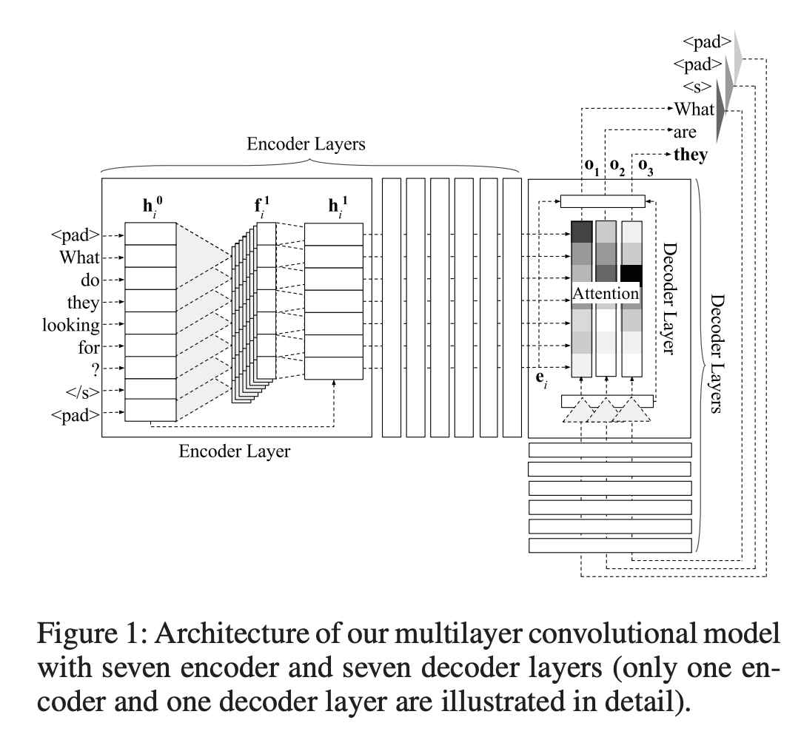

# 摘要

We improve automatic correction of grammatical, orthographic, and collocation errors in text using a multilayer convolutional encoder-decoder neural network. The network is initialized with embeddings that make use of character Ngram information to better suit this task. When evaluated on common benchmark test data sets (CoNLL-2014 and JFLEG), our model substantially outperforms all prior neural approaches on this task as well as strong statistical machine translation-based systems with neural and task-specific features trained on the same data. Our analysis shows the superiority of convolutional neural networks over recurrent neural networks such as long short-term memory (LSTM) networks in capturing the local context via attention, and thereby improving the coverage in correcting grammatical errors. By ensembling multiple models, and incorporating an N-gram language model and edit features via rescoring, our novel method becomes the first neural approach to outperform the current state-of-the-art statistical machine translation-based approach, both in terms of grammaticality and fluency

我们使用多层卷积编码器-解码器神经网络来改进文本中语法，正字和搭配错误的自动校正。网络是
使用使用字符Ngram信息的嵌入进行初始化，以更好地适合此任务。评估时
在通用基准测试数据集（CoNLL-2014和JFLEG）上，我们的模型大大优于所有先前的神经网络
这项任务的方法以及强大的统计机器
基于翻译的系统，具有针对相同数据训练的神经和特定于任务的功能。我们的分析表明卷积神经网络优于递归神经网络网络，例如长短期记忆（LSTM）网络通过注意力捕捉局部语境，从而改善纠正语法错误的覆盖范围。通过
集合多个模型，并合并一个N-gram
语言模型并通过重新记录来编辑功能，这是我们的小说
方法成为优于神经网络的第一种神经方法
基于最新技术的统计机器翻译
语法和流利度方面的方法

# **简介**

With the increasing number of non-native learners and writers of the English language around the globe, the necessity to improve authoring tools such as error correction systems is increasing. Grammatical error correction (GEC) is a well-established natural language processing (NLP) task that deals with building systems for automatically correcting errors in written text, particularly in non-native written text. The errors that a GEC system attempts to correct are not limited to grammatical errors, but also include spelling and collocation errors

随着全球非英语语言学习者和作家的增多，改进诸如纠错系统之类的创作工具的必要性也在增加。 语法错误校正（GEC）为完善的自然语言处理（NLP）任务用于自动纠正书面文本中的错误的建筑系统，尤其是非本地书面文本中的错误文本。 GEC系统尝试纠正的错误是不仅限于语法错误，还包括拼写和搭配错误

GEC in English has gained much attention within the NLP community recently. The phrase-based statistical machine translation (SMT) approach has emerged as the stateof-the-art approach for this task (Chollampatt and Ng 2017; Junczys-Dowmunt and Grundkiewicz 2016), in which GEC is treated as a translation task from the language of “bad” English to the language of “good” English. The translation model is learned using parallel error-corrected corpora (source text that contains errors and their corresponding corrected target text).

英文的GEC在
NLP社区最近。 基于短语的统计机器翻译（SMT）方法已成为该任务的最新方法（Chollampatt和Ng 2017;
Junczys-Dowmunt and Grundkiewicz 2016），其中GEC
被视为来自“坏”语言的翻译任务
英语改为“好”英语。 使用并行纠错语料库学习翻译模型
（包含错误的源文本及其相应的更正目标文本）。

Although neural network (NN) models have been used as features to improve the generalization of
the SMT approach (Chollampatt, Taghipour, and Ng 2016),
SMT still suffers from limitations in accessing the global
source and target context effectively. The treatment of words
and phrases as discrete entities during decoding also limits its generalization capabilities. To this end, several neural encoder-decoder approaches were proposed for this task
(Xie et al. 2016; Yuan and Briscoe 2016; Ji et al. 2017;
Schmaltz et al. 2017). However, their performance still falls
substantially behind state-of-the-art SMT approaches.

虽然神经网络（NN）模型已被用作改善特征的通用性
SMT方法（Chollampatt，Taghipour和Ng 2016），
SMT在进入全球市场时仍然受到限制
有效地提供源和目标上下文。 单词的处理
和作为离散实体的短语在解码期间也限制了其泛化能力。 为此，为此任务提出了几种神经编码器-解码器方法。
（Xie等人2016; Yuan和Briscoe 2016; Ji等人2017;
Schmaltz等。 2017）。 但是，他们的表现仍然下降
基本上落后于最新的SMT方法。

All prior neural approaches for GEC relied on using recurrent neural networks (RNNs). In contrast to previous neural approaches, our neural approach to GEC is based on a fully convolutional encoder-decoder architecture with multiple layers of convolutions and attention (Gehring et al. 2017). Our analysis shows that convolutional neural networks (CNNs) can capture local context more effectively than RNNs as the convolution operations are performed over smaller windows of word sequences. Most grammatical errors are often localized and dependent only on the nearby words. Wider contexts and interaction between distant words can also be captured by a multilayer hierarchical structure of convolutions and an attention mechanism that weights the source words based on their relevance in predicting the target word. Moreover, only a fixed number of non-linearities are performed on the input irrespective of the input length whereas in RNNs, the number of non-linearities is proportional to the length of the input, diminishing the effects of distant words.

用于GEC的所有现有神经方法都依赖于使用递归神经网络（RNN）。与以前的神经方法相比，我们对GEC的神经方法基于
具有多层卷积和注意力的完全卷积编码器-解码器体系结构（Gehring等。
2017）。我们的分析表明，卷积神经网络（CNN）可以更有效地捕获局部上下文
比RNN进行卷积运算
在较小的单词序列窗口上。大多数语法错误通常是局部的，并且仅取决于
附近的字词。多层层次结构还可以捕获更广泛的上下文和远处单词之间的交互
卷积的结构和注意机制
根据源单词在预测目标单词中的相关性对单词进行加权。而且，只有固定数量的
无论输入信号是多少，都对输入执行非线性
输入长度，而在RNN中，非线性数
与输入长度成正比，从而减少了远处单词的影响。

We further improve the performance by ensembling multiple models. Contrary to prior neural approaches, we use a simpler pre-processing method to alleviate the unknown word problem (Sennrich, Haddow, and Birch 2016). Rare words are split into multiple frequent sub-words using a byte pair encoding (BPE) algorithm. One of the major weaknesses of prior neural approaches is that they do not incorporate task-specific features nor utilize large native English corpora to good effect. We use such English corpora in our encoder-decoder model to pre-train the word vectors to be used for initializing the embeddings in the encoder and decoder. We also train an N-gram language model to be used as a feature along with edit operation count features in rescoring to produce an overall better output.

我们通过整合多个模型进一步提高了性能。 与先前的神经方法相反，我们使用
减轻未知的更简单的预处理方法
单词问题（Sennrich，Haddow和Birch 2016）。 罕见
使用a将单词分成多个频繁的子单词
字节对编码（BPE）算法。 先前的神经方法的主要缺点之一是它们没有结合特定任务的功能，也没有利用大量的母语英语。
语料库效果良好。 我们在我们的英语中使用这样的语料库
编码器-解码器模型将词向量预先训练为
用于初始化编码器和解码器中的嵌入。 我们还训练了N-gram语言模型
一项功能与编辑操作计数功能一起记录，以产生总体上更好的输出。

To summarize, this paper makes the following contributions: (1) We successfully employ a convolutional encoderdecoder model trained on BPE tokens as our primary model
to achieve state-of-the-art performance for GEC. Ours is the
first work to use fully convolutional neural networks for
end-to-end GEC. (2) We exploit larger English corpora to
pre-train word embeddings and to train an N-gram language
model to be used as a feature in a rescorer that is trained to
optimize the target metric using minimum error rate training (Och 2003). (3) We conduct a comparison of attention
mechanisms in typical recurrent architectures and our models, and perform error type performance analysis to identify
the strengths of our approach over the current state-of-theart SMT approach.

总而言之，本文做出了以下贡献：（1）我们成功地采用了基于BPE令牌训练的卷积编码器/解码器模型作为主要模型
实现GEC的最新性能。 我们的是
将全卷积神经网络用于
端到端GEC。 （2）我们利用更大的英语语料库
训练词嵌入和训练N-gram语言
模型，将其用作经过训练的侦查器中的功能
使用最小错误率训练来优化目标指标（Och 2003）。 （3）进行注意力的比较
典型循环体系结构和模型中的机制，并执行错误类型性能分析以识别
与当前最先进的SMT方法相比，我们的方法的优势。

