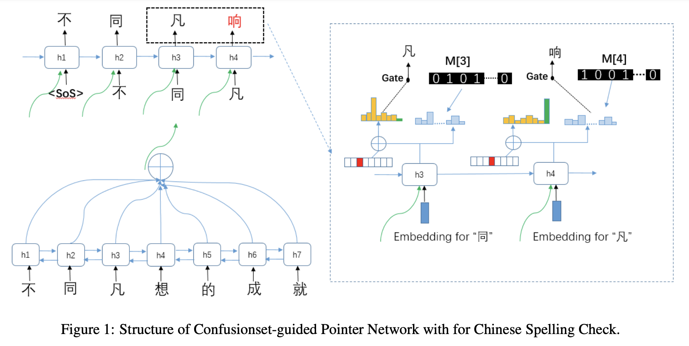

# 摘要

This paper proposes Confusionset-guided Pointer Networks for Chinese Spell Check (CSC) task. More concretely, our approach utilizes the off-the-shelf confusionset for guiding the character generation. To this end, our novel Seq2Seq model jointly learns to copy a correct character from an input sentence through a pointer network, or generate a character from the confusionset rather than the entire vocabulary. We conduct experiments on three human-annotated datasets, and results demonstrate that our proposed generative model outperforms all competitor models by a large margin of up to 20% F1 score, achieving state-of-the-art performance on three datasets.

本文提出了Confusionset-guided
用于中文拼写检查的指针网络
（CSC）任务。 更具体地说，我们的方法
利用现成的混淆集指导角色生成。 为此，
我们新颖的Seq2Seq模型可以共同学习
通过指针网络从输入句子中复制正确的字符，或生成
来自混乱集中的角色，而不是
整个词汇表。 我们进行实验
在三个人类注释的数据集上，结果表明我们提出的生成式
该模型的表现优于所有竞争对手的模型
F1分数高达20％的大幅度增长，实现了
三个数据集的最新性能。

# 简介

In our everyday writing, there exists different types of errors, one of which that frequently occurs is misspelling a character due to the characters’ similarity in terms of sound, shape, and/or meaning. Spelling check is a task to detect and correct such problematic usage of language. Although these tools been useful, detecting and fixing errors in natural language, especially in Chinese, remains far from solved. Notably, Chinese is very different from other alphabetical languages (e.g., English). First, there are no word delimiters between the Chinese words. Second, the error detection task is difficult due to its context-sensitive nature, i.e., errors can be only often determined at phrase/sentence level and not at character-level

在我们的日常写作中，存在着不同类型的错误，由于字符在声音，形状和/或方面的相似性，经常发生的错误拼写是错误的字符含义。 拼写检查是一项检测和纠正这种有问题的语言用法。 尽管这些工具很有用，但检测和修复自然语言（尤其是中文）中的错误仍远远没有解决。 尤其是中文
与其他字母语言有很大不同
（例如英语）。 首先，没有字定界符
中文单词之间。 其次，由于其上下文敏感，错误检测任务很困难
性质，即错误通常只能在
短语/句子级别，而不是字符级别

In this paper, we propose a novel neural architecture for the Chinese Spelling Check (CSC) task. For the task at hand, it is intuitive that the generated sentence and the input sentence would usually share most characters, along with same sentence structure with a slight exception for several incorrect characters. This is unlike other generative tasks (e.g., neural machine translation or dialog translation) in which the output would differ greatly from the input.

在本文中，我们为中文拼写检查（CSC）任务提出了一种新颖的神经体系结构。 对于手头的任务，很直观的是，生成的句子和输入的句子通常将共享大多数字符，以及相同的句子结构，但对于几个不正确的字符则稍有例外。 这与其他生成任务（例如，神经机器翻译或对话翻译）不同，在其他生成任务中，输出与输入将有很大差异。

To this end, this paper proposes a novel Confusionset-guided copy mechanism which achieves significant performance gain over competitor approaches. Copy mechanisms (Gulcehre et al., 2016), enable the copying of words directly from the input via pointing, providing an extremely appropriate inductive bias for the CSC task. More concretely, our model jointly learns the selection of appropriate characters to copy or to generate a correct character from the vocabulary when an incorrect character occurs. The clear novelty of our work, however, is the infusion of Confusionsets1 with Pointer Networks, which help reduce the search space and vastly improve the probability of generating correct characters. Experimental results on three benchmark datasets demonstrate that our model outperforms all competitor models, obtaining performance gains of up to 20%.

为此，本文提出了一种小说
混淆集指导的复制机制
与竞争对手的方法相比，可显着提高性能。 复制机制（Gulcehre
等人，2016年），则可以通过指向直接从输入中复制单词，从而提供
CSC非常合适的感应偏置
任务。 更具体地说，我们的模型共同学习
选择要复制或复制到的适当字符
从词汇中产生正确的字符
当出现不正确的字符时。 清除
然而，我们工作的新颖之处在于
带有指针网络的Confusionsets1
帮助减少搜索空间并大大改善
生成正确字符的可能性。
在三个基准数据集上的实验结果
证明我们的模型优于所有模型
竞争者模型，获得绩效提升
高达20％。

# 模型

# **数据集**

We use the large annotated corpus which contains spelling errors, either visually or phonologically resembled characters, by an automatic approach proposed in (Wang et al., 2018). In addition, a small fraction of three humanannotated training datasets provided in (Wu et al., 2013; Yu et al., 2014; Tseng et al., 2015) are also included in our training data.

我们使用大型带注释的语料库，该语料库通过（Wang等人，2018）中提出的自动方法包含视觉或语音类似字符的拼写错误。 此外，我们的训练数据中还包含了（Wu等人，2013； Yu等人，2014； Tseng等人，2015）中提供的三个人工注释训练数据集的一小部分。