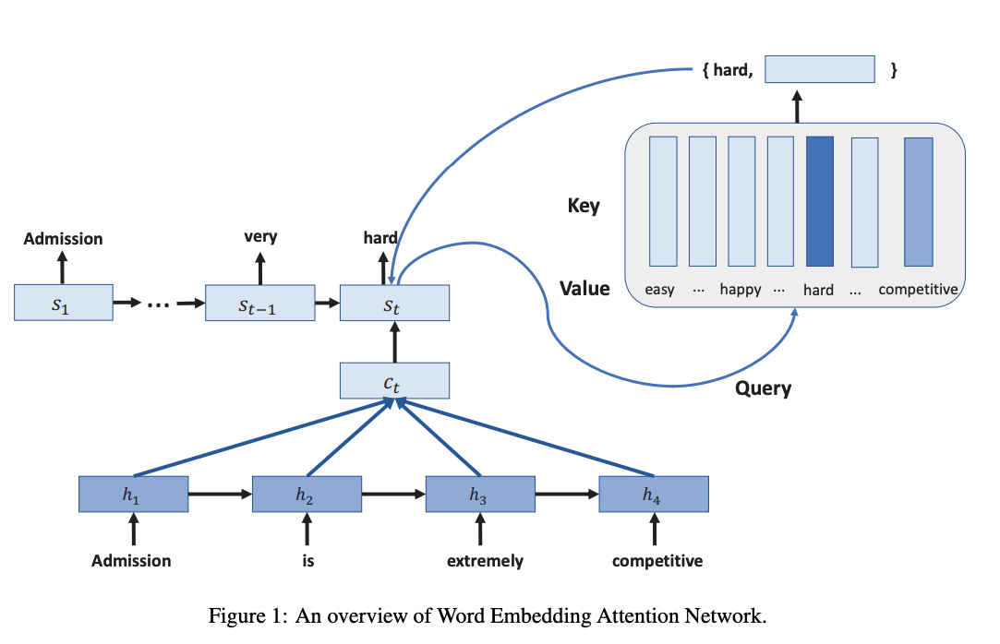
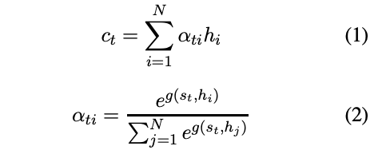
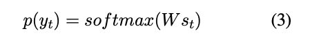
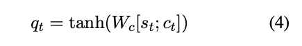

# 简介

提出了一种新颖的encoder-decoder框架，叫做WEAN。所提出的模型通过查分布式单词表示，以捕获相关单词的含义。实验在两个语句对象生成的任务上进行。

# **创新点**

给出一个原文本，encoder层压缩原始文本到一个全连接代表的词向量表示，decoder层生成了释义文本。为了预测一个单词，decoder层使用**隐藏层的输出去查询词嵌入**，词嵌入获取了所有候选词，并且返回最符合查询的词嵌入，

被选中的单词就作为预测的token，它的embedding然后被用来作为LSTM下一个时间步的输入。经过反向传播，词嵌入经过三个来源获得了更新：

1. encoder的输入
2. decoder的输入
3. output 层的查询

# **模型**

$y_t：$  word 生成器计算输出的词向量的分布

模型生成词向量的方式不同于传统的生成风格。将原始上下文词向量$c_t$和目标词向量$s_t$, 用于生成查询向量$q_t$



