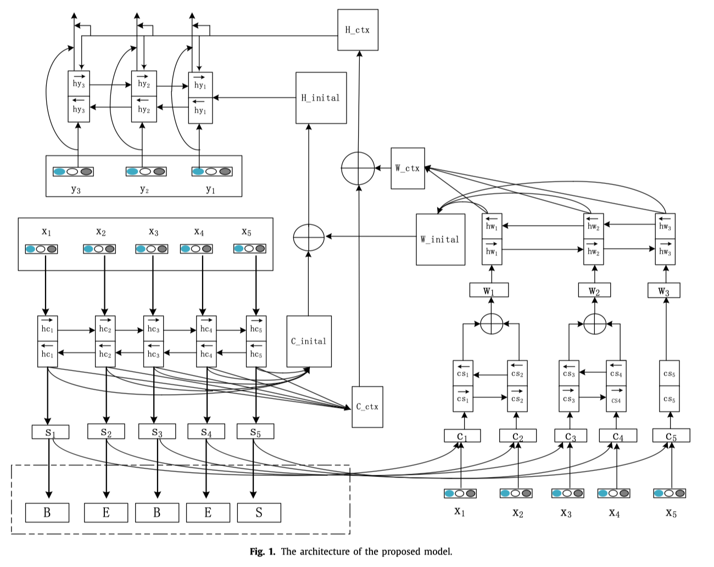

# **简介**

1. 提出了一种新颖的机器翻译模型，关注字符级别和单词级别的attention
2. 使用双向GRU
3. 两种不同的attention，一种是字符级别，输入是原始字符，另一种是单词级别，可以自动生成组合单词
4. 有了这两种attention，模型可以同步组合单词级别和词级别
5. 实验在中英文翻译的任务上进行，BLEU值有所提高

# **模型**

## encoder

1. 包含两个单独的双向GRU
2. 其中一个被用来使用转移字符嵌入序列$x_1$,.....为隐藏变量序列$hc_1$,.....
3. 另一个将单词序列的表示$w_1$,......编码成可变序列$hw_1$,.....

# **实验**

# **参考**

