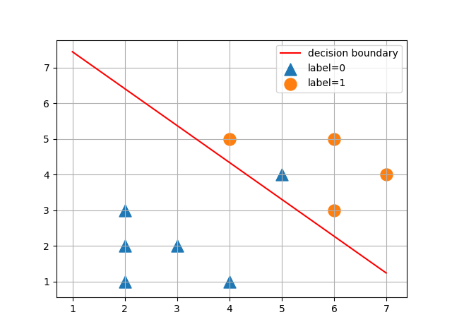

**b站上一个例子：**

> 数据集
>
> ```
> 2 1 0
> 2 2 0
> 5 4 1
> 4 5 1
> 2 3 0
> 3 2 0
> 6 5 1
> 4 1 0
> 6 3 1
> 7 4 1 
> ```

**step1:加载文件**

~~~python
import numpy as np
import matplotlib.pyplot as plt


#def loaddata
def loaddata(filename):
    file = open(filename)
    x = []
    y = []
    for line in file.readlines():
        line = line.strip().split()
        x.append([float(line[0]), float(line[1])])
        y.append(float(line[-1]))
    #将列表格式变成为矩阵的格式
    xmat = np.mat(x)
    ymat = np.mat(y)
    file.close()
    return xmat, ymat


#implement
xmat, ymat = loaddata('ytb_lr.txt')
print('xmat:', xmat, xmat.shape)
print('ymat:', ymat, ymat.shape)

~~~

**运行结果：**

~~~python
D:\1b\Anoconda\setup\set\python.exe E:/python_workspace/ML/WuEnDa_Work/LogisticReg0801.py
xmat: [[ 2.  1.]
 [ 2.  2.]
 [ 5.  4.]
 [ 4.  5.]
 [ 2.  3.]
 [ 3.  2.]
 [ 6.  5.]
 [ 4.  1.]
 [ 6.  3.]
 [ 7.  4.]] (10, 2)
ymat: [[ 0.  0.  0.  1.  0.  0.  1.  0.  1.  1.]] (1, 10)
~~~

**step2:定义具体的计算部分**

~~~python
import numpy as np
import matplotlib.pyplot as plt


#def loaddata
def loaddata(filename):
    file = open(filename)
    x = []
    y = []
    for line in file.readlines():
        line = line.strip().split()
        x.append([1, float(line[0]), float(line[1])])
        y.append(float(line[-1]))
    #将列表格式变成为矩阵的格式
    xmat = np.mat(x)
    ymat = np.mat(y).T
    file.close()
    return xmat, ymat

# w calc
def w_calc(xmat, ymat, alpha= 0.001, maxIter = 10001):
    # W需要进行一个初始化看，就是里面的参数,初始化为三行一列
    W = np.mat(np.random.randn(3,1))
    # W update
    for i in range(maxIter):
        H = 1/(1+np.exp(-xmat*W))
        dw = xmat.T * (H - ymat)  #dw(3, 1)
        W -= alpha * dw
    return W


#implement
xmat, ymat = loaddata('ytb_lr.txt')
# print('xmat:', xmat, xmat.shape)
# print('ymat:', ymat, ymat.shape)
W = w_calc(xmat, ymat)
print(W)
~~~

**运行结果：**

~~~
D:\1b\Anoconda\setup\set\python.exe E:/python_workspace/ML/WuEnDa_Work/LogisticReg0801.py
[[-5.62068929]
 [ 0.71391472]
 [ 0.69674633]]
~~~

**step3：图像展示**

~~~python
import numpy as np
import matplotlib.pyplot as plt


#def loaddata
def loaddata(filename):
    file = open(filename)
    x = []
    y = []
    for line in file.readlines():
        line = line.strip().split()
        x.append([1, float(line[0]), float(line[1])])
        y.append(float(line[-1]))
    #将列表格式变成为矩阵的格式
    xmat = np.mat(x)
    ymat = np.mat(y).T
    file.close()
    return xmat, ymat

# w calc
def w_calc(xmat, ymat, alpha= 0.001, maxIter = 10001):
    # W需要进行一个初始化看，就是里面的参数,初始化为三行一列
    W = np.mat(np.random.randn(3,1))
    # W update
    for i in range(maxIter):
        H = 1/(1+np.exp(-xmat*W))
        dw = xmat.T * (H - ymat)  #dw(3, 1)
        W -= alpha * dw
    return W


#implement
xmat, ymat = loaddata('ytb_lr.txt')
# print('xmat:', xmat, xmat.shape)
# print('ymat:', ymat, ymat.shape)
W = w_calc(xmat, ymat, 0.001, 50000)
print(W)

# show
#分界线也需要画出来
w0 = W[0,0]
w1 = W[1,0]
w2 = W[2,0]

plotx1 = np.arange(1, 7, 0.01)
plotx2 = -w0/w2 - (w1/w2)*plotx1
#线条画出来
plt.plot(plotx1, plotx2, c='r',label='decision boundary')

#每个点显示出来；.A表示变成array的形式
plt.scatter(xmat[:, 1][ymat==0], xmat[:, 2][ymat==0].A, marker='^', s=150, label='label=0')
plt.scatter(xmat[:, 1][ymat==1], xmat[:, 2][ymat==1].A, s=150, label='label=1')
#网格线
plt.grid()
#图标
plt.legend()
plt.show()
~~~


**运行结果：**

