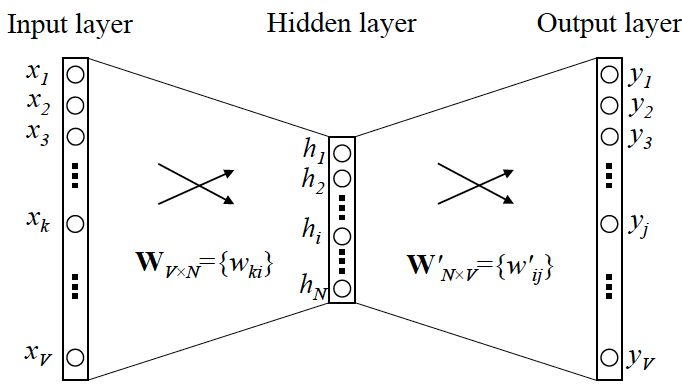

---

layout: post
title: "word2vec"
tag: 机器学习
---
Word2vec 是一种计算效率特别高的预测模型，用于学习原始文本中的字词嵌入。它分为两种类型：连续词袋模型 (CBOW) 和 Skip-Gram 模型

~~~python
# import modules & set up logging
import gensim, logging
logging.basicConfig(format='%(asctime)s : %(levelname)s : %(message)s', level=logging.INFO)

sentences = [['first', 'sentence'], ['second', 'sentence']]
# train word2vec on the two sentences
model = gensim.models.Word2Vec(sentences, min_count=1)
~~~

### 初始化一个model

~~~python 
from gensim.test.utils import common_texts, get_tmpfile
from gensim.models import  Word2Vec
from gensim.models import KeyedVectors

path = get_tmpfile("word2vec.model")
path2 = get_tmpfile("wordvectors.kv")

model = Word2Vec(common_texts, size=100, window=5, min_count=1, workers=4)
model.save("word2vec.model")
model.wv.save(path2)
~~~

#### common_texts

-  产生model . 是gensim的测试数据

~~~python
vector = model.wv['computer']

~~~

~~~
[-2.0298951e-03 -4.4539995e-03  7.5115362e-04 -3.7422150e-03
  3.7343863e-03  3.8227346e-03 -3.3621665e-03 -3.8272697e-03
 -3.2934430e-03  2.9346012e-03 -2.3954774e-03 -3.4397035e-03
 -4.9599716e-03  2.1682580e-03  9.5739530e-04  2.2096122e-03
  2.2193079e-03  2.4574336e-03 -4.8889155e-03  1.7797578e-03
 -1.1287667e-03  4.1063866e-03  4.8284451e-04 -2.0675457e-03
  1.5903882e-03  1.7069015e-03  4.9332688e-03  7.5630349e-04
  4.2695226e-03 -4.1955328e-03  3.4170281e-03  2.2169119e-03
 -2.4260854e-04 -2.8504848e-03 -4.4269264e-03 -4.5933598e-03
 -2.1460224e-03 -2.2596235e-03  2.2327297e-03  2.1441011e-03
 -4.1635497e-04  1.9936890e-03 -4.2722635e-03  4.3454394e-03
 -3.9185360e-03 -2.7288478e-03 -3.7113763e-03 -2.7675966e-03
 -3.0576696e-03 -6.0346600e-04  2.3078735e-03  1.1032440e-03
  1.8327657e-04 -2.2308755e-04 -4.7107758e-03 -3.5732766e-04
 -2.7011607e-03 -6.1050488e-04  2.5788716e-03 -2.0656015e-03
 -4.5464477e-03  4.2969654e-03 -1.1062053e-03 -3.9891023e-03
 -2.5598434e-04 -3.9003484e-03  2.2582673e-03 -3.5574008e-03
 -1.6659809e-05  1.3468560e-03 -7.1467541e-04  4.9408739e-03
  4.2910832e-03  2.4076167e-03 -1.0254798e-03  2.2274945e-03
 -1.2324662e-03  3.9318190e-03 -8.4824505e-04 -1.5694465e-04
 -2.1363069e-04  2.9782741e-03  1.3584413e-03  6.7159184e-04
 -6.8980904e-04 -1.9685728e-03 -3.5247076e-03 -4.0641655e-03
  3.3526996e-03 -2.2572193e-03 -3.6249401e-03 -4.0557226e-03
  3.2149111e-03  3.5485411e-03  3.9969394e-03 -3.7304128e-03
 -2.5903918e-03  4.1160835e-03  1.1693449e-03 -3.5692379e-03]
~~~

- 其中vector就是一个词向量

#### KeyedVectors

- 存储训练好的词向量

“The reason for separating the trained vectors into KeyedVectors is that if you don’t need the full model state any more (don’t need to continue training), the state can discarded, resulting in a much smaller and faster object that can be mmapped for lightning fast loading and sharing the vectors”

把训练好的词向量存在KeyedVectors 中，是因为这样可以删除一些不需要的状态，减少空间。

代价是不能使用KeyedVectors 中的词向量继续参与训练。但是可以使用KeyedVectors 中数据完成NLP的工作。KeyedVectors 的详情可以查阅：

#### LineSentence

`gensim.models.word2vec.LineSentence`(*source*, *max_sentence_length=10000*, *limit=None*)

- source: 指定的文件的iterator，一行对应一句，每一句需要先分好词，用空格分开

~~~python
sentences = LineSentence(datapath('lee_background.cor'))
for sentence in sentences
    pass
~~~

#### PathLineSentences

`gensim.models.word2vec.``PathLineSentences`(*source*, *max_sentence_length=10000*, *limit=None*)

- source: 指定文件夹， 返回iterator

**参数介绍**

- sentences ：可以是a list of list of tokens，也可以是硬盘放置训练数据的路径；

- size (int, optional) ：训练出的词向量的维度；

- window (int, optional)：Maximum distance between the current and predicted word within a sentence。是不是就是N-gram中的窗口大小？

- min_count (int, optional)：一个阈值。训练数据中出现频次小于此频次的词被忽略。用户过滤低频词汇；

- workers (int, optional) ：训练使用多线程吗？加快训练速度；

- sg ({0, 1}, optional)：使用不同模型训练。1 for skip-gram; otherwise CBOW.

- hs ({0, 1}, optional)：优化方法选择，和‘negative’选项组合使用。If 1, hierarchical softmax will be used for model training. If 0, and negative is non-zero, negative sampling will be used.

- negative (int, optional)：negative sampling优化参数。If > 0, negative sampling will be used, the int for negative specifies how many “noise words” should be drawn (usually between 5-20). If set to 0, no negative sampling is used.

- ns_exponent (float, optional)：negative sampling优化参数。详见文章顶部的官网链接；

- cbow_mean ({0, 1}, optional)：CBOW参数。

- alpha (float, optional)：初始学习速率；

- min_alpha (float, optional)：学习速率下限。训练进行过程中学习速率会线性下降；

- seed (int, optional)：初始词向量的值随机产生，这里指定随机数的种子；产生方法见官网链接；

- max_vocab_size (int, optional)：训练过程词表建设过程中RAM的最大值。1千万词的词表占用1GB的RAM。训练过程中词表占用的RAM超过此参数后，就将频次少的词删除。如果设置为None，则不设限；

- max_final_vocab (int, optional)：指定词表大小。我的理解，本参数指定vocab词量；“max_vocab_size ”指定所占空间大小，不知理解是否正确。

- sample (float, optional)：用于对高频词汇降采样。思考：什么场景降采样？

- hashfxn (function, optional)：用于初始化神经网络权重值；

- iter (int, optional)：指定训练数据迭代训练多少遍；

- trim_rule (function, optional)：该参数为函数，用于判断某个词是应该留在词表中，还是该被删除。函数输入参数固定为： (word, count, min_count)；

- sorted_vocab ({0, 1}, optional)：1：按照频次从高到低排序；

- batch_words (int, optional) ：多线程相关。传递给一个worker的example数量；

- compute_loss (bool, optional) ：计算loss。这个值可以用函数获取get_latest_training_loss()；

- callbacks (iterable of CallbackAny2Vec, optional)：回调函数

#### gensim.models.word2vec. Word2Vec

- 训练词向量，神经网络
- 使用save，load 进行存储以及读取

#### Word2VecTrainables

`gensim.models.word2vec.``Word2VecTrainables`(*vector_size=100*, *seed=1*, *hashfxn=<built-in function hash>*)

- 表示词向量的训练网络

#### Word2VecVocab

`gensim.models.word2vec.``Word2VecVocab`

- 词表对象

### 使用word2vec原因

- 举个简单例子，判断一个词的词性，是动词还是名词。用机器学习的思路，我们有一系列样本(x,y)，这里 x 是词语，y 是它们的词性，我们要构建 f(x)->y 的映射，但这里的数学模型 f（比如神经网络、SVM）只接受数值型输入，而 NLP 里的词语，是人类的抽象总结，是符号形式的（比如中文、英文、拉丁文等等），所以需要把他们转换成数值形式，或者说——嵌入到一个数学空间里，这种嵌入方式，就叫词嵌入（word embedding)，而 Word2vec，就是词嵌入（ word embedding) 的一种

- > f(x) --> y

  把 x 看做一个句子里的一个词语，y 是这个词语的上下文词语，那么这里的 f，便是 NLP 中经常出现的『语言模型』（language model），这个模型的目的，就是判断 (x,y) 这个样本，是否符合自然语言的法则，更通俗点说就是：词语x和词语y放在一起，是不是人话。

### word2vec目的

- Word2vec 正是来源于这个思想，但它的最终目的，不是要把 f 训练得多么完美，而是只关心模型训练完后的副产物——模型参数（这里特指神经网络的权重），并将这些参数，作为输入 x 的某种向量化的表示，这个向量便叫做——词向量（这里看不懂没关系，下一节我们详细剖析）

### word2vec如何进行相似词的判断

我们来看个例子，如何用 Word2vec 寻找相似词：

- 对于一句话：『她们 夸 吴彦祖 帅 到 没朋友』，如果输入 x 是『吴彦祖』，那么 y 可以是『她们』、『夸』、『帅』、『没朋友』这些词
- 现有另一句话：『她们 夸 我 帅 到 没朋友』，如果输入 x 是『我』，那么不难发现，这里的上下文 y 跟上面一句话一样
- 从而 f(吴彦祖) = f(我) = y，所以大数据告诉我们：我 = 吴彦祖（完美的结论）

### Skip-gram 和 CBOW 模型

- 一个词语作为输入，预测其上下文（skip-gram)
- 上下文作为输入， 预测改词语(cbpw)

#### one-hot 

假设全世界所有的词语总共有 V 个，这 V 个词语有自己的先后顺序，假设『吴彦祖』这个词是第1个词，『我』这个单词是第2个词，那么『吴彦祖』就可以表示为一个 V 维全零向量、把第1个位置的0变成1，而『我』同样表示为 V 维全零向量、把第2个位置的0变成1。这样，每个词语都可以找到属于自己的唯一表示。

#### **CBOW**

将一句话中的某个词挖去，用其上下文对其进行预测。

输入层是上下文单词的one-hot编码，词典大小为V,第一个权重矩阵W为V行N列的词向量矩阵，N是词向量的维度，如常用的300维、400维等，暂且称W为"输入词向量"，它的作用是把上下文单词的词向量表示出来，如：

此处的**隐藏层**并不经过非线性激活，只是将上下文单词用**W**表示出来的词向量的各维线性地传到下一层；矩阵W' 的形状为N*V，暂且称为**"输出词向量"**，其作用是表示待预测的中心词的词向量；现在要做的就是计算词典中所有词的“得分”，选出最大概率的中心词作为预测结果。

论文中采用的方法是将上下文单词的词向量与中心词的词向量做点积来表示得分，即

而我们知道两个向量的做点积的结果是可以反映它们的相似度的，我认为这也是为什么将词向量用来做相似词检测效果很好的原因。将隐藏层h (上文提到过，将上下文经过输入词向量得到的表示线性传递过来)与w'相乘，便能得到词典中所有的词与上下文的词的得分了(**词典大小为V,经矩阵运算后就是形如V*1的向量，即所有单词得分**)，最后再在输出层计算softmax函数将分数归一化成概率：

使得概率最大的中心词就作为预测的结果。训练过程则采用反向传播和随机梯度下降，不断更新词向量矩阵

- **更一般的情况**

用上下文的C个词来预测中心词，与上下文只有一个词的不同之处在于隐藏层不再是取一个词的词向量的各维，而是上下文C个词的词向量各维的平均值，即：

**最小化损失函数**

#### skip-gram 

x 就是上面提到的 one-hot encoder 形式的输入，y 是在这 V 个词上输出的概率，我们希望跟真实的 y 的 one-hot encoder 一样

- 隐藏层的激活函数是线性的
- 训练神经网络，使用反向传播（链式求导）
- 模型训练完之后，得到的是网络的权重
- 权重的个数==隐藏层的结点数
- 这些权重组成一个向量vx用来代表x.
- 隐藏层到输出层的向量可以使用一个向量vy来表示
- 而这两种词向量 vx 和 vy，正是 Mikolov 在论文里所提到的，『输入向量』和『输出向量』，一般我们用『输入向量』
- 这个词向量的维度（与隐含层节点数一致）一般情况下要远远小于词语总数 V 的大小，所以 Word2vec 本质上是一种**降维**操作——把词语从 one-hot encoder 形式的表示降维到 Word2vec 形式的表示。
- 该种情况是y只有一个词，当y有多个词的时候，网络结构如下
- 首先我们选句子中间的一个词作为我们的输入词，例如我们选取“dog”作为input word；
  有了input word以后，我们再定义一个叫做**skip_window**的参数，它代表着我们从当前input word的一侧（左边或右边）选取词的数量。如果我们设置[公式]，那么我们最终获得窗口中的词（包括input word在内）就是['The', 'dog'，'barked', 'at']。[公式]代表着选取左input word左侧2个词和右侧2个词进入我们的窗口，所以整个窗口大小[公式]。另一个参数叫num_skips，它代表着我们从整个窗口中选取多少个不同的词作为我们的output word，当[公式]，[公式]时，我们将会得到两组 (input word, output word) 形式的训练数据，即 ('dog', 'barked')，('dog', 'the')。
  神经网络基于这些训练数据将会输出一个概率分布，这个概率代表着我们的词典中的每个词是output word的可能性。这句话有点绕，我们来看个栗子。第二步中我们在设置skip_window和num_skips=2的情况下获得了两组训练数据。假如我们先拿一组数据 ('dog', 'barked') 来训练神经网络，那么模型通过学习这个训练样本，会告诉我们词汇表中每个单词是“barked”的概率大小。

#### Skip-gram 更一般的形式

- 可以看作是单个x-->单个y的并联， cost function是单个cost function 的累加

- **输入：**中心词的one-hot编码，经过"输入词向量"得到其词向量表示，隐藏层为中心词词向量的各维：

  

  

- Skip-gram 是预测一个词的上下文，而 CBOW 是用上下文预测这个词
- 这里是输入变成了多个单词，所以要对输入处理下（一般是求和然后平均），输出的 cost function 不变

#### 词向量相关应用

- 计算相似度（寻找相似词，信息检索）
- 作为机器学习模型的输入（中文分词，命名实体识别）
- 句子表示（情感分析）
- 文档表示（文档主题判别）

### **优化方法**

上述未优化的CBOW和Skip-gram中，输出层后采用一般的softmax层，在预测每个词的概率时都要累加一次分母的归一化项，而指数计算的复杂度又比较高，因此一旦词典的规模比较大，预测的效率将会极其低下。在CBOW和Skip-gram中都有相应的优化方法以减小计算复杂度，我们来介绍其中的两种。

##### Hierarchical Softmax

首先以词典中的每个词在语料中出现的次数（或频率）为权重，构建一棵哈夫曼树，叶子节点为词典中的每个词的one-hot表示，每个非叶子结点也表示为一个向量。此时，从根节点到每一个叶子节点的路径都可以由一串哈夫曼编码来表示，如假设向左结点为0，向右结点为1，上图中的“cat”就可以表示为011.

在预测过程中，每一个非叶子结点都用自身的向量表示来做一次二分类（如使用逻辑回归），分类的结果便导向其是去到左结点还是右结点，这样一来，预测为"cat"的概率就可表示为P(结点1==0)P(结点2==1)*P(结点5==1)了，更复杂的树结构也以此类推。此法在预测某一个特定的词的概率时就只需考虑从根节点到该叶子结点这几步了，使预测的效率大大提升。

### 实战

#### 训练一个模型

- 建立词向量模型：`gensim.models.Word2Vec(sentences)`

  1. 建立一个空的模型对象

  2. 遍历一次语料库建立词典

  3. 第二次遍历语料库建立神经网络模型

     ~~~
     model = gensimm.model.word2Vec()
     model.build_vocab(sentence)
     model.train(sentence)
     ~~~

- 训练时可以指定参数

  - min_count：需要训练词语的最小出现次数。默认为5
  - size：指定训练时词向量维度，默认为100
  - worker：指定完成训练过程的线程数，默认为1不使用多线程

- 查询训练结果(保存为文件)

  - 使用model.save('fname')
  - model.save_word2vec_format(fname)

- 读取查询出来的结果

  - model.load(fname)
  - model.load_word2vec_format(fname,encoding='utf-8')

##### 代码

~~~python
from gensim.models.word2vec import Word2Vec 

sentences = [['A1'，'A2']，[]，[]，....] 
model= Word2Vec()
model.build_vocab(sentences)
model.train(sentences，total_examples = model.corpus_count，epochs = model.iter)

保存：
model.save('/tmp/MyModel')
＃model.save_word2vec_format('/tmp/mymodel.txt',binary = False)
＃model.save_word2vec_format('/tmp/mymodel.bin.gz',binary = True)

追加加训练：
model = gensim.models.Word2Vec.load('/tmp/mymodel')
model.train(more_sentences)

加载：
model = gensim.models.Word2Vec.load('/tmp/mymodel')
#model = gensim.models.KeyedVectors.load_word2vec_format('/tmp/vectors.txt',binary = False)
#model = gensim.models.KeyedVectors。load_word2vec_format('/tmp/vectors.bin',binary = True)
##使用gzipped / bz2输入也可以，不需要解压：
#model = gensim.models.KeyedVectors.load_word2vec_format('/tmp/vectors.bin.gz',binary=True)
~~~

#### 使用训练好的模型

##### 获取词向量

~~~python
print(model ['man'])
print(type(model ['man']))
# 输出：
[0.14116223 0.05663395 0.01500377 -0.03592452 ...] 
numpy.ndarray
~~~

##### 计算一个词的最近似的词，倒排序

~~~python
model.most_similar(['男人'])
# 输出：
[（'女'，0.7664012908935547），
 （ '男孩'，0.6824870109558105），
 （ '青少年'，0.6586930155754089），
 （ '女孩'，0.5921714305877686），
 （ '强盗'，0.5585119128227234），
 （ '男'，0.5489763021469116），
 （'人'，0.5420035719871521），
 （ '人'，0.5342026352882385），
 （ '绅士'，0.5337990522384644），
 （ '摩托车手'，0.5336882472038269）]
~~~

##### 计算两次之间的余弦相似度

~~~python
# word2vec一个很大的亮点：支持词语的加减运算（实际中可能只有少数例子比较符合）
model.most_similar(positive = ['woman','king'],negative = ['man'],topn = 2)
# 输出
[（'王后'，0.7118192911148071）,（'君主'，0.6189675331115723）]
model.similarity('女人', '男人')

0.7664012234410319
~~~

##### 计算两个集合之间的余弦似度

~~~python
# 当出现某个词语不在这个训练集合中的时候，会报错！
list1 = ['我'，'走'，'我'，'学校'] 
list2 = ['我'，'去'，'家'] 
list_sim1 = model.n_similarity（list1，list2）
print（list_sim1）
# 输出
0.772446878519
~~~

##### 选出集合中不同类的词语

~~~python
model.doesnt_match('breakfast cereal dinner lunch'.split())
# 输出
‘谷类’
~~~

### 完整的案例实践

#### 1. 准备语料库，进行分词

~~~python
# 1. 对于给定的语料库，首先要进行分词
def segment_file(read_path, write_path):
    f2 = open(write_path, 'a', encoding='utf-8')
    # 1.1 判断路径是否存在
    if os.path.exists(read_path):
        with open(read_path, 'r', encoding='utf-8') as f:
            # f.readlines() 读取全部内容
            text = f.readlines()
            for line in text:
                line.replace('\t', '').replace('\n', '').replace(' ', '')
                seg_text = jieba.cut(line, cut_all=False)
                # print(" ".join(seg_text))
                # with open(write_path, 'a', encoding='utf-8') as f2:
                f2.write(" ".join(seg_text), )
                # print(" ".join(seg_text))
            f2.close()
~~~

#### 2. 训练模型

~~~python
# 2. 使用Word2vec模型
def train(file_path):
    logging.basicConfig(format='%(asctime)s:%(levelname)s:%(message)s', level=logging.INFO)
    # 加载语料
    sentences = word2vec.Text8Corpus(file_path)
    # 训练skip-gram模型， 默认windows=5
    model = word2vec.Word2Vec(sentences, size=200)
    print(model)
~~~

- 输出结果

~~~python
2018-12-10 19:34:24,044:INFO:collecting all words and their counts
2018-12-10 19:34:24,047:INFO:PROGRESS: at sentence #0, processed 0 words, keeping 0 word types
2018-12-10 19:34:24,057:INFO:collected 949 word types from a corpus of 21696 raw words and 3 sentences
2018-12-10 19:34:24,058:INFO:Loading a fresh vocabulary
2018-12-10 19:34:24,059:INFO:effective_min_count=5 retains 476 unique words (50% of original 949, drops 473)
2018-12-10 19:34:24,059:INFO:effective_min_count=5 leaves 19804 word corpus (91% of original 21696, drops 1892)
2018-12-10 19:34:24,061:INFO:deleting the raw counts dictionary of 949 items
2018-12-10 19:34:24,062:INFO:sample=0.001 downsamples 67 most-common words
2018-12-10 19:34:24,062:INFO:downsampling leaves estimated 11305 word corpus (57.1% of prior 19804)
2018-12-10 19:34:24,085:INFO:estimated required memory for 476 words and 200 dimensions: 999600 bytes
2018-12-10 19:34:24,086:INFO:resetting layer weights
2018-12-10 19:34:24,109:INFO:training model with 3 workers on 476 vocabulary and 200 features, using sg=0 hs=0 sample=0.001 negative=5 window=5
2018-12-10 19:34:24,155:INFO:worker thread finished; awaiting finish of 2 more threads
2018-12-10 19:34:24,171:INFO:worker thread finished; awaiting finish of 1 more threads
2018-12-10 19:34:24,172:INFO:worker thread finished; awaiting finish of 0 more threads
2018-12-10 19:34:24,173:INFO:EPOCH - 1 : training on 21696 raw words (11304 effective words) took 0.0s, 243500 effective words/s
2018-12-10 19:34:24,201:INFO:worker thread finished; awaiting finish of 2 more threads
2018-12-10 19:34:24,209:INFO:worker thread finished; awaiting finish of 1 more threads
2018-12-10 19:34:24,217:INFO:worker thread finished; awaiting finish of 0 more threads
2018-12-10 19:34:24,218:INFO:EPOCH - 2 : training on 21696 raw words (11360 effective words) took 0.0s, 436565 effective words/s
2018-12-10 19:34:24,247:INFO:worker thread finished; awaiting finish of 2 more threads
2018-12-10 19:34:24,250:INFO:worker thread finished; awaiting finish of 1 more threads
2018-12-10 19:34:24,255:INFO:worker thread finished; awaiting finish of 0 more threads
2018-12-10 19:34:24,255:INFO:EPOCH - 3 : training on 21696 raw words (11220 effective words) took 0.0s, 320207 effective words/s
2018-12-10 19:34:24,279:INFO:worker thread finished; awaiting finish of 2 more threads
2018-12-10 19:34:24,286:INFO:worker thread finished; awaiting finish of 1 more threads
2018-12-10 19:34:24,289:INFO:worker thread finished; awaiting finish of 0 more threads
2018-12-10 19:34:24,289:INFO:EPOCH - 4 : training on 21696 raw words (11265 effective words) took 0.0s, 349448 effective words/s
2018-12-10 19:34:24,308:INFO:worker thread finished; awaiting finish of 2 more threads
2018-12-10 19:34:24,315:INFO:worker thread finished; awaiting finish of 1 more threads
2018-12-10 19:34:24,320:INFO:worker thread finished; awaiting finish of 0 more threads
2018-12-10 19:34:24,320:INFO:EPOCH - 5 : training on 21696 raw words (11353 effective words) took 0.0s, 391712 effective words/s
2018-12-10 19:34:24,320:INFO:training on a 108480 raw words (56502 effective words) took 0.2s, 267862 effective words/s
2018-12-10 19:34:24,320:WARNING:under 10 jobs per worker: consider setting a smaller `batch_words' for smoother alpha decay
Word2Vec(vocab=476, size=200, alpha=0.025)
~~~

#### 3. 计算两个词的相似性

~~~python
# 3. 计算两个词之间的相似度
def calc_similarity(my_model):
    try:
        y1 = my_model.similarity(u"交通", u"交通事故")
    except KeyError:
        y1 = 0
    print("交通，交通事故的相似度为：", y1)
~~~

- 结果

~~~python 
交通，交通事故的相似度为： 0.9967415
~~~

#### 4. 寻找对应关系

~~~python
def find_Correspondence(my_model):
    print("交通事故，赔偿-")
    y = my_model.most_similar([u'交通事故', u'赔偿'], [u'书'], topn=3)
    for item in y:
        print(item[0], item[1])
~~~

- 结果

~~~
30000 0.9456740617752075
后要 0.942922830581665
到位 0.9408597946166992
~~~

#### 5. 计算两个词的相关词列表

~~~python
# 5. 计算两个词的相关词列表
def find_twowords(my_model):
    y = my_model.most_similar(u"交通", topn=20)
    print("和交通相关的词有：")
    for item in y:
        print(item[0], item[1])
~~~

- 结果

~~~
和交通相关的词有：
标准 0.9994759559631348
费用 0.9994104504585266
不能 0.9993982911109924
过期 0.9993927478790283
学 0.9993722438812256
住院 0.999354362487793
解决 0.9993520975112915
私人 0.9993283748626709
快速 0.9993126392364502
出院 0.9993119835853577
行使 0.9993066787719727
擦 0.9992993474006653
比如 0.9992930889129639
万 0.9992604851722717
她 0.999256432056427
） 0.9992414712905884
变道 0.9992201328277588
48 0.9992151260375977
虚线 0.9992151260375977
一点 0.9992074966430664

~~~

#### 6. 寻找不合群的词

~~~python

# 6. 寻找不合群的词
def find_different(my_model):
    y = my_model.doesnt_match(u"交通 肇事 罪名".split())
    print("不合群的词：", y)

~~~

- 结果

~~~
不合群的词： 肇事
~~~

#### 参考网址：

- <https://blog.csdn.net/xiaoquantouer/article/details/53583980>

### 报错

~~~python
E:\YanJiuSheng-download\2a\anaconda\envs\tensorflow\lib\site-packages\gensim\utils.py:1212: UserWarning: detected Windows; aliasing chunkize to chunkize_serial
  warnings.warn("detected Windows; aliasing chunkize to chunkize_serial")
~~~

### 参考网址

- <https://blog.csdn.net/tong_xin2010/article/details/81199446>
- <https://zhuanlan.zhihu.com/p/26306795>
- <https://blog.csdn.net/qq_19707521/article/details/79169826>
- <https://blog.csdn.net/xiaoquantouer/article/details/53583980>
- https://zhuanlan.zhihu.com/p/58425003（优化方法讲的很详细）

