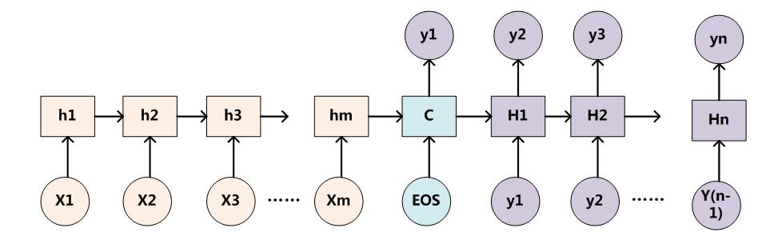
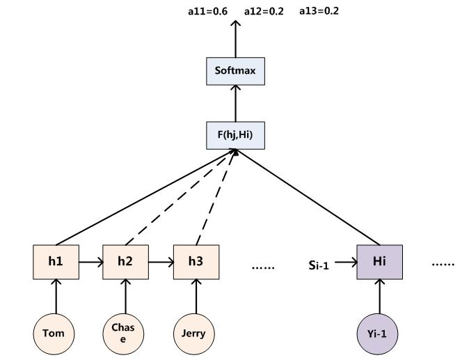

# 简介

- 用于提升基于RNN（LSTM或GRU）的Encoder + Decoder模型的效果的的机制（Mechanism）

- 一种资源分配模型，在某个特定时刻，你的注意力总是集中在画面中的某个焦点部分，而对其它部分视而不见。

# 适用领域

机器翻译、语音识别、图像标注（Image Caption）等很多领域

# 优点

- Attention给模型赋予了区分辨别的能力

- 在机器翻译、语音识别应用中，为句子中的每个词赋予不同的权重，使神经网络模型的学习变得更加灵活（soft），同时Attention本身可以做为一种对齐关系，解释翻译输入/输出句子之间的对齐关系，解释模型到底学到了什么知识，为我们打开深度学习的黑箱，提供了一个窗口，如图1所示。
- 与人类对外界食物的观察机制类似，当人类观察外界事物的时候，一般不会把事物当成一个整体去看，往往倾向于根据需要选择性的去获取被观察事物的某些重要部分。

# 原理

## Encoder-Decoder

- 可以把它看作适合处理由一个句子（或篇章）生成另外一个句子（或篇章）的通用处理模型。对于句子对<X,Y>，我们的目标是给定输入句子X，期待通过Encoder-Decoder框架来生成目标句子Y。X和Y可以是同一种语言，也可以是两种不同的语言。而X和Y分别由各自的单词序列构成：

- 把一个变成的输入序列x1，x2，x3....xt编码成一个固定长度隐向量（背景向量，或上下文向量context）c，c有两个作用：1、做为初始向量初始化Decoder的模型，做为decoder模型预测y1的初始向量。2、做为背景向量，指导y序列中每一个step的y的产出。Decoder主要基于背景向量c和上一步的输出yt-1解码得到该时刻t的输出yt，直到碰到结束标志（`<EOS>`）为止。

> X: 句子
>
> X={x1,x2,...,x3}
>
> X --> C(背景向量、语义编码、上下文向量)

- 句子中任意单词对生成目标单词yi， 影响力都是一样的， 没有任何区别
- 所以谷歌提出S2S时，发现输入句子逆序输入做翻译效果更好

### 常用模型

- CNN/RNN/BiRNN/GRU/LSTM/Deep LSTM

### 应用场景

- Encoder-Decoder是个创新游戏大杀器，一方面如上所述，可以搞各种不同的模型组合，另外一方面它的应用场景多得不得了，比如对于机器翻译来说，<X,Y>就是对应不同语言的句子，比如X是英语句子，Y是对应的中文句子翻译。再比如对于文本摘要来说，X就是一篇文章，Y就是对应的摘要；再比如对于对话机器人来说，X就是某人的一句话，Y就是对话机器人的应答；再比如……总之，太多了。哎，那位施主，听老衲的话，赶紧从天台下来吧，无数创新在等着你发掘呢。

# 详细解释

- 在encoder-decoder基础上，引入AM模型
- 给定一个概率分布值`（Tom,0.3）(Chase,0.2) (Jerry,0.5)`
- 每个单词的概率代表了在当前单词下，注意力分配给不同英文单词的**注意力大小**。对于正确翻译目标单词是有帮助的，因为引入了新的信息。
- 每个单词都应该学会其对应的源语句子中单词的注意力分配概率信息。
- 这意味着在生成每个单词Yi的时候，原先都是相同的中间语义表示C会替换成根据当前生成单词而不断变化的Ci。

- 相应的生成目标句子单词的过程如下：

  

- 而每个Ci可能对应着不同的源语句子单词的注意力分配概率分布，比如对于上面的英汉翻译来说，其对应的信息可能如下：

  

  > f2: 代表Encoder对于输入英文单词的某种变换函数（如果Encoder用的是RNN, f2的结果就是指某个时刻输入xi后隐层节点的状态值）
  >
  > g:代表Encoder根据单词的中间表示合成整个句子中间语义表示的变换函数， 一般， g函数就是构成元素的加权求和

## 模型一般结构

## 公式

> i表示encoder端的第i个词，
>
> hj表示encoder端的第j词的隐向量，
>
> aij表示encoder端的第j个词与decoder端的第i个词之间的权值，表示源端第j个词对目标端第i个词的影响程度，

- Ci ：Ci中那个i就是上面的“汤姆”
- Tx：对应上面的3，代表输入句子的长度
- h1=f(“Tom”)，h2=f(“Chase”), h3=f(“Jerry”)
- 注意力模型权值分别为0.6， 0.2， 0.2

- aij的计算公式如下

> aij是一个softmax模型输出，概率值的和为1;
>
> eij表示一个对齐模型，用于衡量encoder端的位置j个词，对于decoder端的位置i个词的对齐程度（影响程度）== decoder端生成位置i的词时，有多少程度受encoder端的位置j的词影响。

- 对齐模型eij的计算方式有很多种，不同的计算方式，代表不同的Attention模型，最简单且最常用的的对齐模型是dot product乘积矩阵，即把target端的输出隐状态ht与source端的输出隐状态进行矩阵乘。常见的对齐计算方式如下：

> 其中,Score(ht,hs) = aij表示源端与目标单单词对齐程度。可见，常见的对齐关系计算方式有，点乘（Dot product），权值网络映射（General）和concat映射几种方式。

## 概率分布值

**存在问题**：如何知道AM模型所需要输入的句子单词注意力概率分布值？

> eg:（Tom,0.6）(Chase,0.2)  (Jerry,0.2）是如何得到的

如上图，非AM模型的Encoder-Decoder框架进行细化，Encoder采用RNN模型，Decoder也采用RNN模型，这是比较常见的一种模型配置

**概率分布值通用计算**：

> 上图对应输入值为Tom时， 对应的输入句子的对齐概率。
>
> 可以用i时刻的隐层节点状态Hi去和输入句子中每个单词对应的RNN隐层节点状态hj进行对比，即通过函数F(hj,Hi)来获得目标单词Yi和每个输入单词对应的对齐可能性
>
> F函数在不同论文里可能会采取不同的方法，然后函数F的输出经过Softmax进行归一化就得到了符合概率分布取值区间的注意力分配概率分布数值

## 物理含义

- 一般会把AM模型看作时单词对齐模型

- 目标句子生成的每个单词对应输入句子单词的概率分布可以理解为输入句子单词和这个目标生成单词的对齐概率
- 传统的统计机器翻译一般在做的过程中会专门有一个短语对齐的步骤，而注意力模型其实起的是相同的作用
- AM模型理解成影响力模型也是合理的，就是说生成目标单词的时候，输入句子每个单词对于生成这个单词有多大的影响程度。这种想法也是比较好理解AM模型物理意义的一种思维方式

## 分类

### **Flat Attention**

### **Global Attention**

> ht : decoder的隐状态
>
> hs: 源端的隐状态
>
> at: 变长的隐对齐权值向量

- score是一个用于评价ht与hs之间关系的函数，即对齐函数，一般有三种计算方式
- 得到对齐向量at之后，就可以通过加权平均的方式，得到上下文向量ct

### **Local Attention：**

- Global Attention有一个明显的缺点就是，每一次，encoder端的所有hidden state都要参与计算，这样做计算开销会比较大，特别是当encoder的句子偏长，比如，一段话或者一篇文章，效率偏低。
- 为提高效率而产生
- 是一种介于Kelvin Xu所提出的Soft Attention和Hard Attention之间的一种Attention方式

- Local Attention首先会为decoder端当前的词，预测一个source端对齐位置（aligned position）pt，然后基于pt选择一个窗口，用于计算背景向量ct。Position pt的计算公式如下：

- 其中，S是encoder端句子长度，vp和wp是模型参数。此时，对齐向量at的计算公式如下：

### **Self Attention**

- Self Attention与传统的Attention机制非常的不同：传统的Attention是基于source端和target端的隐变量（hidden state）计算Attention的，得到的结果是源端的每个词与目标端每个词之间的依赖关系。

- Self Attention不同，它分别在source端和target端进行，仅与source input或者target input自身相关的Self Attention，捕捉source端或target端自身的词与词之间的依赖关系；然后再把source端的得到的self Attention加入到target端得到的Attention中，捕捉source端和target端词与词之间的依赖关系。

- self Attention比传统的Attention mechanism效果要好，主要原因之一是，传统的Attention机制忽略了源端或目标端句子中词与词之间的依赖关系，相对比，self Attention可以不仅可以得到源端与目标端词与词之间的依赖关系，同时还可以有效获取源端或目标端自身词与词之间的依赖关系

  

  

- Encoder的输入inputs和decoder的输入outputs，加上position embedding，做为各自的最初的输入，那么问题来了，self Attention具体是怎么实现的呢？从All Attention的结构示意图可以发现，Encoder和decoder是层叠了多个类似的Multi-Head Attention单元构成，而每一个Multi-Head Attention单元由多个结构相似的Scaled Dot-Product Attention单元组成

- Self Attention也是在Scaled Dot-Product Attention单元里面实现的，如上图左图所示，首先把输入Input经过线性变换分别得到Q、K、V，注意，Q、K、V都来自于Input，只不过是线性变换的矩阵的权值不同而已。然后把Q和K做dot Product相乘，得到输入Input词与词之间的依赖关系，然后经过尺度变换（scale）、掩码（mask）和softmax操作，得到最终的Self Attention矩阵。尺度变换是为了防止输入值过大导致训练不稳定，mask则是为了保证时间的先后关系。
- 最后，把encoder端self Attention计算的结果加入到decoder做为k和V，结合decoder自身的输出做为q，得到encoder端的attention与decoder端attention之间的依赖关系。

### **Hierarchical Attention**

- Zichao Yang等人在论文《Hierarchical Attention Networks for Document Classification》提出了Hierarchical Attention用于文档分类。Hierarchical Attention构建了两个层次的Attention Mechanism，第一个层次是对句子中每个词的attention，即word attention；第二个层次是针对文档中每个句子的attention，即sentence attention。

- 整个网络结构由四个部分组成：一个由双向RNN（GRU）构成的word sequence encoder，然后是一个关于词的word-level的attention layer；基于word attention layar之上，是一个由双向RNN构成的sentence encoder，最后的输出层是一个sentence-level的attention layer。

# 参考网址、文献

- 《Sequence to Sequence Learning with Neural Networks》
- 《Learning Phrase Representations using RNN Encoder–Decoder for Statistical Machine Translation》
- <https://blog.csdn.net/xiewenbo/article/details/79382785>
- <https://zhuanlan.zhihu.com/p/31547842>