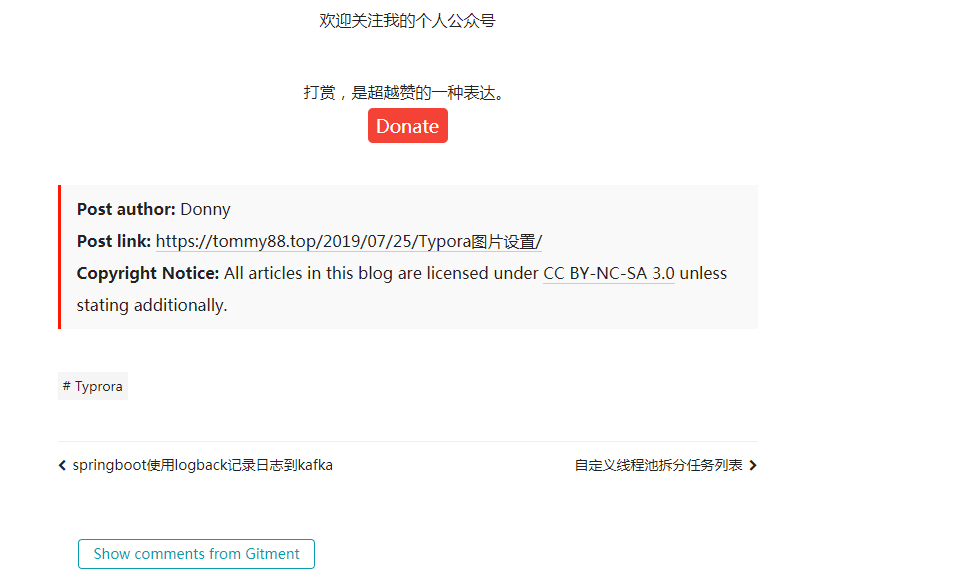

# **常见算法**

## **回归算法**

## **聚类算法**

## **正则化方法**

## **决策树学习**

## **贝叶斯方法**

## **基于核的算法**

## **聚类算法**

## **关联规则学习**

## **人工神经网络**

## **深度学习**

## **降低维度**

## **集成学习**

# **监督学习、非监督学习、半监督学习、弱监督学习**

## **监督学习**

- 应用场景：分类问题， 回归问题
- 常见监督学习
  - 支持向量机
  - 朴素贝叶斯
  - 逻辑回归
  - K近邻
  - 决策树
  - 随机森林
  - AdaBoost
  - 线性判别分析
  - 大多数深度学习

## **非监督学习**

- 应用场景：关联规则的学习， 聚类
- 常见算法
  - Apriori算法
  - K-means算法

## **半监督式学习**

- 应用场景：分类，回归，包括一些对常用监督式学习算法的延伸，通过对已标记数据建模，在此基础上，对未标记数据进行预测。
- 常见算法
  - 图论推理算法
  - 拉普拉斯支持向量机

## **弱监督学习**

- 可以看做是有多个标记的数据集合，次集合可以是空集，单个元素，或包含多种情况（没有标记，有一个标记，和有多个标记）的多个元素
- 数据集的标签是不可靠的，这里的不可靠可以是标记不正确，多种标记，标记不充分，局部标记等
- 已知数据和其一一对应的弱标签，训练一个智能算法，将输入数据映射到一组更强的标签的过程。标签的强弱指的是标签蕴含的信息量的多少，比如相对于分割的标签来说，分类的标签就是弱标签
- 举例，给出一张包含气球的图片，需要得出气球在图片中的位置及气球和背景的分割线，这就是已知弱标签学习强标签的问题。

在企业数据应用的场景下， 人们最常用的可能就是监督式学习和非监督式学习的模型。 在图像识别等领域，由于存在大量的非标识的数据和少量的可标识数据， 目前半监督式学习是一个很热的话题。

# **监督学习步骤**

## 1. 数据集的创建和分类

##2. 数据增强

## **3. 特征工程**

## **4. 构建预测模型和损失**

- 保证模型的输出和输入标签的一致性，需要构建模型预测和标签之间的损失函数，常见的损失函数(Loss Function)有交叉熵、均方差等。通过优化方法不断迭代，使模型从最初的初始化状态一步步变化为有预测能力的模型的过程，实际上就是学习的过程。 

## **5. 训练**

- 选择合适的模型和超参数进行初始化，其中超参数比如支持向量机中核函数、误差项惩罚权重等。当模型初始化参数设定好后，将制作好的特征数据输入到模型，通过合适的优化方法不断缩小输出与标签之间的差距，当迭代过程到了截止条件，就可以得到训练好的模型。优化方法最常见的就是梯度下降法及其变种，使用梯度下降法的前提是优化目标函数对于模型是可导的。

## **6. 验证和模型选择**

## **7. 测试及应用**

# **分类和回归**

- 分类模型是认为模型的输出是离散的，例如大自然的生物被划分为不同的种类，是离散的。回归模型的输出是连续的

# 常见分类算法优缺点

| 算法                        | 优点                                                         | 缺点                                                         |
| --------------------------- | ------------------------------------------------------------ | ------------------------------------------------------------ |
| Bayes 贝叶斯分类法          | 1）所需估计的参数少，对于缺失数据不敏感。 2）有着坚实的数学基础，以及稳定的分类效率。 | 1）需要假设属性之间相互独立，这往往并不成立。（喜欢吃番茄、鸡蛋，却不喜欢吃番茄炒蛋）。 2）需要知道先验概率。 3）分类决策存在错误率。 |
| Decision Tree决策树         | 1）不需要任何领域知识或参数假设。 2）适合高维数据。 3）简单易于理解。 4）短时间内处理大量数据，得到可行且效果较好的结果。 5）能够同时处理数据型和常规性属性。 | 1）对于各类别样本数量不一致数据，信息增益偏向于那些具有更多数值的特征。 2）易于过拟合。 3）忽略属性之间的相关性。 4）不支持在线学习。 |
| SVM支持向量机               | 1）可以解决小样本下机器学习的问题。 2）提高泛化性能。 3）可以解决高维、非线性问题。超高维文本分类仍受欢迎。 4）避免神经网络结构选择和局部极小的问题。 | 1）对缺失数据敏感。 2）内存消耗大，难以解释。 3）运行和调参略烦人。 |
| KNN K近邻                   | 1）思想简单，理论成熟，既可以用来做分类也可以用来做回归；  2）可用于非线性分类； 3）训练时间复杂度为O(n)；  4）准确度高，对数据没有假设，对outlier不敏感； | 1）计算量太大。 2）对于样本分类不均衡的问题，会产生误判。 3）需要大量的内存。 4）输出的可解释性不强。 |
| Logistic Regression逻辑回归 | 1）速度快。 2）简单易于理解，直接看到各个特征的权重。 3）能容易地更新模型吸收新的数据。 4）如果想要一个概率框架，动态调整分类阀值。 | 特征处理复杂。需要归一化和较多的特征工程。                   |
| Neural Network 神经网络     | 1）分类准确率高。 2）并行处理能力强。 3）分布式存储和学习能力强。 4）鲁棒性较强，不易受噪声影响。 | 1）需要大量参数（网络拓扑、阀值、阈值）。 2）结果难以解释。 3）训练时间过长。 |
| Adaboosting                 | 1）adaboost是一种有很高精度的分类器。 2）可以使用各种方法构建子分类器，Adaboost算法提供的是框架。 3）当使用简单分类器时，计算出的结果是可以理解的。而且弱分类器构造极其简单。 4）简单，不用做特征筛选。 5）不用担心overfitting。 | 对outlier比较敏感                                            |

### 

$ S_{N}=\sqrt{\frac{1}{N}\sum_{i=1}^{N}(x_{i}-\bar{x})^{2}} $

# **人工智能应用场景**

- 农业

- 教育

- 医疗

- 零售

- 金融

- 汽车

- 广告

  ## 监督学习和无监督学习常用算法
  
  
  
  
  
  
  
  
  
  
  
  
  
  
  
  
  
  
  
  
  
  
  
  
  
  
  
  
  
  
  
  
  
  
  
  
  
  
  
  
  
  
  
  
  
  
  
  
  
  
  
  
  
  
  
  
  
  
  
  
  
  
  
  
  
  
  
  
  
  
  
  
  
  
  
  
  
  
  
  
  
  
  
  
  
  
  
  
  
  
  
  
  
  
  
  
  
  
  
  
  
  
  
  
  
  
  
  
  
  
  
  
  
  
  
  
  
  
  
  
  
  
  
  
  
  
  
  
  
  
  
  
  
  
  
  
  
  
  
  
  
  
  
  
  
  

