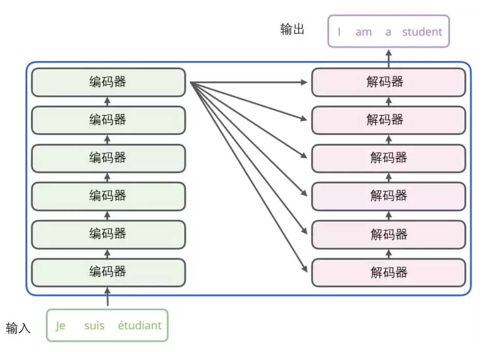

# **简介**

Transformer由论文《Attention is All You Need》提出，现在是谷歌云TPU推荐的参考模型

# **模型结构**

## **自注意力作用**

- 帮助编码器对每个单词编码时，可以关注其他单词

## **decoder**

解码器中也有编码器的自注意力（self-attention）层和前馈（feed-forward）层。除此之外，这两个层之间还有一个注意力层，用来关注输入句子的相关部分（和seq2seq模型的注意力作用相似）。