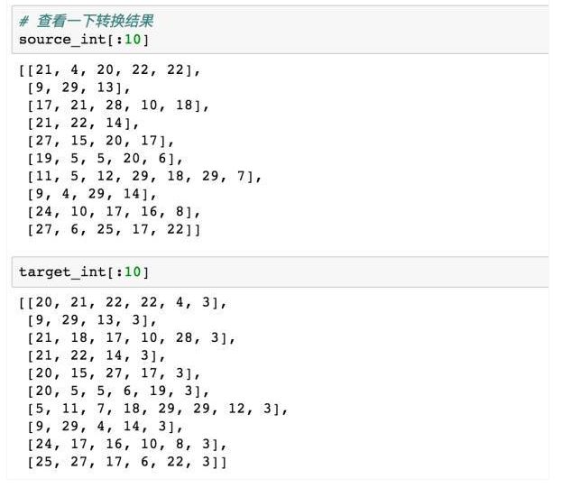

# **数据预处理**

- < PAD>: 补全字符。
- < EOS>: 解码器端的句子结束标识符。
- < UNK>: 低频词或者一些未遇到过的词等。
- < GO>: 解码器端的句子起始标识符。



# **模型构建**

## **encoder层**

1. 定义输入的tensor

2. 对字母进行embedding

   `tf.contrib.layers.embed_sequence`: 对于输入进行embedding

   我们来看一个栗子，假如我们有一个batch=2，sequence_length=5的样本，features = [[1,2,3,4,5],[6,7,8,9,10]]，使用

   ```javascript
   tf.contrib.layers.embed_sequence(features,vocab_size=n_words, embed_dim=10)
   ```

   那么我们会得到一个2 x 5 x 10的输出，其中features中的每个数字都被embed成了一个10维向量。

## **decoder层**

1. target数据预处理
   - target序列作为输入传给decoder端RNN的每个阶段，而不是使用前一阶段的预测输出。
   - 使用target数据计算模型的loss
2. 构造decoder
   - 对target数据进行embedding。
   - 构造Decoder端的RNN单元。
   - 构造输出层，从而得到每个时间序列上的预测结果。
   - 构造training decoder。
   - 构造predicting decoder。


# 参考网址

- <https://cloud.tencent.com/developer/article/1031373> 详细讲解了一个简单的例子，有代码