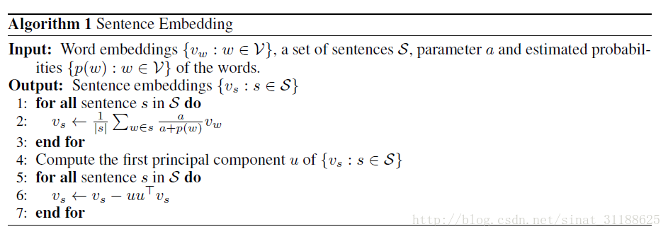

# 核心论文

**A SIMPLE BUT TOUGH-TO-BEAT BASELINE FOR SENTENCE EMBEDDINGS**

<https://openreview.net/pdf?id=SyK00v5xx>

## 简介

- 提出了一个无监督的句子建模方法，并且给出了该方法的一些理论解释。通过该方法得到的句子向量，在STS数据集上取得了不输给神经网络的效果。

## 句子建模算法

- 作者将该算法称之为WR。
- W表示Weighted，意为使用预估计的参数给句中的每个词向量赋予权重。
- R表示Removal，意为使用PCA或者SVD方法移除句向量中的无关部分。

### 输入：

1. 预训练好的词向量
2. 待处理的句子S

我现在格式是这样的

<sos>

标题 标题词向量

内容 内容词向量

语句1 语句1词向量

语句2 语句2词向量

。。。

<sos>

。。

