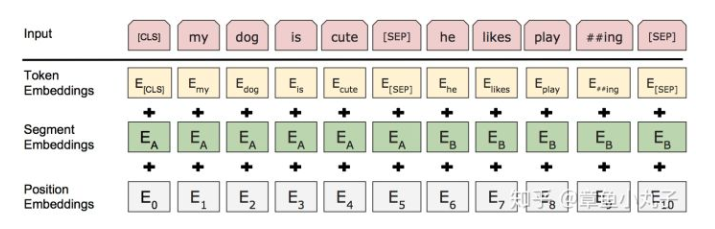
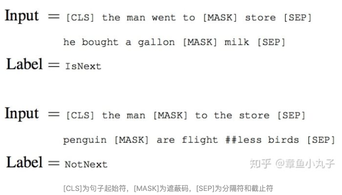

## 一、简介

BERT模型实际上是一个语言编码器，把输入的句子或者段落转化成特征向量（embedding）。论文中有两大亮点：1.双向编码器。作者沿用了《attention is all you need》里提到的语言编码器，并提出**双向的概念**，利用masked语言模型实现双向。2.作**者提出了两种预训练的方法Masked语言模型和下一个句子的预测方法**。作者认为现在很多语言模型低估了预训练的力量。Masked语言模型比起预测下一个句子的语言模型，多了双向的概念。

## 二、输入

输入表示为每个词对应的词向量，segment向量，位置向量相加而成。（位置向量参考《attention is all you need》）

## **三、预训练过程**

**Masked语言模型是**为了训练深度双向语言表示向量，作者用了一个非常直接的方式，遮住句子里某些单词，让编码器预测这个单词是什么。

训练方法为：作者随机遮住15%的单词作为训练样本。

（1）其中80%用masked token来代替。

（2）10%用随机的一个词来替换。

（3）10%保持这个词不变。

作者在论文中提到这样做的好处是，编码器不知道哪些词需要预测的，哪些词是错误的，因此被迫需要学习每一个token的表示向量。另外作者表示，每个batchsize只有15%的词被遮盖的原因，是性能开销。双向编码器比单项编码器训练要慢。

## **四、NSP**

预训练一个二分类的模型，来学习句子之间的关系。预测下一个句子的方法对学习句子之间关系很有帮助。

**训练方法：**正样本和负样本比例是1：1，50%的句子是正样本，随机选择50%的句子作为负样本。

## **五、预训练参数**

（1）256个句子作为一个batch,每个句子最多512个token。

（2）迭代100万步。

（3）总共训练样本超过33亿。

（4）迭代40个epochs。

（5）用adam学习率， 1 = 0.9, 2 = 0.999。

（6）学习率头一万步保持固定值，之后线性衰减。

（7）L2衰减，衰减参数为0.01。

（8）drop out设置为0.1。

（9）激活函数用GELU代替RELU。

（10）Bert base版本用了16个TPU，Bert large版本用了64个TPU，训练时间4天完成。

（论文定义了两个版本，一个是base版本，一个是large版本。Large版本（L=24, H=1024, A=16, Total Parameters=340M）。base版本（ L=12, H=768, A=12, Total Pa- rameters=110M）。L代表网络层数，H代表隐藏层数，A代表self attention head的数量。）

## **六、微调阶段**

微调阶段根据不同任务使用不同网络模型。在微调阶段，大部分模型的超参数跟预训练时差不多，除了batchsize，学习率，epochs。

训练参数：

Batch size: 16, 32

Learning rate (Adam): 5e-5, 3e-5, 2e-5

Number of epochs: 3, 4

## **七、参考网址**

- <https://cloud.tencent.com/developer/article/1389555> 强烈推荐观看
- <https://zhuanlan.zhihu.com/p/46997268>
- 

