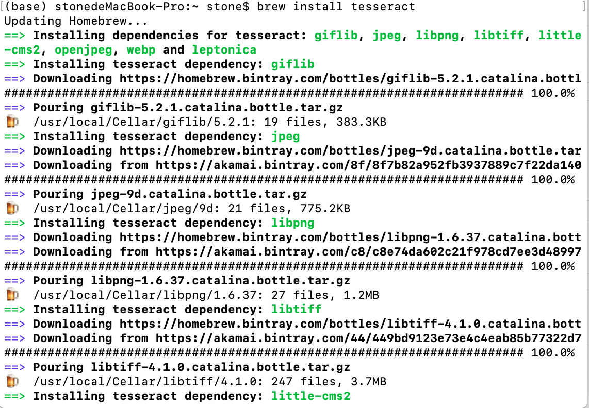
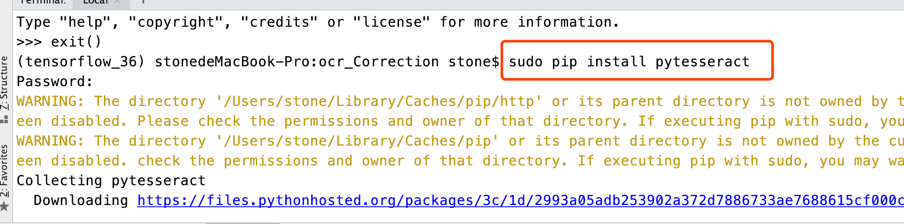
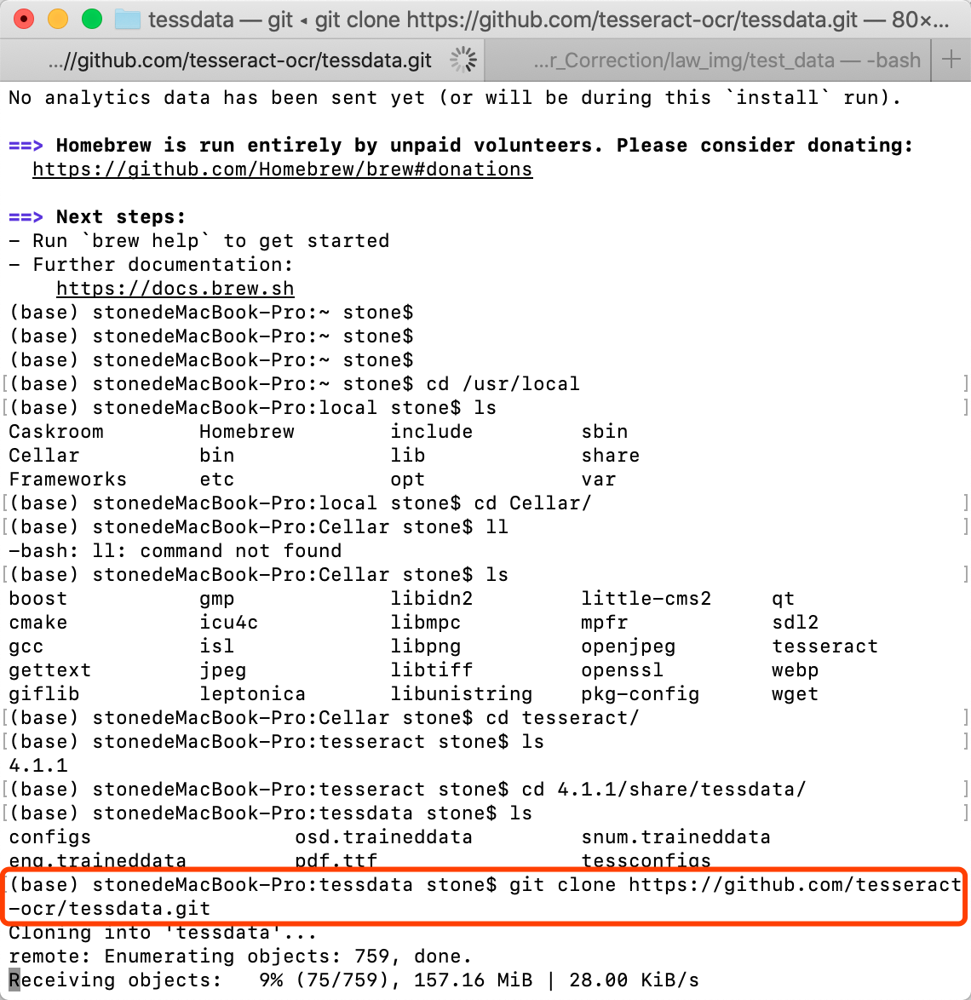

## 前提

- 在安装好homebrew的前提下
- macOS 10.15.3

## 指令

`brew install tesseract`

## 安装pytesseract

## **字体安装**

- 如果需要识别中文或者其他字体，还需要进一步安装字体

- 参考<https://www.jianshu.com/p/8729de67a83c>

## 参考网址

- <https://github.com/tesseract-ocr/tesseract/wiki>

