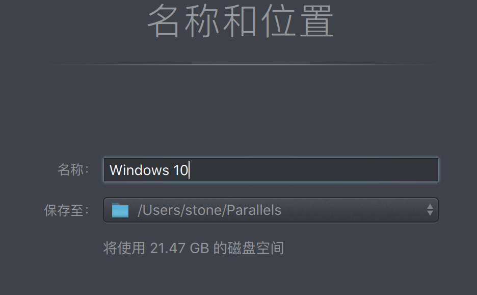

### 参加网址

- 参考的B站上的一个视频

  <https://www.bilibili.com/video/av36914543?from=search&seid=7664098763037668914>

### 资源地址

- Windows镜像资源

  <http://msdn.itellyou.cn/>

  下载版本` Windows 10 (consumer editions), version 1903 (updated Sept 2019) (x64) - DVD (Chinese-Simplified)`

  复制地址到迅雷中下载

- Parallels Desktop

  <https://www.parallels.com/cn/welcome-trial/>

