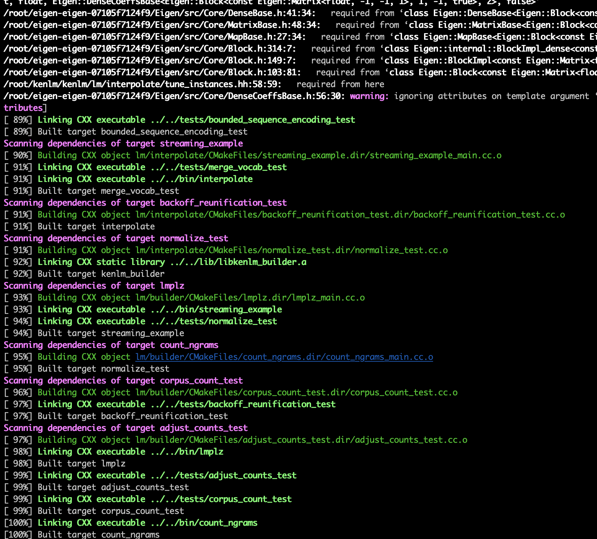

### 参考网址

- <https://blog.csdn.net/Nicholas_Wong/article/details/80013547>

### 出现问题

- cmake Could NOT find ZLIB (missing: ZLIB_LIBRARY)

  <https://blog.csdn.net/bobay/article/details/78616649>

  `apt-get install zlib1g zlib1g-dev`

- Eigen3找不到

  按照安装过程的提示

### **安装结果**

-  

### **训练过程**

~~~
root@20a49529b74e:~/kenlm/kenlm/build# bin/lmplz -o 3 --verbose_header --text /root/Ocr_source/婚姻法相关法条/最高人民法院关于适用婚姻法问题的通知\(1981\).txt --arpa yao.arpa
~~~

### **训练结果**

~~~
root@20a49529b74e:~/kenlm/kenlm/build# bin/lmplz -o 3 --verbose_header --text /root/Ocr_source/训练语料 --arpa yao2.arpa
=== 1/5 Counting and sorting n-grams ===
Reading /root/Ocr_source/训练语料
----5---10---15---20---25---30---35---40---45---50---55---60---65---70---75---80---85---90---95--100
****************************************************************************************************
Unigram tokens 78536442 types 863701
=== 2/5 Calculating and sorting adjusted counts ===
Chain sizes: 1:10364412 2:58744557568 3:110146043904
Statistics:
1 863701 D1=0.70875 D2=1.04067 D3+=1.35443
2 10683699 D1=0.757294 D2=1.08072 D3+=1.35845
3 33500658 D1=0.816186 D2=1.1527 D3+=1.34858
Memory estimate for binary LM:
type     MB
probing 841 assuming -p 1.5
probing 905 assuming -r models -p 1.5
trie    360 without quantization
trie    209 assuming -q 8 -b 8 quantization
trie    340 assuming -a 22 array pointer compression
trie    188 assuming -a 22 -q 8 -b 8 array pointer compression and quantization
=== 3/5 Calculating and sorting initial probabilities ===
Chain sizes: 1:10364412 2:170939184 3:670013160
----5---10---15---20---25---30---35---40---45---50---55---60---65---70---75---80---85---90---95--100
####################################################################################################
=== 4/5 Calculating and writing order-interpolated probabilities ===
Chain sizes: 1:10364412 2:170939184 3:670013160
----5---10---15---20---25---30---35---40---45---50---55---60---65---70---75---80---85---90---95--100
####################################################################################################
=== 5/5 Writing ARPA model ===
----5---10---15---20---25---30---35---40---45---50---55---60---65---70---75---80---85---90---95--100
****************************************************************************************************
Name:lmplz	VmPeak:165117532 kB	VmRSS:29928 kB	RSSMax:38744500 kB	user:51.1437	sys:13.0813	CPU:64.2251	real:60.8634
~~~

